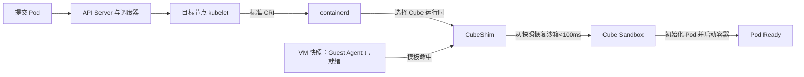
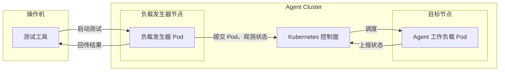

# Agent Cluster 工作负载启动性能测试 Cookbook

本文指导您在 Agent Cluster 的单个计算节点上依次完成工作负载串行和并行启动测试。测试通过批量部署模拟 Agent 应用的工作负载 Pod，验证从提交 Pod 到应用可开始处理请求的端到端耗时、成功率和稳定性。

```text
确认测试目标 → 准备环境 → 下载工具 → 执行测试 → 查看结果 → 清理资源
```

> **测试影响**：请使用测试集群或隔离节点，不要在繁忙的生产节点上执行。

## 1. 测试目标



Agent Cluster 提供的 Cube 运行时具备快速启动安全容器的能力，使您可以将 Pod 作为 Agent 应用的运行单元。

为了准确测量 Pod 启动耗时，本文使用运行轻量常驻进程的工作负载 Pod 模拟 Agent 应用，并以 Pod 进入 `Ready` 状态作为运行环境启动完成的信号。测试范围不包含应用初始化和真实 LLM 请求，避免语言运行时、模型推理、外部网络和服务限流等因素影响启动耗时。

按以下顺序逐级测试：

| 测试 | 默认规模 | 用途 |
| --- | ---: | --- |
| 串行启动 | 16 Pod、1 QPS、1 worker | 建立逐个部署 Agent 应用时的启动基线 |
| 并行启动 | 16 Pod、16 QPS、16 workers | 模拟批量部署或突发扩容，验证成功率和尾延迟 |

两组测试默认均创建 16 个 Pod，建议 Agent Cluster 目标节点的 Kubernetes `allocatable CPU` 不低于 16 核。

工具记录 Create、Scheduled、ContainersStarted、Ready 等时间点，并输出 `Create → Ready` 端到端延迟的 P50、P95、P99 和最大值。

## 2. 准备环境

### 2.1 集群要求

| 项目 | 要求 |
| --- | --- |
| Agent Cluster 目标节点 | `Ready`，已启用 Cube 运行时，标签 `agc.cloud.tencent.com/cube-ready=true`，`allocatable CPU` 不低于 16 核 |
| 负载发生器节点 | `Ready`，且不能与目标节点相同；可以使用其他 Agent Cluster 节点 |
| 目标节点资源 | 剩余 CPU、内存、临时存储、Pod 槽位、Pod IP 和 Cube/NBD 资源能容纳 16 个 Agent 工作负载 Pod |
| 发生器节点资源 | 至少剩余 `16100m` CPU 和约 5 GiB 内存 |

### 2.2 操作机工具

操作机需要能访问 Kubernetes API，并安装：Bash、`kubectl`、`jq` 和 `yq` v4。

```bash
kubectl version --client
jq --version
yq --version
```

### 2.3 设置参数

设置集群访问配置和节点名称。目标节点用于运行 Agent 工作负载，负载发生器节点用于提交 Pod 和采集性能数据。

```bash
export KUBECONFIG='/absolute/path/to/kubeconfig'
export TARGET_NODE='cube-node-name'
export GENERATOR_NODE='generator-node-name'

# 使用包含 sleep 命令的普通 Linux 镜像。
export LOAD_IMAGE='mirror.ccs.tencentyun.com/library/ubuntu:24.04'

# 串行和并行测试均创建 16 个 Pod。
export TEST_PODS=16
```

### 2.4 检查集群和节点

```bash
kubectl cluster-info

if [[ "$TARGET_NODE" == "$GENERATOR_NODE" ]]; then
  echo '目标节点和发生器节点不能相同。' >&2
  exit 1
fi
if [[ "$(kubectl auth can-i '*' '*')" != yes ]]; then
  echo '当前身份没有集群管理员权限。' >&2
  exit 1
fi
```

## 3. 测试工具

本文档随附 [performance-test-tools](./performance-test-tools/) 目录：

```text
agent-cluster/
├── performance-test-sop.md
└── performance-test-tools/
    ├── run.sh
    ├── cleanup.sh
    ├── sop-functions.sh
    ├── VERSION
    ├── SHA256SUMS
    └── manifests/
```

在操作机上进入本文档所在目录（仓库中的 `benchmarks/agent-cluster`），然后检查工具：

```bash
export SCALE_LOAD_DIR="$PWD/performance-test-tools"

chmod +x "$SCALE_LOAD_DIR/run.sh" "$SCALE_LOAD_DIR/cleanup.sh"
```

工具按以下流程执行测试：



- 操作机负责发起预热、串行和并行测试。工具检查集群与节点状态，并创建本轮测试所需的命名空间和权限。
- 工具在集群内的独立节点启动负载发生器 Pod。性能计时全部在该 Pod 内完成，可排除操作机与集群控制面之间的网络延迟和抖动。
- 负载发生器与目标节点分开部署，避免发生器的 CPU 和内存开销与被测 Agent 工作负载争抢资源。
- 负载发生器直接访问集群控制面，按指定 QPS 提交工作负载 Pod，并持续观测 Scheduled、ContainersStarted 和 Ready 状态。
- 测试完成后，工具将结果和诊断信息回传至操作机，并在校验资源归属后清理本轮资源，防止误删其他工作负载。

## 4. 执行测试

### 4.1 初始化命令

复制执行以下命令，后续各档测试共用：

```bash
source "$SCALE_LOAD_DIR/sop-functions.sh"
```

初始化完成后即可执行下述命令。每个测试 Pod 代表一个待启动的 Agent 应用实例。每档测试完成后先查看结果，再清理并进入下一档；失败时停止扩大规模并保留现场。

### 4.2 预热

预热使用与正式测试相同的工作负载模板，运行 1 个 Pod，就绪后观测 10 秒并清理。结果单独保存，不计入正式测试。

```bash
run_warmup_test
```

成功时仅输出 `Warm-up succeeded.`。

### 4.3 串行启动

按 1 QPS、1 worker 逐个提交 16 个 Pod，模拟 Agent 应用依次部署的场景：

默认使用以下工作负载 Pod。工具会为每个 Pod 生成唯一的名称和 Namespace，并根据 `TARGET_NODE` 和 `LOAD_IMAGE` 填充目标节点与镜像：

```yaml
apiVersion: v1
kind: Pod
metadata:
  name: cube-cri-<run-id>-00000
  namespace: cube-cri-load-<run-id>-0
spec:
  runtimeClassName: cube-load
  terminationGracePeriodSeconds: 0
  nodeSelector:
    kubernetes.io/hostname: <TARGET_NODE>
  containers:
    - name: main
      image: <LOAD_IMAGE>
      imagePullPolicy: IfNotPresent
      command: ["sleep", "infinity"]
      resources:
        requests:
          cpu: 512m
          memory: 512Mi
        limits:
          cpu: 512m
          memory: 512Mi
```

```bash
run_serial_test "$TEST_PODS"
```

命令会直接输出本轮结果，你会看到类似以下输出：

```json
{
  "runId": "serial-0923132837",
  "accepted": true,
  "success": true,
  "count": 16,
  "created": 16,
  "scheduled": 16,
  "containersStarted": 16,
  "ready": 16,
  "restartCount": 0,
  "readyLost": 0,
  "configured": { "qps": 1, "workers": 1, "stableSeconds": 10 },
  "actualRequestWriteQPS": 1.0003728207435059,
  "batchMs": { "allReady": 15342.32772 },
  "latencyMs": {
    "createToReady": {
      "count": 16,
      "p50Ms": 324.956354,
      "p95Ms": 356.721557,
      "p99Ms": 356.721557,
      "maxMs": 356.721557
    }
  },
  "warnings": { "count": 0 }
}
```

重点记录 `latencyMs.createToReady` 的 P50、P95、P99 和最大值，作为 Agent 工作负载逐个启动时的基线，同时记录 `batchMs.allReady`。

阶段时间是负载发生器通过 Watch/List 首次观察到状态的时间，不是控制面、kubelet 或 Cube 运行时的内部纯执行耗时。

成功时命令会在输出结果后自动清理本轮资源。如需重新查看已保存的结果，执行：

```bash
show_result "$SERIAL_RUN_ID"
```

### 4.4 并行启动

再次确认目标节点能容纳 16 个 Pod，然后执行以下命令，模拟 Agent 应用批量部署或突发扩容：

```bash
run_parallel_test "$TEST_PODS"
```

`TEST_PODS=16` 表示在约 1 秒内按 16 QPS、16 workers 提交 16 个 Pod。`workers` 是最大在途 Create 请求数；实际在途请求数取决于 Create 延迟。

你会看到类似以下输出：

```json
{
  "runId": "parallel-0923132926",
  "accepted": true,
  "success": true,
  "count": 16,
  "created": 16,
  "scheduled": 16,
  "containersStarted": 16,
  "ready": 16,
  "restartCount": 0,
  "readyLost": 0,
  "configured": { "qps": 16, "workers": 16, "stableSeconds": 10 },
  "actualRequestWriteQPS": 16.090460224116832,
  "batchMs": { "allReady": 2233.049143 },
  "latencyMs": {
    "createToReady": {
      "count": 16,
      "p50Ms": 409.697772,
      "p95Ms": 1295.035886,
      "p99Ms": 1295.035886,
      "maxMs": 1295.035886
    }
  },
  "warnings": {
    "count": 1,
    "affectedPods": ["cube-cri-parallel-0923132926-00015"],
    "reasons": [{ "reason": "FailedCreatePodSandBox", "count": 1 }]
  }
}
```

重点关注 `latencyMs.createToReady` 的 P95、P99、最大值和 `batchMs.allReady`，并与串行结果比较，判断并发压力是否放大节点启动或尾延迟。如需重新查看已保存的结果，执行：

```bash
show_result "$PARALLEL_RUN_ID"
```

成功时命令会在输出结果后自动清理本轮资源。

## 5. 清理资源

成功轮次会自动清理。如果测试失败、被中断或仍有资源残留，使用对应的精确 `run-id` 清理：

```bash
cleanup_test "$PARALLEL_RUN_ID"
```

全部测试结束后，清理共享测试资源和发生器节点标记：

```bash
cleanup_shared_test_resources
```

命令会先检查清理范围、资源归属和残留测试 Pod；检查不通过时拒绝删除。清理失败轮次时，将对应的精确 `run-id` 传给 `cleanup_test`，例如 `cleanup_test "$FAILED_RUN_ID"`。不要猜测或复用 ID。

本地结果保留在 `$RESULT_ROOT`，上述命令不会删除结果文件。

## 6. 进阶测试

### 6.1 EROX 测试

EROX 当前需要联系产品团队完成开通，并获取已完成 EROX 转换的正式测试镜像。确认集群和镜像均已就绪后，将参数改为：

```bash
export SNAPSHOTTER_PROFILE=erox
export LOAD_IMAGE='replace-with-product-erox-image@sha256:replace-with-digest'
```

建议使用产品团队提供的不可变 digest，便于复现测试。设置镜像后重新预热，再执行测试：

```bash
run_warmup_test
run_serial_test "$TEST_PODS"
run_parallel_test "$TEST_PODS"
```

镜像身份差异仅用于诊断，不影响验收结果，无需配置 `allowed-image-identities`。EROX 与 overlayfs 的测试结果应分别记录，不能混合统计。

### 6.2 生产近似 Agent 工作负载

默认 `simple` 工作负载在 Ubuntu 容器中运行 `sleep infinity`，用于测量不包含语言运行时初始化的 Pod 启动基线。若要模拟结构更接近生产的 Agent 应用，将 `LOAD_IMAGE` 设置为包含 Node.js 的镜像，并在预热、串行和并行测试命令中指定 `--workload-profile production`：

```bash
export LOAD_IMAGE='mirror.ccs.tencentyun.com/library/node:22-bookworm-slim'
run_warmup_test --workload-profile production
run_serial_test "$TEST_PODS" --workload-profile production
run_parallel_test "$TEST_PODS" --workload-profile production
```

对应的 Pod 如下：

```yaml
apiVersion: v1
kind: Pod
metadata:
  name: cube-cri-<run-id>-00000
  namespace: cube-cri-load-<run-id>-0
  labels:
    app: cube-cri-load
    load-test-batch: <run-id>
spec:
  runtimeClassName: cube-load
  nodeSelector:
    kubernetes.io/hostname: <TARGET_NODE>
  serviceAccountName: cube-cri-load
  automountServiceAccountToken: true
  restartPolicy: Always
  terminationGracePeriodSeconds: 0
  dnsPolicy: ClusterFirst
  enableServiceLinks: false
  initContainers:
    - name: init-write
      image: <LOAD_IMAGE>
      imagePullPolicy: IfNotPresent
      command: ["node", "-e"]
      args:
        - 'require("fs").writeFileSync("/shared/init-written", "initialized\n");'
      resources:
        requests:
          cpu: 10m
          memory: "0"
        limits:
          cpu: 10m
          memory: "0"
      volumeMounts:
        - name: shared-data
          mountPath: /shared

    - name: init-check
      image: <LOAD_IMAGE>
      imagePullPolicy: IfNotPresent
      command: ["node", "-e"]
      args:
        - |
          const fs = require("fs");
          if (!fs.statSync("/shared/init-written").size || !fs.statSync("/projected/namespace").size) process.exit(1);
          fs.writeFileSync("/shared/init-complete", "ready\n");
      resources:
        requests:
          cpu: 10m
          memory: "0"
        limits:
          cpu: 10m
          memory: "0"
      volumeMounts:
        - name: shared-data
          mountPath: /shared
        - name: projected-data
          mountPath: /projected
          readOnly: true

  containers:
    - name: main
      image: <LOAD_IMAGE>
      imagePullPolicy: IfNotPresent
      command: ["node", "-e"]
      args:
        - |
          const fs = require("fs");
          const http = require("http");
          if (!fs.statSync("/shared/init-complete").size) process.exit(1);
          http.createServer((request, response) => {
            if (request.url === "/healthz") {
              response.writeHead(200, {"content-type": "text/plain"});
              response.end("ok\n");
              return;
            }
            response.writeHead(404, {"content-type": "text/plain"});
            response.end("not found\n");
          }).listen(8080, "0.0.0.0");
      ports:
        - name: http
          containerPort: 8080
          protocol: TCP
      startupProbe:
        httpGet:
          path: /healthz
          port: http
        periodSeconds: 1
        failureThreshold: 30
      readinessProbe:
        httpGet:
          path: /healthz
          port: http
        periodSeconds: 1
        failureThreshold: 3
      livenessProbe:
        httpGet:
          path: /healthz
          port: http
        periodSeconds: 10
        failureThreshold: 3
      resources:
        requests:
          cpu: 50m
          memory: "0"
          ephemeral-storage: 512Mi
        limits:
          cpu: 50m
          memory: "0"
          ephemeral-storage: 512Mi
      volumeMounts:
        - name: shared-data
          mountPath: /shared
        - name: projected-data
          mountPath: /projected
          readOnly: true

    - name: sidecar
      image: <LOAD_IMAGE>
      imagePullPolicy: IfNotPresent
      command: ["node", "-e"]
      args:
        - |
          const fs = require("fs");
          const net = require("net");
          if (!fs.statSync("/shared/init-complete").size) process.exit(1);
          net.createServer((socket) => {
            socket.on("error", (error) => {
              if (error.code !== "ECONNRESET" && error.code !== "EPIPE") console.error(error);
              socket.destroy();
            });
            socket.end("ready\n");
          }).listen(8081, "0.0.0.0");
      ports:
        - name: sidecar
          containerPort: 8081
          protocol: TCP
      readinessProbe:
        tcpSocket:
          port: sidecar
        periodSeconds: 1
        failureThreshold: 3
      livenessProbe:
        tcpSocket:
          port: sidecar
        periodSeconds: 10
        failureThreshold: 3
      resources:
        requests:
          cpu: 17m
          memory: "0"
        limits:
          cpu: 17m
          memory: "0"
      volumeMounts:
        - name: shared-data
          mountPath: /shared

    - name: net-admin
      image: <LOAD_IMAGE>
      imagePullPolicy: IfNotPresent
      command: ["node", "-e"]
      args:
        - |
          if (!require("fs").statSync("/projected/namespace").size) process.exit(1);
          setInterval(() => {}, 3600000);
      securityContext:
        capabilities:
          add:
            - NET_ADMIN
      resources:
        requests:
          cpu: 16m
          memory: "0"
        limits:
          cpu: 16m
          memory: "0"
      volumeMounts:
        - name: projected-data
          mountPath: /projected
          readOnly: true

  volumes:
    - name: shared-data
      emptyDir:
        sizeLimit: 512Mi
    - name: projected-data
      projected:
        sources:
          - serviceAccountToken:
              audience: cube-cri-load
              expirationSeconds: 3600
              path: token
          - configMap:
              name: kube-root-ca.crt
              items:
                - key: ca.crt
                  path: ca.crt
          - downwardAPI:
              items:
                - path: namespace
                  fieldRef:
                    apiVersion: v1
                    fieldPath: metadata.namespace
```

`production` 工作负载包含 init container、主服务容器、Sidecar、volume、HTTP/TCP probe 和 `NET_ADMIN`，用于模拟 Agent 应用启动前初始化依赖、启动辅助组件并通过健康检查后才能接收请求的过程。此时 Pod `Ready` 比默认 `simple` 工作负载更接近“Agent 应用可以处理请求”的语义。

`production` 需要额外的安全评审，测试结果不能与 `simple` 混合比较。如果您的实际 Agent 镜像和 Pod 结构与上述两种 profile 差异较大，应使用相同工具单独建立业务工作负载基线，并明确就绪探针代表的可服务条件。

### 6.3 扩大规模

在 Agent Cluster 上扩大 Agent 应用规模前，应先核算单个工作负载 Pod 的资源需求。当前 `simple` 工作负载为每个 Pod 配置 `512m CPU + 512Mi memory + 1 个 Pod IP`；`cube-load` RuntimeClass 不再额外增加资源 overhead。还需检查节点可用资源、`maxPods`、NBD 和其他 Cube 运行时资源。

建议逐级增加并发，每一级至少重复两轮：

```text
0.5 × 节点 allocatable CPU → 1 × allocatable CPU → 按专项容量评估继续增加
```

单节点 1 秒突发测试继续保持 `count=qps=workers=C`，其中 `C` 是本级批次大小。

单轮 Pod 数量不得超过目标节点的剩余承载量。需要更多样本时，应清理后重复测试。
