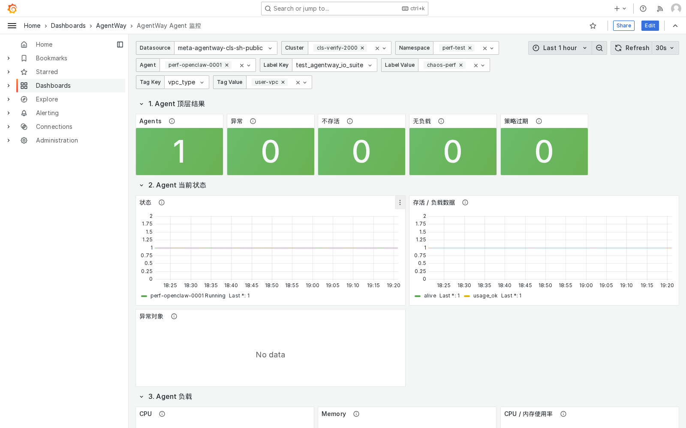
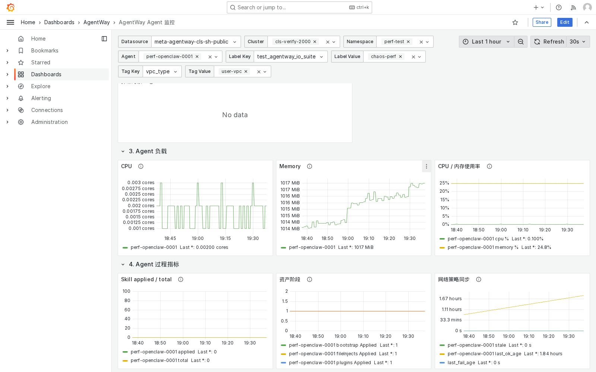
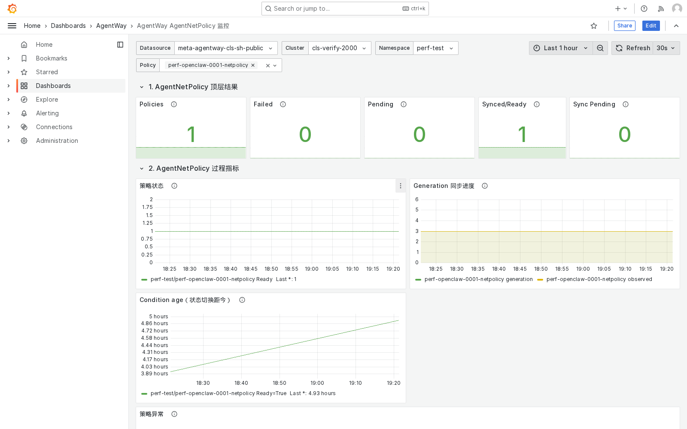
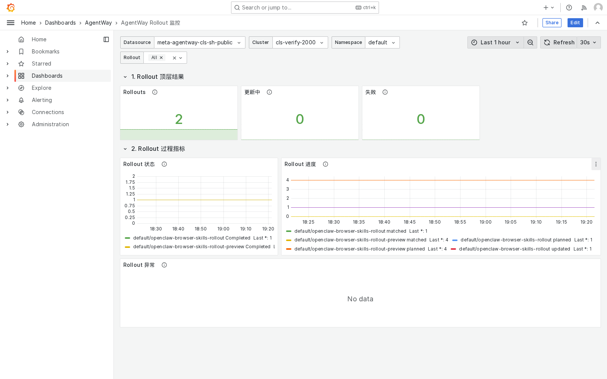

# 搭建 AgentWay 监控面板

这个 cookbook 与 `openclaw-browser-on-TencentAGS` 平级，面向客户侧交付：从部署 `agentway-exporter`，到 Prometheus 采集配置、常用 PromQL、Grafana 面板导入，完整搭建一套可用于观测 AgentWay 资产的监控面板。

---

## 最终效果

完成后，Grafana 中会有 3 个 dashboard：

| Dashboard | 主要用途 |
|---|---|
| AgentWay / Agent Overview | 查看 Agent 基础信息、状态、底层 sandbox 存活性、CPU/内存使用率、Skill 安装进度、按 label/tag 过滤 Agent |
| AgentWay / AgentNetPolicy Overview | 查看网络策略状态、同步是否 stale、最近一次 condition 更新时间、失败/异常策略 |
| AgentWay / AgentRollout Overview | 查看 rollout 是否仍在进行、matched/planned/updated/ready/failed 进度和异常 rollout |

数据链路如下：

```text
Agent / AgentNetPolicy / AgentRollout CRD
        │ watch
        ▼
agentway-exporter ──周期性批量拉取──► Barad / 云监控 usage 数据
        │ /metrics
        ▼
Prometheus ──datasource: meta-agentway-cls-sh-public──► Grafana dashboards
```

---

## 面板截图示例

下面截图来自 dev 验证集群，仅用于说明 dashboard 结构和典型视图。客户侧数据、对象名称和数值会随实际集群变化。

### Agent 顶层状态



### Agent runtime metrics



### AgentNetPolicy



### AgentRollout



---

## 前置条件

请先确认：

1. AgentWay Operator 已部署，且 CRD 已安装。
2. 集群内有 Prometheus，或你准备把下面的 `scrape_configs` 合并到现有 Prometheus。
3. 集群内或集群外有 Grafana，且能访问 Prometheus。
4. `agent-way-system` namespace 中存在 Operator 使用的腾讯云 AK/SK Secret。默认示例读取：

```text
namespace: agent-way-system
secret: tencent-runtime-credentials
secret_id key: secret_id
secret_key key: secret_key
```

如客户环境不同，请修改 `manifests/agentway-exporter.yaml` 中这些环境变量：

```yaml
AGENTWAY_EXPORTER_BARAD_SECRET_NAME
AGENTWAY_EXPORTER_BARAD_SECRET_ID_KEY
AGENTWAY_EXPORTER_BARAD_SECRET_KEY_KEY
AGENTWAY_EXPORTER_BARAD_REGION
```

---

## 文档与 manifest 目录

文档入口：

```text
./agentway-monitoring-dashboard/
├── README.md       # 部署、采集和面板导入流程
├── metrics.md      # 指标字典：含义、标签与统计口径
└── performance.md  # 大规模 Agent 场景下的 series、采样点、磁盘和 exporter 规格估算
```

本 cookbook 需要给客户侧的物料都放在：

```text
./agentway-monitoring-dashboard/manifests/
├── monitoring-stack.yaml                     # 可选：最小 Prometheus + Grafana 部署
├── agentway-exporter.yaml                    # exporter Deployment + Service
├── servicemonitor.yaml                       # Prometheus Operator ServiceMonitor
├── prometheus-scrape-config.yaml             # 原生 Prometheus scrape_configs 片段
├── promql-examples.promql                    # 常用 PromQL / 面板查询参考
├── grafana-datasource.yaml                   # Grafana datasource provisioning 示例
├── grafana-agent-dashboard.json              # Agent dashboard
├── grafana-agentnetpolicy-dashboard.json     # AgentNetPolicy dashboard
├── grafana-rollout-dashboard.json            # AgentRollout dashboard
└── sample-resources.yaml                     # 验证面板用的示例资源

./agentway-monitoring-dashboard/images/
├── agent-dashboard.png                       # Agent dashboard 顶层状态示例截图
├── agent-resource-dashboard.png              # Agent runtime metrics 示例截图
├── agentnetpolicy-dashboard.png              # AgentNetPolicy dashboard 示例截图
└── rollout-dashboard.png                     # AgentRollout dashboard 示例截图
```

---

## 1. 部署 Prometheus 和 Grafana

如果客户环境已经有 Prometheus 和 Grafana，可以跳过本节，直接使用后面的 ServiceMonitor / scrape_configs / dashboard JSON 接入现有监控系统。

如果需要快速搭建一套最小可用监控栈，先创建 dashboard ConfigMap，再部署 Prometheus 和 Grafana：

```bash
kubectl create namespace agentway-monitoring --dry-run=client -o yaml | kubectl apply -f -

kubectl -n agentway-monitoring create configmap grafana-agentway-dashboard \
  --from-file=agentway-agent-dashboard.json=./agentway-monitoring-dashboard/manifests/grafana-agent-dashboard.json \
  --from-file=agentway-agentnetpolicy-dashboard.json=./agentway-monitoring-dashboard/manifests/grafana-agentnetpolicy-dashboard.json \
  --from-file=agentway-rollout-dashboard.json=./agentway-monitoring-dashboard/manifests/grafana-rollout-dashboard.json \
  --dry-run=client -o yaml | kubectl apply -f -

kubectl apply -f ./agentway-monitoring-dashboard/manifests/monitoring-stack.yaml
kubectl -n agentway-monitoring rollout status deploy/prometheus
kubectl -n agentway-monitoring rollout status deploy/grafana
```

默认 Grafana 账号：

```text
admin / agentway
```

本地验证可用 port-forward：

```bash
kubectl -n agentway-monitoring port-forward svc/grafana 3000:3000
```

然后打开：

```text
http://127.0.0.1:3000
```

> `monitoring-stack.yaml` 内置 Prometheus Kubernetes service discovery 采集配置和最小 RBAC，默认 `clusterID=cls-xxx`。生产环境请改成真实集群 ID。

---

## 2. 部署 agentway-exporter

先确认镜像地址。示例文件默认使用：

```yaml
image: ccr.ccs.tencentyun.com/agentway/exporter:v1.0.1
```

正式客户环境请替换成对应发布版本镜像。

部署时请先指定 exporter 镜像。下面命令会在不改动原始 manifest 的情况下替换镜像后应用：

```bash
export AGENTWAY_EXPORTER_IMAGE=ccr.ccs.tencentyun.com/agentway/exporter:v1.0.1

sed "s#ccr.ccs.tencentyun.com/agentway/exporter:v1.0.1#${AGENTWAY_EXPORTER_IMAGE}#g" \
  ./agentway-monitoring-dashboard/manifests/agentway-exporter.yaml \
  | kubectl apply -f -

kubectl -n agent-way-system rollout status deploy/agentway-exporter
```

例如在本地 k3d/dev 集群验证时，如果已经把镜像导入到节点，可以设置为：

```bash
export AGENTWAY_EXPORTER_IMAGE=local/agentway-exporter:dev-20260529120356
```

确认服务可访问：

```bash
kubectl -n agent-way-system get pod,svc -l app.kubernetes.io/name=agentway-exporter
kubectl -n agent-way-system port-forward svc/agentway-exporter 9108:9108
curl -s http://127.0.0.1:9108/metrics | grep -E 'agentway_agent_phase|agentway_exporter_runtime_metric_cache_entries' | head
```

### exporter 关键配置

| 配置 | 示例 | 说明 |
|---|---|---|
| `AGENTWAY_EXPORTER_BIND_ADDR` | `:9108` | `/metrics` 暴露端口 |
| `AGENTWAY_EXPORTER_TAG_LABELS_ENABLED` | `true` | 开启 tags/labels 元数据指标 |
| `AGENTWAY_EXPORTER_BARAD_ENABLED` | `true` | 开启 Barad usage 数据拉取 |
| `AGENTWAY_EXPORTER_BARAD_REGION` | `ap-shanghai` | Barad 查询地域 |
| `AGENTWAY_EXPORTER_BARAD_QUERY_WINDOW` | `5m` | 查询时间窗口 |
| `AGENTWAY_EXPORTER_BARAD_CACHE_TTL` | `5m` | usage 缓存有效期 |
| `AGENTWAY_EXPORTER_BARAD_BATCH_SIZE` | `50` | 每次 GetMonitorData 批量拉取的 sandbox 数；腾讯云接口单次最多 50 个实例 |
| `AGENTWAY_EXPORTER_BARAD_MAX_CONCURRENT_REQUESTS` | `8` | Barad GetMonitorData 最大并发请求数，用于加速大规模 Agent usage 同步 |
| `AGENTWAY_EXPORTER_BARAD_MAX_REQUESTS_PER_SECOND` | `20` | Barad GetMonitorData 客户端限速，避免大规模 Agent 下触发云监控 QPS 限制；最大有效值 50 |
| `AGENTWAY_EXPORTER_BARAD_SECRET_NAME` | `tencent-runtime-credentials` | 复用 Operator AK/SK Secret |

> 注意：Barad 数据更新周期通常约 1 分钟，新建 sandbox 后 CPU/内存/磁盘/文件系统/网络 runtime usage 面板可能需要等待 1-3 分钟。

---

## 3. 查看指标字典

指标的完整含义、标签和统计口径见：

- [`metrics.md`](./metrics.md)

建议在配置告警规则或二次开发 Grafana 面板前先阅读这份指标字典，特别是：

- `clusterID` 由 Prometheus 注入，不是 exporter 业务指标直接输出。
- Agent 主指标不直接展开 `tag_xxx` / `label_xxx`，需要通过 `agentway_agent_tags` / `agentway_agent_labels` join 过滤。
- CPU / 内存 / 磁盘 / 文件系统 / 网络 runtime usage 来自 Barad/云监控 cache，可能存在 1-3 分钟延迟。

大规模场景下的容量估算见：

- [`performance.md`](./performance.md)

---

## 4. 配置 Prometheus 采集

`clusterID` 是多集群监控最重要的 label。exporter 自身不直接输出 `clusterID`，应由 Prometheus 采集配置注入。

### 方式 A：Prometheus Operator

如果客户环境使用 Prometheus Operator，直接创建 ServiceMonitor：

```bash
kubectl apply -f ./agentway-monitoring-dashboard/manifests/servicemonitor.yaml
```

默认 ServiceMonitor 会注入：

```yaml
relabelings:
  - targetLabel: clusterID
    replacement: cls-xxx
```

客户侧请将 `cls-xxx` 改成真实集群 ID，例如：

```text
cls-sh-prod-001
cls-gz-prod-002
```

### 方式 B：原生 Prometheus scrape_configs

如果客户维护的是原生 Prometheus，把下面 Kubernetes service discovery 片段合并到 Prometheus 配置中。不要写死 `agentway-exporter.agent-way-system.svc:9108`，否则 service/port/namespace 调整时容易漏改，也不利于标准 Kubernetes 发现与 relabel。请确认 Prometheus ServiceAccount 具备 `endpoints`、`services`、`pods`、`endpointslices` 的 list/watch 权限：

```yaml
scrape_configs:
  - job_name: agentway-exporter
    scrape_interval: 30s
    scrape_timeout: 10s
    kubernetes_sd_configs:
      - role: endpoints
        namespaces:
          names:
            - agent-way-system
    relabel_configs:
      - source_labels: [__meta_kubernetes_service_label_app_kubernetes_io_name]
        action: keep
        regex: agentway-exporter
      - source_labels: [__meta_kubernetes_endpoint_port_name]
        action: keep
        regex: metrics
      - source_labels: [__meta_kubernetes_namespace]
        target_label: k8s_namespace
      - source_labels: [__meta_kubernetes_service_name]
        target_label: k8s_service
      - source_labels: [__meta_kubernetes_pod_name]
        target_label: k8s_pod
      - target_label: clusterID
        replacement: cls-xxx
```

对应文件：

```bash
cat ./agentway-monitoring-dashboard/manifests/prometheus-scrape-config.yaml
```

验证 Prometheus 是否采到数据：

```bash
# 如果 Prometheus 在集群内，可先 port-forward 到本地
kubectl -n agentway-monitoring port-forward svc/prometheus 9090:9090

curl -G http://127.0.0.1:9090/api/v1/query \
  --data-urlencode 'query=up{job="agentway-exporter"}'

curl -G http://127.0.0.1:9090/api/v1/query \
  --data-urlencode 'query=agentway_agent_phase{clusterID="cls-xxx"}'
```

---

## 5. 常用 PromQL

完整 PromQL 参考放在：

```bash
./agentway-monitoring-dashboard/manifests/promql-examples.promql
```

常用查询如下。

### Agent 当前状态分布

```promql
sum by (clusterID, namespace, phase) (
  agentway_agent_phase{clusterID=~"$clusterID", namespace=~"$namespace"}
)
```

### Agent 当前状态时间线

```promql
agentway_agent_phase{clusterID=~"$clusterID", namespace=~"$namespace", agent=~"$agent"} == 1
```

### 按 Kubernetes label 和 Agent tag 过滤目标 Agent

`agentway_agent_labels` / `agentway_agent_tags` 使用 kube-state-metrics 风格暴露，业务指标本身不展开动态 label/tag，查询时通过 `on(namespace, agent)` join：

```promql
agentway_agent_info{clusterID=~"$clusterID", namespace=~"$namespace"}
  and on(namespace, agent) agentway_agent_labels{label_app=~"$labelValue"}
  and on(namespace, agent) agentway_agent_tags{tag_env=~"$tagValue"}
```

### Runtime 指标

CPU / 内存使用率优先使用 Barad 原始百分比指标（`agentway_agent_cpu_usage_percent` / `agentway_agent_memory_usage_percent`），不要用 used bytes 除以 Agent spec limit 替代真实 runtime 百分比；spec 与实际 sandbox 规格不一致时会产生误导。


```promql
agentway_agent_cpu_usage_percent{clusterID=~"$clusterID", namespace=~"$namespace", agent=~"$agent"}
agentway_agent_cpu_usage_cores{clusterID=~"$clusterID", namespace=~"$namespace", agent=~"$agent"}
agentway_agent_memory_usage_percent{clusterID=~"$clusterID", namespace=~"$namespace", agent=~"$agent"}
agentway_agent_memory_usage_bytes{clusterID=~"$clusterID", namespace=~"$namespace", agent=~"$agent"}
agentway_agent_disk_read_bytes_per_second{clusterID=~"$clusterID", namespace=~"$namespace", agent=~"$agent"}
agentway_agent_disk_write_bytes_per_second{clusterID=~"$clusterID", namespace=~"$namespace", agent=~"$agent"}
agentway_agent_filesystem_usage_percent{clusterID=~"$clusterID", namespace=~"$namespace", agent=~"$agent"}
agentway_agent_filesystem_used_bytes{clusterID=~"$clusterID", namespace=~"$namespace", agent=~"$agent"}
agentway_agent_network_receive_bytes_per_second{clusterID=~"$clusterID", namespace=~"$namespace", agent=~"$agent"}
agentway_agent_network_transmit_bytes_per_second{clusterID=~"$clusterID", namespace=~"$namespace", agent=~"$agent"}
```

### Sandbox 存活性与 usage 数据新鲜度

```promql
agentway_agent_sandbox_alive{clusterID=~"$clusterID", namespace=~"$namespace", agent=~"$agent"}
agentway_agent_sandbox_metrics_available{clusterID=~"$clusterID", namespace=~"$namespace", agent=~"$agent"}
agentway_agent_sandbox_metrics_cache_age_seconds{clusterID=~"$clusterID", namespace=~"$namespace", agent=~"$agent"}
```

### 网络策略同步情况

```promql
agentway_agent_network_policy_stale{clusterID=~"$clusterID", namespace=~"$namespace", agent=~"$agent"}
time() - agentway_agent_network_policy_last_sync_timestamp_seconds{clusterID=~"$clusterID", namespace=~"$namespace", agent=~"$agent"}
```

### Rollout 进度

```promql
agentway_agentrollout_matched_agents{clusterID=~"$clusterID", namespace=~"$namespace", agentrollout=~"$agentrollout"}
agentway_agentrollout_updated_agents{clusterID=~"$clusterID", namespace=~"$namespace", agentrollout=~"$agentrollout"}
agentway_agentrollout_ready_agents{clusterID=~"$clusterID", namespace=~"$namespace", agentrollout=~"$agentrollout"}
agentway_agentrollout_failed_agents{clusterID=~"$clusterID", namespace=~"$namespace", agentrollout=~"$agentrollout"}
```

---

## 6. 配置 Grafana datasource

Dashboard 的默认 datasource 名称是：

```text
meta-agentway-cls-sh-public
```

建议客户侧 Grafana datasource 也使用这个名字，避免导入 dashboard 后逐个替换。

如果 Grafana 使用文件 provisioning，可参考：

```bash
./agentway-monitoring-dashboard/manifests/grafana-datasource.yaml
```

内容示例：

```yaml
apiVersion: 1

datasources:
  - name: meta-agentway-cls-sh-public
    type: prometheus
    access: proxy
    url: http://prometheus.agentway-monitoring.svc:9090
    isDefault: true
    editable: true
```

如果 Grafana 在集群外，请把 `url` 改成 Grafana 能访问到的 Prometheus 地址。

---

## 7. 导入 Grafana 面板

导入下面 3 个 JSON：

```text
./agentway-monitoring-dashboard/manifests/grafana-agent-dashboard.json
./agentway-monitoring-dashboard/manifests/grafana-agentnetpolicy-dashboard.json
./agentway-monitoring-dashboard/manifests/grafana-rollout-dashboard.json
```

### 方式 A：Grafana UI 导入

1. 打开 Grafana。
2. 进入 **Dashboards → New → Import**。
3. 上传 JSON 文件。
4. 选择 datasource：`meta-agentway-cls-sh-public`。
5. 点击 Import。

### 方式 B：Grafana API 导入

```bash
export GRAFANA_URL=http://<grafana-host>:3000
export GRAFANA_USER=admin
export GRAFANA_PASSWORD='<password>'

for f in \
  ./agentway-monitoring-dashboard/manifests/grafana-agent-dashboard.json \
  ./agentway-monitoring-dashboard/manifests/grafana-agentnetpolicy-dashboard.json \
  ./agentway-monitoring-dashboard/manifests/grafana-rollout-dashboard.json; do
  jq -n --argjson dashboard "$(cat "$f")" '{dashboard: $dashboard, overwrite: true, folderUid: null}' \
    | curl -sS -u "$GRAFANA_USER:$GRAFANA_PASSWORD" \
      -H 'Content-Type: application/json' \
      -X POST "$GRAFANA_URL/api/dashboards/db" \
      -d @-
done
```

---

## 8. 创建示例资源验证面板

如果客户环境还没有足够的数据，可以创建示例资源：

```bash
kubectl apply -f ./agentway-monitoring-dashboard/manifests/sample-resources.yaml
```

等待 exporter 和 Prometheus 至少完成一次采集：

```bash
sleep 60
```

然后在 Grafana 中检查：

| 检查项 | 预期 |
|---|---|
| `clusterID` 下拉框 | 能看到配置的集群 ID |
| Agent dashboard | 能看到 Agent 状态、Skill applied/total、sandbox 存活/usage 面板 |
| AgentNetPolicy dashboard | 能看到策略状态和 condition 更新时间 |
| AgentRollout dashboard | 能看到 rollout matched/updated/ready/failed 进度 |
| label/tag 过滤 | Agent dashboard 可按 `label_app`、`tag_env` 等过滤目标 Agent |

---

## 9. 常见问题

### Grafana 变量或面板报 PromQL parse error

先检查是否误把复杂表达式放进 `label_values((...), xxx)`。Grafana Prometheus 变量不支持这种写法。需要使用：

```promql
query_result(<完整 PromQL 表达式>)
```

再用 regex 从结果中提取 label。

### Dashboard 没有数据

按顺序排查：

```bash
kubectl -n agent-way-system get pod,svc -l app.kubernetes.io/name=agentway-exporter
curl -G http://127.0.0.1:9090/api/v1/query --data-urlencode 'query=up{job="agentway-exporter"}'
curl -G http://127.0.0.1:9090/api/v1/query --data-urlencode 'query=agentway_agent_info'
```

常见原因：

- Prometheus 没有采集 exporter。
- `clusterID` 注入值与 Grafana 变量不一致。
- Grafana datasource 指向了错误的 Prometheus。
- namespace / agent 变量过滤过窄。

### CPU / 内存使用率没有数据

CPU/内存/磁盘/文件系统/网络 runtime usage 来自 Barad/云监控，不是 Kubernetes metrics-server。请检查：

- `AGENTWAY_EXPORTER_BARAD_ENABLED=true`
- AK/SK Secret 名称和 key 是否正确
- `AGENTWAY_EXPORTER_BARAD_REGION` 与 sandbox 所在地域一致
- 新建 sandbox 后是否已经等待 1-3 分钟
- `agentway_agent_sandbox_metrics_available` 是否为 1
- `agentway_agent_sandbox_metrics_cache_age_seconds` 是否持续增长

### label/tag 过滤没有目标 Agent

Agent 主指标不会直接带 `tag_xxx` / `label_xxx`，需要看 metadata 指标：

```promql
agentway_agent_labels
agentway_agent_tags
```

例如：

```promql
agentway_agent_labels{label_app="openclaw"}
agentway_agent_tags{tag_env="dev"}
```

---

## 清理示例资源

如果只想删除验证数据：

```bash
kubectl delete -f ./agentway-monitoring-dashboard/manifests/sample-resources.yaml --ignore-not-found
```

如果要删除 exporter：

```bash
kubectl delete -f ./agentway-monitoring-dashboard/manifests/servicemonitor.yaml --ignore-not-found
kubectl delete -f ./agentway-monitoring-dashboard/manifests/agentway-exporter.yaml --ignore-not-found
```
