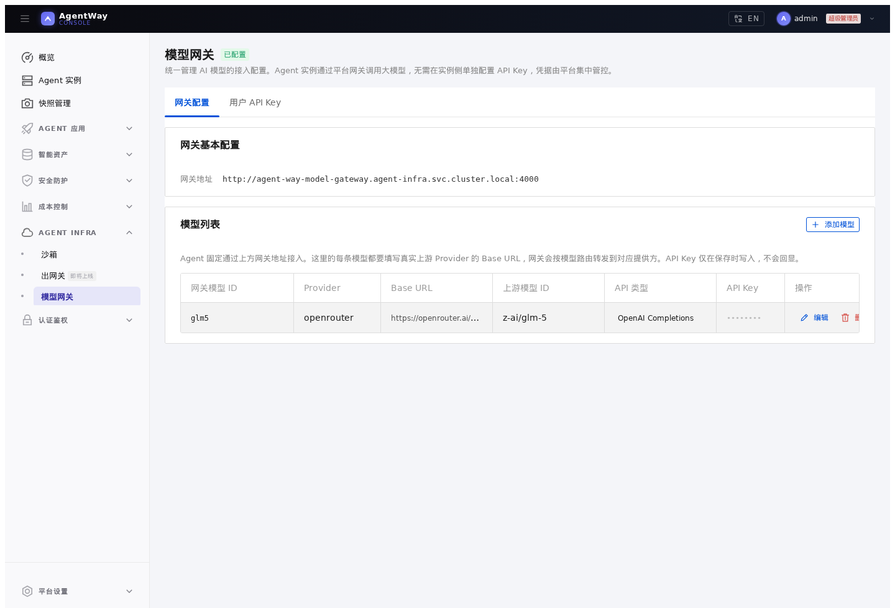
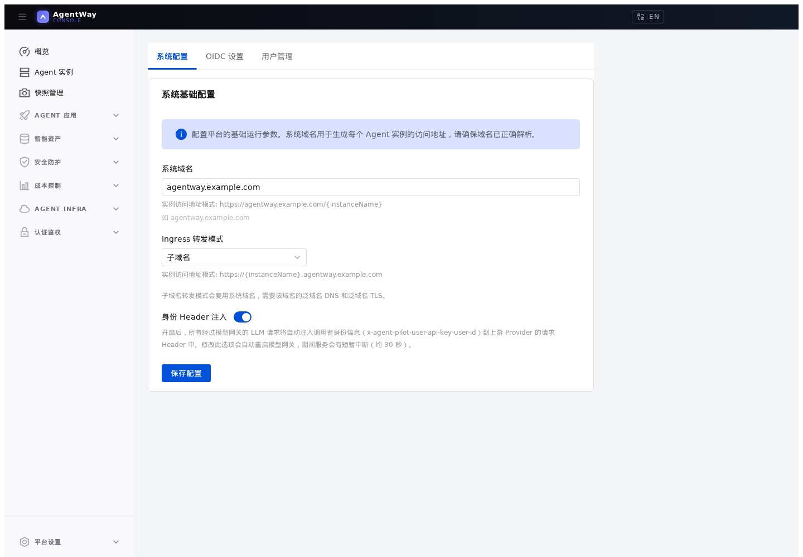
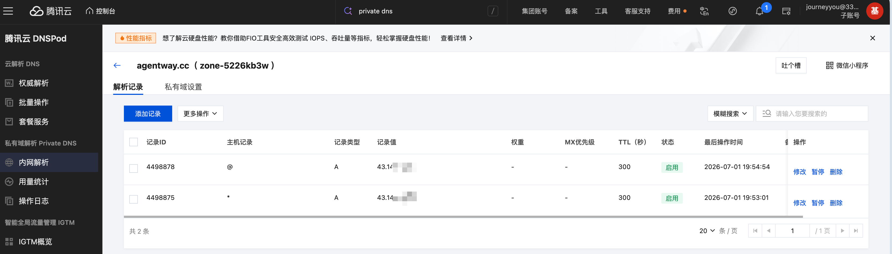

# 01. 准备 Hermes 需要的平台设置

## 本章场景

AgentWay 已经部署完成。现在你需要先准备 Hermes Dashboard 依赖的平台能力：

- 模型网关中至少有一个可用模型
- Agent 访问地址使用子域名模式
- 系统域名和 DNS 能解析到 Ingress Gateway

这些设置准备好之后，再创建 Hermes 实例会更顺畅。

---

## 前置章节

请先完成：

- [00. 在 TKE 上部署 AgentWay](./00-deploy-agent-way.md)

---

## 为什么先做这一步

Hermes Dashboard 会发起 `/auth/password-login`、`/api/...` 这类根路径请求。

如果 AgentWay 使用 path prefix 模式，访问地址通常是：

```text
http://<domain>/<agentID>/login
```

浏览器里的根路径请求可能回到共享 Console 域名，导致登录请求没有进入 Hermes 实例。Hermes 更适合使用子域名模式：

```text
http://<agentID>.<domain>/login
```

这样同一个浏览器 Host 下的 `/auth/password-login` 和 `/api/...` 都会继续进入同一个 Hermes 实例。

---

## 你需要填写的参数

| 参数 | 是否必填 | 示例 |
|---|---|---:|
| 系统域名 | 是 | `agentway.example.com` |
| Agent 泛域名 | 是 | `*.agentway.example.com` |
| 网关模型 ID | 是 | `glm5` |
| 上游模型 ID | 是 | `z-ai/glm-5` |
| Provider Base URL | 是 | `https://openrouter.ai/api/v1` |
| Provider API Key | 是 | `<Provider API Key>` |

---

## 通过 Console 操作

### 1. 配置模型网关

打开 **Agent Infra / 模型网关**，点击 **添加模型**，填写：

```text
网关模型 ID：glm5
Provider：openrouter
Base URL：https://openrouter.ai/api/v1
上游模型 ID：z-ai/glm-5
API Type：OpenAI Completions
API Key：模型 Provider API Key
```

这里的 `网关模型 ID` 是 Agent / Hermes 实例侧使用的模型 ID，`上游模型 ID` 是模型网关转发到上游 Provider 时实际请求的模型 ID。

保存后，页面应显示 `已配置`。



Hermes 后续访问的是 AgentWay 内置模型网关地址：

```text
http://agent-way-model-gateway.agent-infra.svc.cluster.local:4000/v1
```

### 2. 配置系统域名和转发模式

打开 **平台设置 / 基础配置**，填写：

```text
系统域名：agentway.example.com
Ingress 转发模式：子域名
```



生产环境需要配置：

```text
agentway.example.com       -> <Ingress Gateway 地址>
*.agentway.example.com     -> <Ingress Gateway 地址>
```

如果使用内网 CLB，请使用 Private DNS 或内网 DNS，并确保浏览器位于可访问该内网 CLB 的网络路径中。



---

## 通过 Kubernetes API 操作

模型配置对应 `ModelProvider` 资源。示例：

```yaml
apiVersion: agent.agentway.io/v1alpha1
kind: ModelProvider
metadata:
  name: glm5
  namespace: agent-way-system
spec:
  modelName: glm5
  providerName: openrouter
  baseUrl: https://openrouter.ai/api/v1
  apiType: openai-completions
  defaultModel: z-ai/glm-5
  apiKeySecretRef:
    name: openrouter-api-key
```

API Key 使用 Secret 保存：

不要在共享终端、文档或截图中粘贴真实 Provider Key；生产环境还应限制能读取该 Secret 的 RBAC。

```bash
kubectl -n agent-way-system create secret generic openrouter-api-key \
  --from-literal=apiKey='<模型 API Key>'
```

系统域名和转发模式由平台配置保存。可以通过 `agent-way-config` 查看当前值：

```bash
kubectl get configmap agent-way-config -n agent-way-system -o yaml
```

如果需要直接写入：

```bash
kubectl patch configmap agent-way-config -n agent-way-system --type merge -p '{
  "data": {
    "system-domain": "agentway.example.com",
    "ingress-routing-mode": "subdomain"
  }
}'
```

---

## 预期效果

完成后：

- 模型配置页面显示至少一个模型
- 系统域名已保存
- Ingress 转发模式为子域名
- DNS 或 hosts 能把 Agent 子域名解析到 Ingress Gateway

---

## 如何验证

Console 侧：

- 模型配置页面显示 `已配置`
- 平台设置页保存后没有报错

Kubernetes 侧：

```bash
kubectl get modelproviders.agent.agentway.io -n agent-way-system
kubectl get configmap agent-way-config -n agent-way-system -o yaml
```

模型网关侧可以做一次只读连通性检查：

```bash
kubectl -n agent-infra port-forward svc/agent-way-model-gateway 14000:4000

curl -s http://127.0.0.1:14000/v1/models \
  -H 'Authorization: Bearer <模型网关密钥>' | jq .
```

能返回模型列表，说明 Console 中的模型配置已经被模型网关接收。不要把真实密钥或完整响应贴到公开渠道。

---

## 下一章

完成后，继续：

- [02. 通过 Console 创建 Hermes Dashboard](./02-create-hermes-dashboard-with-console.md)
