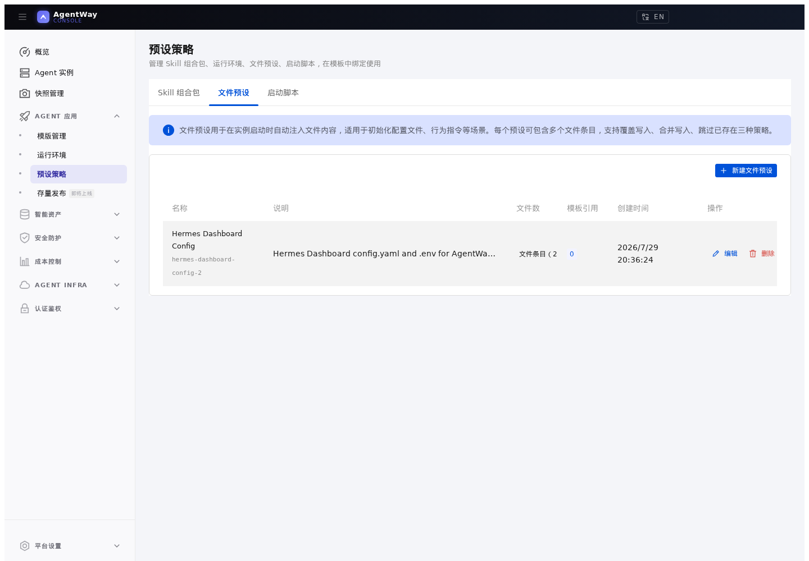
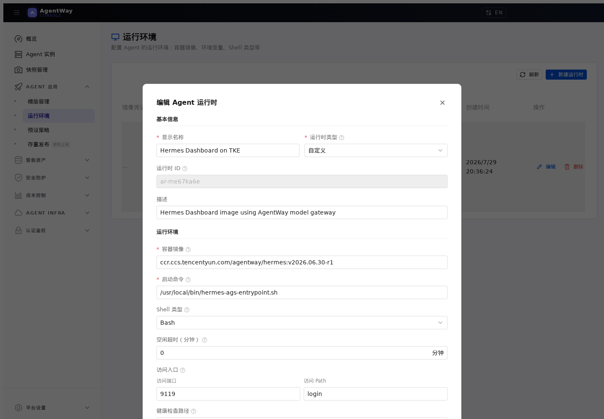
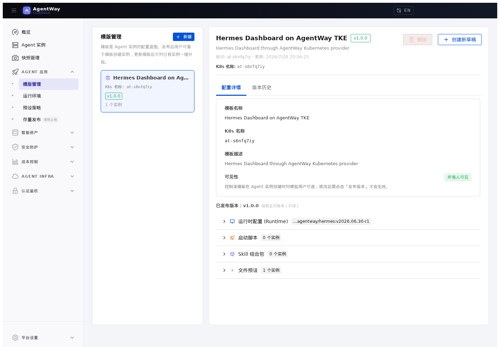
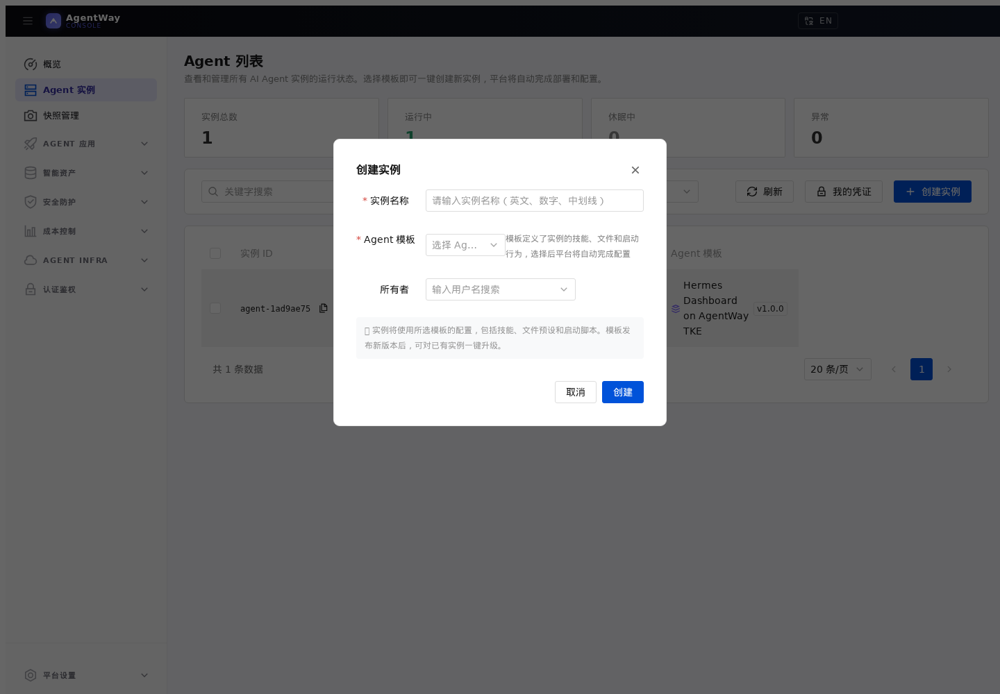
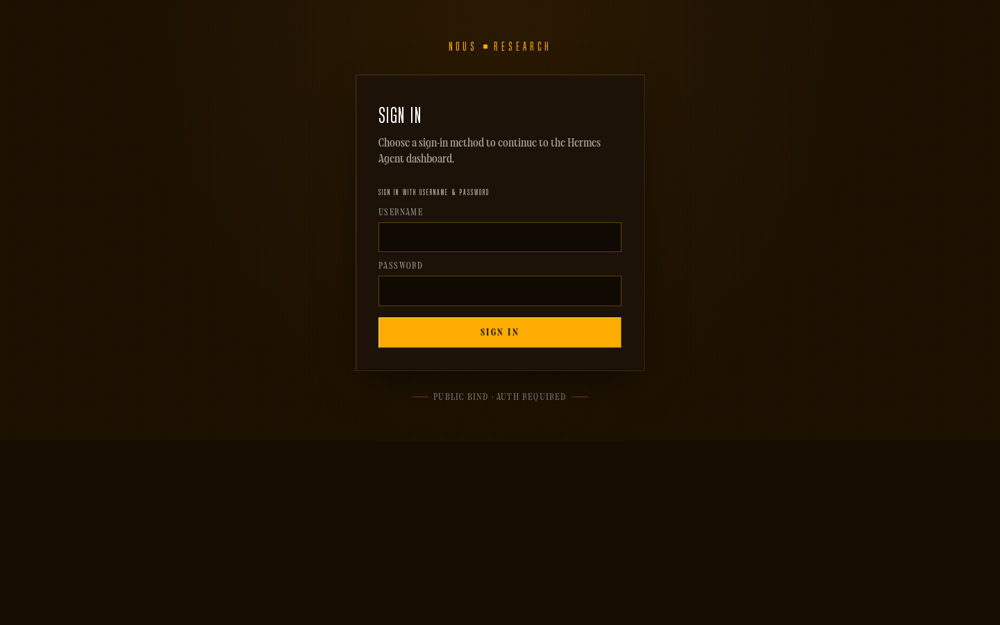

# 02. 通过 Console 创建 Hermes Dashboard

## 本章场景

你已经完成平台设置，现在要创建一个可以打开的 Hermes Dashboard 实例。

本章会通过 Console 完成：

1. 创建 Hermes 文件预设
2. 创建 Hermes 运行时
3. 创建并发布 Hermes 模板
4. 创建 Hermes 实例
5. 打开 Dashboard 登录页并验证

同一套配置也会给出 Kubernetes API 写法，方便你用 `kubectl apply` 复现。

---

## 前置章节

请先完成：

- [00. 在 TKE 上部署 AgentWay](./00-deploy-agent-way.md)
- [01. 准备 Hermes 需要的平台设置](./01-prepare-hermes-platform-settings.md)

---

## 为什么这一章这样组织

这一章先关注使用结果，而不是先解释 CRD 的创建顺序：

- Hermes Dashboard 能不能启动
- 登录页能不能打开
- 模型调用能不能走 AgentWay model gateway
- Dashboard 密码和 API Server Bearer key 能不能由平台统一生成

所以本章按 Console 的实际页面顺序来讲。底层 Kubernetes API 示例放在后半部分，作为自动化和问题定位入口。

---

## 你需要填写的参数

| 参数 | 是否必填 | 示例 |
|---|---|---:|
| Hermes 镜像 | 是 | `ccr.ccs.tencentyun.com/agentway/hermes:v2026.06.30-r1` |
| 模型名称 | 是 | `glm5` |
| Dashboard 端口 | 是 | `9119` |
| Dashboard 路径 | 是 | `login` |
| 健康检查路径 | 是 | `login` |
| 状态目录 | 是 | `/opt/data` |

---

## 通过 Console 操作

### 1. 创建 Hermes 文件预设

打开 **预设策略 / 文件预设**，点击 **新建文件预设**。

基础信息：

```text
显示名称：Hermes Dashboard Config
描述：Hermes Dashboard config.yaml and .env for AgentWay model gateway and gateway-token auth
```

添加第一个文件：

```text
文件路径：/opt/data/config.yaml
写入模式：覆盖写入
```

内容：

```yaml
model:
  provider: "custom"
  default: "glm5"
  base_url: "http://agent-way-model-gateway.agent-infra.svc.cluster.local:4000/v1"
  api_key: "$MODEL_API_KEY"

dashboard:
  basic_auth:
    username: "admin"
    password: "$AGENT_ACCESS_TOKEN"
    secret: "$AGENT_ACCESS_TOKEN"
```

添加第二个文件：

```text
文件路径：/opt/data/.env
写入模式：覆盖写入
```

内容：

```dotenv
API_SERVER_ENABLED=true
API_SERVER_HOST=0.0.0.0
API_SERVER_KEY=$AGENT_ACCESS_TOKEN
GATEWAY_ALLOW_ALL_USERS=true
```

`MODEL_API_KEY` 是平台为实例注入的模型网关虚拟 key。`AGENT_ACCESS_TOKEN` 是实例 gateway token。它会同时作为 Dashboard 登录密码和 Hermes API Server Bearer key。

这个 token 等同于实例访问凭证。不要把它出现在截图、日志、浏览器共享链接或聊天记录中；公网访问时请配合 HTTPS、访问控制和最小授权。



### 2. 创建 Hermes 运行时

打开 **Agent 应用 / 运行环境**，点击 **新建运行时**。

填写：

```text
显示名称：Hermes Dashboard on TKE
容器镜像：ccr.ccs.tencentyun.com/agentway/hermes:v2026.06.30-r1
启动命令：/usr/local/bin/hermes-ags-entrypoint.sh
Shell 类型：bash
访问端口：9119
访问 Path：login
健康检查路径：login
CPU：2
内存：4 Gi
容器运行权限：SETUID、SETGID
```

环境变量：

```text
HERMES_DASHBOARD=true
HERMES_DASHBOARD_HOST=0.0.0.0
HERMES_DASHBOARD_PORT=9119
```

当前开箱验证建议先不要启用持久化存储，等 Dashboard 跑通后再看 [07. 持久化 Hermes 数据目录](./07-persist-hermes-data-on-tke.md)。



### 3. 创建并发布 Hermes 模板

打开 **Agent 应用 / 模版管理**，点击 **新建 Agent 模板**。

填写：

```text
显示名称：Hermes Dashboard on AgentWay TKE
描述：Hermes Dashboard through AgentWay Kubernetes provider
可见性：所有人可见 或 仅管理员可见，按使用范围选择
运行环境：选择上一步创建的 Hermes 运行时
文件预设：选择 Hermes Dashboard Config
```

创建后进入模板详情，确认草稿内容正确，然后点击 **发布版本**。

发布说明可以填写：

```text
创建 Hermes Dashboard 模板
```



### 4. 创建 Hermes 实例

打开 **Agent 实例**，点击 **创建实例**。

填写：

```text
实例名称：hermes-dashboard-tke
Agent 模板：选择刚发布的 Hermes 模板
```

提交后，等待实例状态变为 `运行中`。



### 5. 打开 Hermes Dashboard

实例进入 `运行中` 后，Console 会显示访问地址。

打开访问地址后，应进入 Hermes Dashboard 登录页。登录方式：

```text
用户名：admin
密码：实例 gateway token
```



---

## 通过 Kubernetes API 操作

如果不通过 Console，可以直接创建等价资源。下面的示例省略了部分展示用注解，只保留使用时需要关心的字段。

### 1. 文件预设：`FileInjects`

```yaml
apiVersion: agent.agentway.io/v1alpha1
kind: FileInjects
metadata:
  name: hermes-dashboard-config-0
  namespace: agent-way-system
  labels:
    agentway.io/file-preset: hermes-dashboard-config
spec:
  path: /opt/data/config.yaml
  writeMode: overwrite
  content: |
    model:
      provider: "custom"
      default: "glm5"
      base_url: "http://agent-way-model-gateway.agent-infra.svc.cluster.local:4000/v1"
      api_key: "$MODEL_API_KEY"

    dashboard:
      basic_auth:
        username: "admin"
        password: "$AGENT_ACCESS_TOKEN"
        secret: "$AGENT_ACCESS_TOKEN"
---
apiVersion: agent.agentway.io/v1alpha1
kind: FileInjects
metadata:
  name: hermes-dashboard-config-1
  namespace: agent-way-system
  labels:
    agentway.io/file-preset: hermes-dashboard-config
spec:
  path: /opt/data/.env
  writeMode: overwrite
  content: |
    API_SERVER_ENABLED=true
    API_SERVER_HOST=0.0.0.0
    API_SERVER_KEY=$AGENT_ACCESS_TOKEN
    GATEWAY_ALLOW_ALL_USERS=true
```

### 2. 运行时：`AgentProfile`

```yaml
apiVersion: agent.agentway.io/v1alpha1
kind: AgentProfile
metadata:
  name: hermes-dashboard-runtime
  namespace: agent-way-system
  annotations:
    agentway.io/display-name: Hermes Dashboard on TKE
    agentway.io/description: Hermes Dashboard image using AgentWay model gateway
    agentway.io/runtime-shell: bash
    agentway.io/resource-cpu: "2"
    agentway.io/resource-memory-gi: "4"
    agentway.io/health-check-path: login
    agentway.io/runtime-capabilities-add: SETUID,SETGID
spec:
  image: ccr.ccs.tencentyun.com/agentway/hermes:v2026.06.30-r1
  command:
    - /usr/local/bin/hermes-ags-entrypoint.sh
  access:
    port: 9119
    path: login
  startupProbe:
    httpGet:
      path: /login
      port: 9119
  env:
    - key: HERMES_DASHBOARD
      value: "true"
    - key: HERMES_DASHBOARD_HOST
      value: 0.0.0.0
    - key: HERMES_DASHBOARD_PORT
        value: "9119"
```

### 3. 模板版本：`AgentTemplate` / `AgentTemplateRevision`

如果希望把这套配置沉淀为 Kubernetes 侧的模板对象，可以声明模板和发布版本：

```yaml
apiVersion: agent.agentway.io/v1alpha1
kind: AgentTemplate
metadata:
  name: hermes-dashboard-template
  namespace: agent-way-system
spec:
  displayName: Hermes Dashboard on AgentWay TKE
  description: Hermes Dashboard through AgentWay Kubernetes provider
  visibility: all
  version: v1.0.0
  currentRevisionRef: hermes-dashboard-template-v1-0-0
  agentSpecTemplate:
    profileRef: hermes-dashboard-runtime
    resources:
      cpuCores: 2
      memoryGi: 4
    fileInjectRefs:
      - hermes-dashboard-config-0
      - hermes-dashboard-config-1
---
apiVersion: agent.agentway.io/v1alpha1
kind: AgentTemplateRevision
metadata:
  name: hermes-dashboard-template-v1-0-0
  namespace: agent-way-system
spec:
  templateRef: hermes-dashboard-template
  version: v1.0.0
  lifecycle: published
  changelog: Create Hermes Dashboard template
  agentSpecTemplate:
    profileRef: hermes-dashboard-runtime
    resources:
      cpuCores: 2
      memoryGi: 4
    fileInjectRefs:
      - hermes-dashboard-config-0
      - hermes-dashboard-config-1
```

### 4. 实例：`Agent`

如果只想验证运行链路，也可以直接创建一个 inline `Agent`：

```bash
kubectl create namespace hermes-dashboard-tke
```

```yaml
apiVersion: agent.agentway.io/v1alpha1
kind: Agent
metadata:
  name: hermes-dashboard-tke
  namespace: hermes-dashboard-tke
  annotations:
    agentway.io/instance-name: hermes-dashboard-tke
    agentway.io/runtime-capabilities-add: SETUID,SETGID
  labels:
    agentway.io/owner: admin
spec:
  virtualAPIKey: <模型网关虚拟Key>
  accessToken: <实例访问Token>
  profile:
    image: ccr.ccs.tencentyun.com/agentway/hermes:v2026.06.30-r1
    command:
      - /usr/local/bin/hermes-ags-entrypoint.sh
    access:
      port: 9119
      path: login
    startupProbe:
      httpGet:
        path: /login
        port: 9119
    env:
      - key: HERMES_DASHBOARD
        value: "true"
      - key: HERMES_DASHBOARD_HOST
        value: 0.0.0.0
      - key: HERMES_DASHBOARD_PORT
        value: "9119"
  resources:
    cpuCores: 2
    memoryGi: 4
  fileInjects:
    - name: Hermes Dashboard Config
      path: /opt/data/config.yaml
      writeMode: overwrite
      content: |
        model:
          provider: "custom"
          default: "glm5"
          base_url: "http://agent-way-model-gateway.agent-infra.svc.cluster.local:4000/v1"
          api_key: "$MODEL_API_KEY"

        dashboard:
          basic_auth:
            username: "admin"
            password: "$AGENT_ACCESS_TOKEN"
            secret: "$AGENT_ACCESS_TOKEN"
    - name: Hermes Dashboard Config
      path: /opt/data/.env
      writeMode: overwrite
      content: |
        API_SERVER_ENABLED=true
        API_SERVER_HOST=0.0.0.0
        API_SERVER_KEY=$AGENT_ACCESS_TOKEN
        GATEWAY_ALLOW_ALL_USERS=true
```

> 通过 Console 创建实例时，平台会自动生成 `virtualAPIKey` 和 `accessToken`，并把它们注入为 `MODEL_API_KEY` 和 `AGENT_ACCESS_TOKEN`。直接写 `Agent` CR 时需要自己提供这两个值；生产环境建议使用预先创建的模型网关虚拟 Key，不要把模型网关 master key 直接放进实例。

---

## 预期效果

完成后，你应该看到：

- 实例状态为 `运行中`
- 实例访问地址非空
- 打开访问地址后进入 Hermes Dashboard 登录页
- `/opt/data/config.yaml` 和 `/opt/data/.env` 已写入容器
- Dashboard 登录密码和 API Server Bearer key 使用实例 gateway token

---

## 如何验证

Console 侧：

- **Agent 实例** 列表中实例状态为 `运行中`
- 访问地址可以打开 Hermes 登录页

Kubernetes 侧：

```bash
kubectl get agent -A
kubectl get agent <agent-id> -n <agent-id> -o yaml
```

重点看：

```yaml
status:
  phase: Running
  accessURL: ...
  fileInjectStatus:
    phase: Applied
  serviceHealth:
    ready: true
```

从访问端再验证一次 Dashboard：

```bash
curl -I http://<Hermes 访问地址>
```

如果当前网络暂时不能访问 Ingress 地址，可以临时用端口转发验证：

```bash
kubectl -n <agent-id> port-forward pod/<pod-name> 19119:9119
curl -I http://127.0.0.1:19119/login
```

登录后在 Dashboard 中发起一次模型请求，确认模型调用也通过。Bearer key 与登录密码都来自实例 gateway token，定位问题时只记录是否成功，不记录 token 明文。

---

## 下一章

完成后，继续：

- [03. 控制 Hermes 的外部访问范围](./03-control-hermes-network-access.md)
