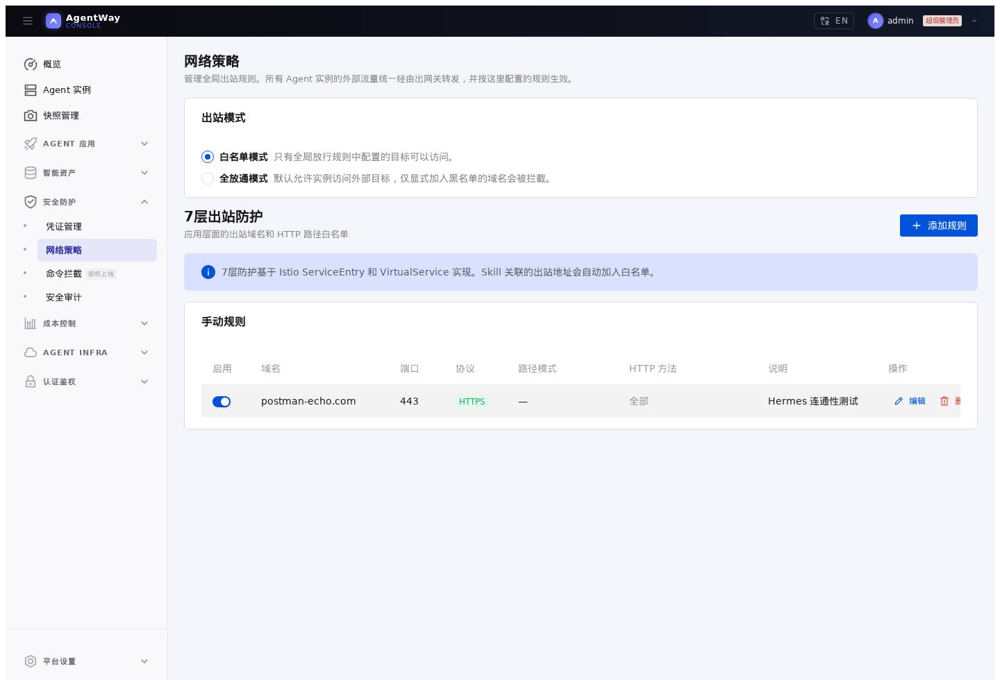

# 03. 控制 Hermes 的外部访问范围

## 本章场景

Hermes Dashboard 已经可以运行。现在你希望控制它能访问哪些外部服务，例如模型 Provider、代码仓库、企业内部 API 或工具服务。

本章只从使用角度介绍出口访问控制，不展开网关实现细节。

---

## 前置章节

请先完成：

- [02. 通过 Console 创建 Hermes Dashboard](./02-create-hermes-dashboard-with-console.md)

---

## 为什么这一章这样组织

Kubernetes provider 下，出口访问规则是平台级配置。它不是每个实例单独填写一份规则，而是由管理员统一维护全局出口模式和出口规则。

这种方式适合生产环境：

- 管理员集中管理外部域名
- 所有 Agent 实例使用同一套出口边界
- 后续新增 Hermes 实例自动受到同样规则约束

---

## 你需要填写的参数

| 参数 | 是否必填 | 示例 |
|---|---|---:|
| 出口模式 | 是 | `whitelist` |
| 目标域名 | 是 | `postman-echo.com` |
| 协议 | 是 | `https` |
| 端口 | 是 | `443` |
| 描述 | 否 | `Hermes 连通性测试` |

---

## 通过 Console 操作

打开 **安全防护 / 网络策略**。

建议生产环境使用：

```text
出站模式：白名单模式
```

然后点击 **添加规则**，为 Hermes 需要访问的目标增加规则：

```text
域名：postman-echo.com
端口：443
协议：HTTPS
启用：开启
描述：Hermes 连通性测试
```

如果使用通配符域名，例如飞书或企业微信相关域名，可以填写：

```text
*.example.com
```

通配符会扩大外联范围。生产环境只添加业务确实需要的最小域名集合，避免把不必要的公网目标放进白名单。



---

## 通过 Kubernetes API 操作

Console 中的全局出口规则最终会写入 `agent-infra/global` 这条 `AgentNetPolicy`。

这是平台级策略，误改会影响所有 Agent 实例。直接操作前先备份当前规则，再合并修改，不要用新 YAML 直接覆盖已有规则。

```bash
kubectl get agentnetpolicy global -n agent-infra -o yaml > agentnetpolicy-global.backup.yaml
```

示例：

先设置白名单模式：

```bash
kubectl patch configmap agent-way-config -n agent-way-system --type merge -p '{
  "data": {
    "egress-mode": "whitelist"
  }
}'
```

再合并允许规则。为了让 Console 能继续读取和编辑，建议 `rules[].name` 使用数字字符串；如果直接写业务名称，Operator 可以处理，但 Console 列表不一定能把它反解成页面规则 ID。

```yaml
apiVersion: agent.agentway.io/v1alpha1
kind: AgentNetPolicy
metadata:
  name: global
  namespace: agent-infra
spec:
  rules:
    - name: "1"
      host: postman-echo.com
      port: 443
      protocol: https
      action: allow
      description: Hermes 连通性测试
    - name: "2"
      host: api.github.com
      port: 443
      protocol: https
      action: allow
      description: GitHub API
```

查看当前规则：

```bash
kubectl get agentnetpolicy global -n agent-infra -o yaml
```

---

## 预期效果

完成后：

- 白名单模式下，只有规则中允许的外部目标可以访问
- 新创建的 Hermes 实例自动使用同一套出口边界
- Console 中的规则状态和 Kubernetes 中的 `AgentNetPolicy` 保持一致

---

## 如何验证

Console 侧：

- **安全防护 / 网络策略** 页面显示 `白名单模式`
- 目标域名规则为启用状态

Kubernetes 侧：

```bash
kubectl get agentnetpolicy global -n agent-infra -o yaml
```

重点确认：

```yaml
status:
  phase: Ready
  observedGeneration: <与 metadata.generation 一致>
```

实例上也可以查看平台是否记录了已应用的全局模式：

```bash
kubectl get agent <agent-id> -n <agent-id> \
  -o jsonpath='{.metadata.annotations.agentway\.io/applied-global-egress-mode}{"\n"}'
```

最后从 Hermes Pod 中访问 `https://postman-echo.com/get` 验证允许目标可以访问，再访问一个未加入白名单的测试域名确认会被拦截。不要在验证命令里输出业务数据。

---

## 下一章

完成后，继续：

- [04. 复用 Hermes 配置](./04-reuse-hermes-configuration.md)
