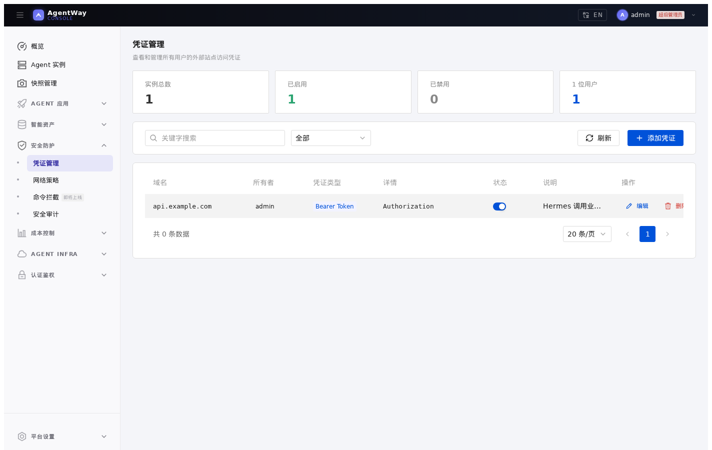
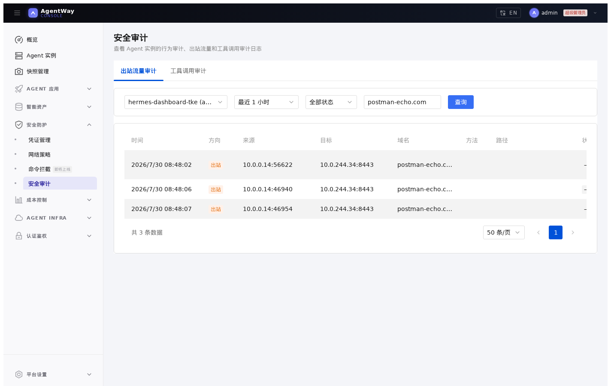
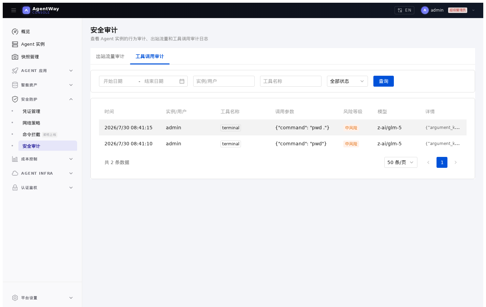

# 05. 使用凭证注入和审计 Hermes

## 本章场景

Hermes Dashboard 已经可以运行。现在你希望它访问外部 API 时不用把 Token 写进 Hermes 配置文件、环境变量或提示词，同时还能查看它的外联和工具调用记录。

注意：**工具调用审计依赖 AgentWay 模型网关**。Hermes 必须使用 [01. 准备 Hermes 需要的平台设置](./01-prepare-hermes-platform-settings.md) 中配置的模型网关地址和网关模型 ID。如果 Hermes 配置成直接访问外部模型 Provider，模型响应不会经过 AgentWay 模型网关，工具调用审计不可用。

本章覆盖：

- 为外部站点注册访问凭证
- 让 Hermes 出站请求按域名自动带上凭证
- 查看出站流量审计
- 查看工具调用审计

---

## 前置章节

请先完成：

- [02. 通过 Console 创建 Hermes Dashboard](./02-create-hermes-dashboard-with-console.md)
- [03. 控制 Hermes 的外部访问范围](./03-control-hermes-network-access.md)

---

## 为什么这样使用凭证

不要把外部系统 Token 写进 `/opt/data/config.yaml`、`.env`、文件预设或模板说明中。更推荐的方式是：

1. 在 AgentWay 中按目标域名注册凭证。
2. Hermes 仍然按普通 HTTPS 地址访问目标站点。
3. 出站链路根据目标域名和实例归属自动注入 Header 或客户端证书。

这样凭证不会出现在实例文件、Pod 环境变量、模板版本或截图中；同一用户后续创建的 Hermes 实例也可以复用自己的凭证。

---

## 你需要填写的参数

| 参数 | 是否必填 | 示例 |
|---|---|---:|
| 目标域名 | 是 | `postman-echo.com` |
| 凭证类型 | 是 | `Bearer Token` / `Basic` / `自定义 Header` / `客户端证书` |
| Header 名称 | Header 类凭证需要 | `Authorization` / `X-API-Key` |
| 凭证值 | Header 类凭证需要 | `<API Token>` |
| 证书链和私钥 | 客户端证书需要 | PEM 内容 |
| 所属用户 | 管理员代填时需要 | `admin` |

---

## 通过 Console 操作

### 1. 准备验证目标

建议先用测试站点和测试 Token 验证凭证注入链路，例如：

```text
目标域名：postman-echo.com
验证地址：https://postman-echo.com/headers
测试 Token：doc-test-token
```

不要用真实业务 API Key 做第一次验证。`postman-echo.com/headers` 会回显请求 Header，只适合验证测试 Token 是否被注入。

确认 **安全防护 / 网络策略** 中已经允许 Hermes 访问该域名：

```text
域名：postman-echo.com
端口：443
协议：HTTPS
启用：开启
```

凭证注入只解决“带什么凭证访问”的问题，不会自动放开出口白名单。

### 2. 添加外部站点凭证

打开 **安全防护 / 凭证管理**，点击 **添加凭证**。

普通用户只能管理自己的凭证；管理员可以在页面中为指定用户添加凭证。凭证所属用户要和 Hermes 实例 Owner 一致，否则该实例不会注入这条凭证。

Header Token 场景填写：

```text
目标域名：postman-echo.com
凭证类型：Bearer Token
Header 名称：Authorization
凭证值：doc-test-token
启用：开启
描述：Hermes 凭证注入验证
```

如果目标系统使用自定义 Header，可以选择自定义类型：

```text
目标域名：api.example.com
凭证类型：自定义 Header
Header 名称：X-API-Key
凭证值：<API Key>
启用：开启
```

客户端证书场景填写证书链和私钥 PEM。证书内容会加密保存，列表中只展示证书指纹、有效期和签发者信息。

不要使用通配符域名保存凭证。凭证注入应按最小域名范围配置，例如 `postman-echo.com` 或 `api.example.com`，不要写成整个根域。



### 3. 在 Hermes 中访问目标域名

在 Hermes Dashboard 中让 Agent 访问验证地址，例如让它读取：

```text
https://postman-echo.com/headers
```

如果目标域名匹配已启用凭证，出站链路会自动注入对应 Header 或客户端证书。使用上面的测试 Token 时，返回结果中应能看到类似：

```json
{
  "authorization": "Bearer doc-test-token"
}
```

验证完成后，删除这条测试凭证，或者改成真实业务域名和真实凭证。真实凭证不要让目标服务回显，也不要出现在截图、日志或聊天记录中。

### 4. 查看出站流量审计

打开 **安全防护 / 安全审计**，进入 **出站流量审计**。

常用查看方式：

```text
实例：选择 Hermes 实例
时间范围：最近 1 小时
关键字：postman-echo.com
```

这里用于确认 Hermes 是否访问了预期域名、响应码是否正常、请求是否经过出站链路。出站流量审计不用于查看凭证明文；它只帮助确认访问行为。审计日志可能包含路径和目标地址，不要把包含敏感业务路径的完整日志贴到共享文档或聊天记录中。



### 5. 查看工具调用审计

打开 **安全防护 / 安全审计**，进入 **工具调用审计**。

常用过滤条件：

```text
实例：Hermes 实例名
工具名：例如 bash / browser / search
风险等级：low / medium / high
时间范围：按需要选择
```

工具调用审计来自模型网关记录的工具调用信息，适合回答这些问题：

- Hermes 是否触发了工具调用
- 调用了哪个工具
- 调用参数是否异常
- 哪些调用需要进一步复核

如果这里一直没有记录，先确认 Hermes 的模型配置是否仍然使用：

```text
base_url: http://agent-way-model-gateway.agent-infra.svc.cluster.local:4000/v1
model id: glm5
```

如果 Hermes 直接请求外部模型 Provider，工具调用审计不会产生记录。



---

## 通过 Console API 操作

创建测试凭证，并记录返回的 `id`：

```bash
CREDENTIAL_ID=$(curl -s -X POST http://<console>/api/credentials \
  -H 'Authorization: Bearer <token>' \
  -H 'Content-Type: application/json' \
  -d '{
    "domain": "postman-echo.com",
    "credType": "bearer",
    "headerName": "Authorization",
    "headerValue": "doc-test-token",
    "enabled": true,
    "description": "Hermes 凭证注入验证"
  }' | jq -r .id)
```

查看当前用户凭证：

```bash
curl -s http://<console>/api/credentials \
  -H 'Authorization: Bearer <token>'
```

创建完成后，在 Hermes Dashboard 中访问：

```text
https://postman-echo.com/headers
```

如果凭证注入生效，返回结果中应能看到测试 Header。然后查询出站审计确认访问行为。

查询实例出站审计：

```bash
curl -s 'http://<console>/api/instances/<agent-id>/audit-logs?since=3600&tail=500&keyword=postman-echo.com' \
  -H 'Authorization: Bearer <token>'
```

查询工具调用审计：

```bash
curl -s 'http://<console>/api/tool-call-audit?instance=<agent-id>&tool=bash&page=1&size=50' \
  -H 'Authorization: Bearer <token>'
```

验证完成后删除测试凭证：

```bash
curl -X DELETE http://<console>/api/credentials/${CREDENTIAL_ID} \
  -H 'Authorization: Bearer <token>'
```

---

## 通过 Kubernetes API 操作

Console 创建的 Header 类凭证会落为 `Secret` 和 `AgentCredential`。如果不通过 Console，可以直接创建等价资源。

先保存凭证值：

```yaml
apiVersion: v1
kind: Secret
metadata:
  name: credential-postman-echo-data
  namespace: agent-way-system
type: Opaque
stringData:
  headerValue: doc-test-token
```

再声明凭证注入规则：

```yaml
apiVersion: agent.agentway.io/v1alpha1
kind: AgentCredential
metadata:
  name: credential-postman-echo
  namespace: agent-way-system
  labels:
    agentway.io/type: credential
    agentway.io/owner: admin
    agentway.io/domain: postman-echo.com
  annotations:
    agentway.io/description: Hermes 凭证注入验证
spec:
  enabled: true
  secretRef:
    name: credential-postman-echo-data
  items:
    - host: postman-echo.com
      credType: bearer
      secretKey: headerValue
      headerName: Authorization
```

说明：

- `agentway.io/owner` 决定这条凭证属于哪个用户；该用户创建的 Hermes 实例访问匹配域名时才会注入。
- `secretKey` 指向 Secret 中保存真实凭证值的 key。
- 直接写 CRD 时不要把真实凭证写进 `AgentCredential` 本体。

查看同步状态：

```bash
kubectl get agentcredential credential-postman-echo -n agent-way-system -o yaml
```

重点确认：

```yaml
status:
  phase: Synced
  observedGeneration: <与 metadata.generation 一致>
```

通过 Kubernetes API 验证凭证注入时，先找到 Hermes Pod：

```bash
kubectl get pod -n <agent-id>
```

再用测试 Token 访问回显地址。如果 Hermes 镜像中没有 `curl`，可以继续使用 Hermes Dashboard 访问同一个地址完成验证。

```bash
kubectl exec -n <agent-id> <pod-name> -- \
  curl -s https://postman-echo.com/headers
```

返回结果中应能看到 `Authorization: Bearer doc-test-token`。验证完成后删除测试凭证：

```bash
kubectl delete agentcredential credential-postman-echo -n agent-way-system
kubectl delete secret credential-postman-echo-data -n agent-way-system
```

工具调用审计没有单独的声明式 CRD。审计记录请通过 Console 或 Console API 查询。

---

## 预期效果

完成后：

- Hermes 配置文件中不需要保存外部 API Token
- 目标域名出站请求会自动带上匹配凭证
- 出站流量审计能看到实例访问记录
- 工具调用审计能看到模型网关记录的工具调用事件

---

## 如何验证

Console 侧：

- **凭证管理** 中凭证为启用状态
- Hermes 访问 `https://postman-echo.com/headers` 时能看到测试 Header
- **安全审计 / 出站流量审计** 能看到访问 `postman-echo.com` 的记录
- **安全审计 / 工具调用审计** 能按实例筛选到工具调用记录；如果 Hermes 直连外部模型 Provider，则这里不会有记录

Kubernetes 侧：

```bash
kubectl get agentcredential -n agent-way-system
kubectl get agentcredential credential-postman-echo -n agent-way-system -o jsonpath='{.status.phase}{"\n"}'
```

如果需要测试凭证注入，建议使用测试环境和测试 Token；不要在验证命令里让目标服务回显真实 Header。

---

## 下一章

完成后，继续：

- [06. 设置实例限额和 Token 额度](./06-control-hermes-quotas.md)
