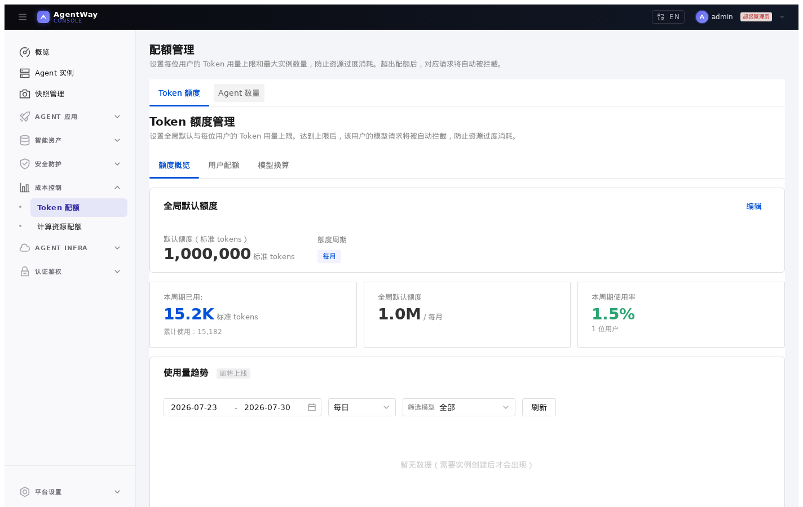
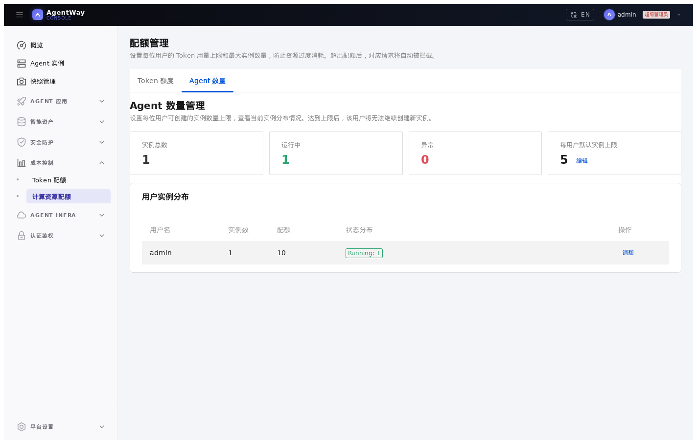

# 06. 设置实例限额和 Token 额度

## 本章场景

Hermes 已经可以创建和访问。现在你希望控制资源使用范围：

- 每个用户最多能创建多少个 Agent 实例
- 每个用户在一个周期内最多能消耗多少标准 tokens
- 不同模型如何换算成统一的标准 tokens
- 如何查看 Token 使用趋势

注意：**Token 额度管理依赖 AgentWay 模型网关**。Hermes 必须通过模型网关地址和网关模型 ID 调用模型，Token 消耗统计、用户额度和额度拦截才会生效。如果 Hermes 配置成直接访问外部模型 Provider，AgentWay 无法统计这部分模型调用，也无法执行 Token 额度限制。实例数量限额不依赖模型网关。

---

## 前置章节

请先完成：

- [02. 通过 Console 创建 Hermes Dashboard](./02-create-hermes-dashboard-with-console.md)
- [05. 使用凭证注入和审计 Hermes](./05-use-credentials-and-audit-hermes.md)

---

## 这两类限额的区别

实例限额控制“还能不能继续创建实例”。达到上限后，创建实例会被拒绝，已有实例不受影响。

Token 额度控制“还能不能继续调用模型”。达到额度后，模型网关会拦截对应用户的模型请求，实例本身仍然运行。

模型供应商返回的 token 计量可能不同。AgentWay 使用“标准 tokens”作为统一口径，可以通过模型换算率把不同模型的消耗统一到同一张表中。

设置 Token 额度前，先确认 Hermes 的模型配置仍然指向 AgentWay 模型网关。例如在文件预设或实例配置中保持：

```yaml
model:
  default: "glm5"
  base_url: "http://agent-way-model-gateway.agent-infra.svc.cluster.local:4000/v1"
  api_key: "$MODEL_API_KEY"
```

其中 `glm5` 是面向 Agent 的网关模型 ID，上游真实模型 ID 在 **模型网关** 页面中维护。

---

## 你需要填写的参数

| 参数 | 是否必填 | 示例 |
|---|---|---:|
| 全局实例上限 | 是 | `5` |
| 用户实例上限 | 可选 | `10` |
| 全局 Token 额度 | 是 | `1000000` |
| 额度周期 | 是 | `monthly` |
| 用户 Token 额度 | 可选 | `5000000` |
| 模型换算率 | 可选 | `glm5 = 1.0` |

---

## 通过 Console 操作

### 1. 确认 Hermes 走模型网关

先打开 Hermes 实例详情，确认实例配置中使用的是平台内模型网关地址，并且模型 ID 使用网关模型 ID，例如：

```text
base_url：http://agent-way-model-gateway.agent-infra.svc.cluster.local:4000/v1
model id：glm5
```

如果实例直连外部模型 Provider，可以继续设置实例数量限额，但 Token 额度、Token 使用趋势和模型换算不会对这个实例的模型调用生效。

### 2. 设置实例数量上限

打开 **成本控制 / 计算资源配额**。

管理员可以设置：

```text
全局默认实例上限：5
```

也可以在用户列表中为某个用户单独调额：

```text
用户：admin
实例上限：10
```

如果用户选择“跟随全局默认”，实际上限使用全局默认值。达到上限后，该用户继续创建 Hermes 实例会失败。

验证时建议使用测试用户，不要直接限制正在使用生产实例的用户。可以先查看该用户当前实例数，然后把用户实例上限临时设为当前实例数，再尝试创建一个新的 Hermes 实例。创建失败后，把用户实例上限恢复为原值或“跟随全局默认”。

### 3. 设置全局 Token 额度

打开 **成本控制 / Token 配额**。

在 **全局默认额度** 中填写：

```text
默认额度：1000000
额度周期：monthly
```

这里的额度单位是标准 tokens。周期可以选择 `daily`、`weekly` 或 `monthly`。

### 4. 设置用户 Token 额度

在 **用户配额** 中选择用户，点击 **调额**。

常见配置：

```text
跟随全局默认
```

或者：

```text
自定义额度：5000000
```

设为 `0` 表示禁止该用户继续使用模型额度；设为自定义值后，该用户不再跟随全局默认。

验证 Token 限额时，建议在测试环境中为测试用户设置一个较小额度，然后在 Hermes Dashboard 中发起一次会调用模型的请求。回到 **Token 配额** 页面刷新，确认该用户的已使用量增加。如果把测试用户额度设为 `0`，该用户后续通过模型网关发起的模型请求应被拒绝。验证完成后恢复额度，避免影响后续测试。

### 5. 设置模型换算率

在 **模型换算** 中确认 Hermes 使用的模型，例如 `glm5`。

如果所有模型都按 1:1 计入标准 tokens，可以保持默认换算。如果某个上游模型成本更高，可以设置更高换算率，让它消耗更多标准 tokens。

### 6. 查看使用趋势

在 **额度概览** 和 **用户配额** 中查看：

- 当前周期已使用 tokens
- 总使用量
- 按模型拆分的使用量
- 用户是否接近额度上限





---

## 通过 Console API 操作

先确认目标 Hermes 实例使用模型网关。可以通过实例详情接口查看配置文件内容，或在 Console 中查看实例配置。Token 额度只对经过模型网关的请求生效。

设置全局实例上限需要更新平台基础设置。先读取当前设置，再只改 `maxInstancesPerUser`：

```bash
curl -s http://<console>/api/settings/system \
  -H 'Authorization: Bearer <token>'
```

保存时保留返回体里的其他字段，只修改实例上限：

```bash
curl -X PUT http://<console>/api/settings/system \
  -H 'Authorization: Bearer <token>' \
  -H 'Content-Type: application/json' \
  -d '{
    "systemDomain": "agentway.example.com",
    "ingressRoutingMode": "subdomain",
    "defaultTokenQuota": -1,
    "maxInstancesPerUser": 5,
    "runAsRoot": false,
    "callerIdentityHeaders": true
  }'
```

设置全局 Token 额度：

```bash
curl -X PUT http://<console>/api/quotas/global \
  -H 'Authorization: Bearer <token>' \
  -H 'Content-Type: application/json' \
  -d '{
    "defaultTokenQuota": 1000000,
    "period": "monthly"
  }'
```

查看用户配额：

```bash
curl -s http://<console>/api/quotas \
  -H 'Authorization: Bearer <token>'
```

为用户设置实例上限和 Token 额度。下面示例把用户实例上限设为 `10`，Token 额度设为 `5000000`：

```bash
curl -X PUT http://<console>/api/quotas/<user-id> \
  -H 'Authorization: Bearer <token>' \
  -H 'Content-Type: application/json' \
  -d '{
    "instanceLimit": 10,
    "tokenLimit": 5000000
  }'
```

验证实例数量限额时，先从 `/api/quotas` 查看该用户当前实例数，再把 `instanceLimit` 临时设成当前实例数。随后用 Console 或创建实例 API 再创建一个 Hermes 实例，预期会被拒绝。验证完成后恢复：

```bash
curl -X PUT http://<console>/api/quotas/<user-id> \
  -H 'Authorization: Bearer <token>' \
  -H 'Content-Type: application/json' \
  -d '{
    "instanceLimit": -1,
    "tokenLimit": 5000000
  }'
```

验证 Token 限额时，可以在测试环境把测试用户额度临时设为 `0`：

```bash
curl -X PUT http://<console>/api/quotas/<user-id> \
  -H 'Authorization: Bearer <token>' \
  -H 'Content-Type: application/json' \
  -d '{
    "instanceLimit": -1,
    "tokenLimit": 0
  }'
```

然后在 Hermes Dashboard 中发起一次会调用模型的请求。因为请求经过模型网关，预期会被额度限制拦截。验证完成后恢复额度：

```bash
curl -X PUT http://<console>/api/quotas/<user-id> \
  -H 'Authorization: Bearer <token>' \
  -H 'Content-Type: application/json' \
  -d '{
    "instanceLimit": -1,
    "tokenLimit": 5000000
  }'
```

查询 Token 使用趋势：

```bash
curl -s 'http://<console>/api/quotas/usage-stats?start=2026-07-01&end=2026-07-31&granularity=daily' \
  -H 'Authorization: Bearer <token>'
```

---

## 通过 Kubernetes API 操作

直接使用 Kubernetes API 时，用户级实例限额对应 `AgentQuota`。下面示例限制 `admin` 用户最多创建 10 个实例：

```yaml
apiVersion: agent.agentway.io/v1alpha1
kind: AgentQuota
metadata:
  name: user-admin
  namespace: agent-way-system
spec:
  subjectScope: user
  subject: admin
  maxInstances: 10
```

用户级 Token 额度对应 `TokenQuota`。下面示例限制 `admin` 用户在月周期内最多消耗 5000000 标准 tokens：

```yaml
apiVersion: agent.agentway.io/v1alpha1
kind: TokenQuota
metadata:
  name: user-admin
  namespace: agent-way-system
spec:
  subjectScope: user
  subject: admin
  budget: 5000000
  period: monthly
```

保存为 YAML 后应用：

```bash
kubectl apply -f user-admin-agentquota.yaml
kubectl apply -f user-admin-tokenquota.yaml
```

查看当前声明：

```bash
kubectl get agentquota -n agent-way-system
kubectl get tokenquota -n agent-way-system
kubectl get agentquota user-admin -n agent-way-system -o yaml
kubectl get tokenquota user-admin -n agent-way-system -o yaml
```

说明：

- `AgentQuota.spec.subject` 和 `TokenQuota.spec.subject` 使用用户名，例如 `admin`。
- `AgentQuota.spec.maxInstances` 控制该用户可创建的实例数。
- `TokenQuota.spec.budget` 使用标准 tokens。
- 全局默认实例上限当前通过平台设置保存；用户级覆盖可以用 `AgentQuota` 声明。
- 全局默认 Token 额度当前建议通过 Console 或 `/api/quotas/global` 设置，以便同步到模型网关已有虚拟 Key。
- `TokenQuota` 只限制通过 AgentWay 模型网关发起的模型请求。Hermes 如果直连外部模型 Provider，不会被这条额度限制拦截。

通过 Kubernetes API 创建限额后，实际效果仍然通过用户操作验证：

```bash
kubectl get agentquota user-admin -n agent-way-system -o jsonpath='{.spec.maxInstances}{"\n"}'
kubectl get tokenquota user-admin -n agent-way-system -o jsonpath='{.spec.budget}{"\n"}'
```

实例限额验证方式：把 `maxInstances` 临时设为该用户当前实例数，然后通过 Console 或 API 再创建一个 Hermes 实例，预期创建失败。

Token 额度验证方式：把测试用户的 `TokenQuota.spec.budget` 临时设为 `0`，然后在 Hermes Dashboard 中发起一次模型请求。只有当 Hermes 经过模型网关调用 `glm5` 这类网关模型 ID 时，请求才会被额度限制拦截。

验证完成后删除测试限额，或恢复为业务需要的数值：

```bash
kubectl delete agentquota user-admin -n agent-way-system
kubectl delete tokenquota user-admin -n agent-way-system
```

---

## 预期效果

完成后：

- 用户创建实例时会受到实例数量上限约束
- 经过 AgentWay 模型网关的用户模型请求会受到 Token 额度约束
- 管理员可以看到用户维度的 Token 使用情况
- Hermes 实例列表中的 token 消耗和预算字段会与模型网关统计保持一致

---

## 如何验证

Console 侧：

- **成本控制 / 计算资源配额** 中显示全局实例上限和用户实例数
- **成本控制 / Token 配额** 中显示全局默认额度、用户额度和使用趋势
- 超过实例上限的用户继续创建实例会失败
- 测试用户额度设为 `0` 后，通过模型网关发起的模型请求会被拒绝

Kubernetes 侧：

```bash
kubectl get agentquota -n agent-way-system
kubectl get tokenquota -n agent-way-system
kubectl get agent -A
```

如果刚调整了 Token 额度，可以在 Hermes Dashboard 中发起一次模型请求，然后回到 **Token 配额** 页面刷新使用量。如果使用量没有变化，先检查 Hermes 是否仍然使用模型网关地址和网关模型 ID；直连外部模型 Provider 的请求不会进入 Token 额度统计。

---

## 下一章

完成后，继续：

- [07. 持久化 Hermes 数据目录](./07-persist-hermes-data-on-tke.md)
