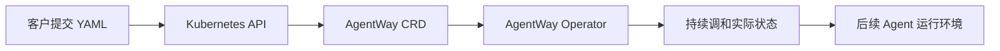

# 00. 准备集群环境并部署 Operator

## 本章场景

你第一次部署 AgentWay，希望先把运行环境准备好，让后续的 Agent 资源有人来接管和调和。

> **入口说明**：本 cookbook 面向客户，使用 raw manifest 快速搭建非托管 operator-only 环境。只使用 AGS provider 且不依赖 Console / Backend 的生产托管部署，请使用 AgentWay 项目的 [`agent-way-operator-addon` chart](https://github.com/TencentCloudAgentRuntime/agentway/tree/main/deploy/helm/agent-way-operator-addon)。客户需要自助安装完整控制面并使用 Kubernetes provider 时，请使用 [`agent-way` chart](https://github.com/TencentCloudAgentRuntime/agentway/tree/main/deploy/helm/agent-way)。

本章按 operator-only 方式部署：只安装 AgentWay CRD、RBAC、Operator，以及可选的 Agent connect API；不部署完整 Console、Backend 或 Helm chart 控制面。

---

## 前置章节

无。这是第一章。

---

## 为什么先做这一步

Operator 是整条链路的控制中心。

你后面会创建的 `AgentProfile`、`AgentTemplate`、`Agent`、`AgentNetPolicy`、`AgentRollout` 都只是 Kubernetes 里的对象定义。
真正让这些对象“生效”的，是 Operator 的调和逻辑。

所以第一章必须先完成环境准备和 Operator 部署。否则后面即使你把 YAML 全部 apply 进去，也只会得到一堆静态对象，而不会真的创建出可运行的 Agent。

---

## 原理说明

可以把 Operator 理解成“平台控制面”。

- 你声明想要什么（YAML）
- Operator 负责持续把声明的目标状态调和成真实状态

这也是 Kubernetes 模式最重要的工作方式：**声明式配置 + 持续调和**。

## 场景示意图



## 你需要填写的参数

这一章通常**不需要填写业务参数**，但你需要确认：

- 你当前 `kubectl` 指向的是目标集群
- 你拥有该集群的安装权限

建议先执行：

```bash
kubectl config current-context
kubectl get nodes
```

---

## 你要做什么

1. 安装 CRD
2. 部署 AgentWay Operator
3. 确认 Operator Ready
4. 如需通过 `kubectl agent exec` 登录 AGS shell，再增量开启 Agent connect API

---

## manifest 文件

基础 Operator 部署使用：

```bash
kubectl apply -f ./openclaw-browser-on-TencentAGS/manifests/00-00-operator.yaml
```

如果需要通过 `kubectl agent exec` 按 Agent 名称进入 AGS shell，再增量开启 AA/connect 服务：

```bash
kubectl apply -f ./openclaw-browser-on-TencentAGS/manifests/00-01-connect.yaml
```

`00-01-connect.yaml` 会额外创建：

- `agent-way-connect` ServiceAccount / RBAC
- `agent-way-connect` Deployment（默认 2 副本）
- `agent-way-connect` Service（9443）
- `v1alpha1.connect.agentway.io` APIService

---

## 执行步骤

本示例的静态清单使用 `v1.0.15-d5afc116` 镜像。先获取同版本 AgentWay 源码并安装 CRD：

```bash
git clone --depth 1 --branch v1.0.15-d5afc116 \
  https://github.com/TencentCloudAgentRuntime/agentway.git agentway-v1.0.15-d5afc116
kubectl apply -f ./agentway-v1.0.15-d5afc116/operator/config/crd/generated/
```

再部署 Operator：

```bash
kubectl apply -f ./openclaw-browser-on-TencentAGS/manifests/00-00-operator.yaml
```

等待 Operator Ready：

```bash
kubectl rollout status deployment/agent-way-operator -n agent-way-system

# 验证 Operator Lease 抢主已启用（holderIdentity 应为当前 operator Pod）
kubectl get lease agent-way-operator-leader-election \
  -n agent-way-system \
  -o jsonpath='{.spec.holderIdentity}{"\n"}'
```

如果你需要 shell 登录能力，再开启 Agent connect：

```bash
kubectl apply -f ./openclaw-browser-on-TencentAGS/manifests/00-01-connect.yaml
kubectl rollout status deployment/agent-way-connect -n agent-way-system
```

确认 Agent connect API 已注册：

```bash
kubectl get svc agent-way-connect -n agent-way-system
kubectl get apiservice v1alpha1.connect.agentway.io
```

---

## 预期效果

基础部署完成后，你应该得到：

- `agent-way-system` namespace 已创建
- `agent-infra` namespace 已创建
- `agent-way-operator` Deployment 正常运行
- `agent-way-operator-metrics` Service 已创建
- `agent-way-operator-leader-election` Lease 已创建，表示 Operator 使用标准 controller-runtime 抢主模式；如果后续将 Deployment 扩容到 2+ 副本，只有 leader 会执行 reconcile。

增量开启 `00-01-connect.yaml` 后，你还会得到：

- `agent-way-connect` Deployment 正常运行（默认 2 副本）
- `agent-way-connect` Service 已创建
- `v1alpha1.connect.agentway.io` APIService 为 `Available=True`

这样在第 02 章创建好 Agent 后，你就可以直接通过 `Agent` 名称进入对应的 AGS shell，而不需要手工查 sandbox ID。

---

## 如何验证

基础 Operator：

```bash
kubectl get pods -n agent-way-system
kubectl get deploy agent-way-operator -n agent-way-system
kubectl get svc agent-way-operator-metrics -n agent-way-system
```

你应该看到：

- `agent-way-operator` 为 `READY 1/1`
- `agent-way-operator-metrics` Service 已存在

如果已开启 Agent connect：

```bash
kubectl get deploy agent-way-connect -n agent-way-system
kubectl get svc agent-way-connect -n agent-way-system
kubectl get apiservice v1alpha1.connect.agentway.io
```

你应该看到：

- `agent-way-connect` 为 `READY 2/2`
- `agent-way-connect` Service 已存在
- `v1alpha1.connect.agentway.io` 的 `AVAILABLE` 为 `True`

---

## 下一章

完成后，继续：

- [01. 准备 Tencent Agent Runtime 基础设施](./01-prepare-tencent-agent-runtime.md)
