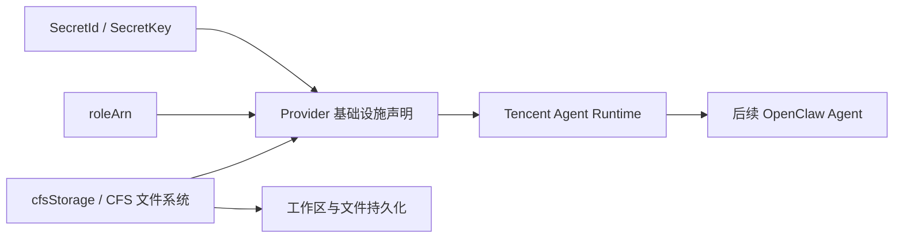

# 01. 准备 Tencent Agent Runtime 基础设施

## 本章场景

你已经部署好了 Operator，下一步要让后续创建出来的 Agent 真正运行到 Tencent Agent Runtime 上。

---

## 前置章节

请先完成：
- [00. 准备集群环境并部署 Operator](./00-prepare-cluster-and-deploy-operator.md)

---

## 为什么这一步要单独做

这一章解决的是“Agent 到底跑在哪里”的问题。

前一章只让平台控制面跑起来了，但还没有告诉平台：
- 使用哪个 Tencent Agent Runtime 账号
- 在哪个 region 创建运行实例
- 用哪个 roleArn 拉镜像
- 用哪个 CFS 文件系统保存工作区数据

如果这些基础设施声明不存在，后面的 Agent 虽然可以被创建，但没有办法真正被放到 Tencent Agent Runtime 上运行。

---

## 原理说明

这一章不要把它理解成“先配几个底层字段”。

更贴近客户场景的理解方式是：

> **你在提前把 OpenClaw 运行所需要的云上条件准备好。**

因为一个真正可用的 OpenClaw，不只是“容器能启动”就够了。它通常还需要：

- 能够被平台创建到正确的 Tencent Agent Runtime 地域
- 能够安全地访问 Tencent Agent Runtime API
- 能够拉取运行镜像
- 能够把工作区、缓存、对话中间产物或技能相关文件保存下来，而不是实例一重建就全部丢失

所以这里的 YAML 本质上是在回答几个很实际的问题：

- **你的 OpenClaw 以后要运行到哪里？** → `region`
- **平台凭什么有权限替你创建它？** → `SecretId / SecretKey`
- **运行时凭什么能拉镜像？** → `roleArn`
- **你的 OpenClaw 工作数据放在哪里，怎么持久保存？** → `cfsStorage`

换句话说，这一章不是在“配置一个 Provider”，而是在给后面的 OpenClaw 提前准备：

> **运行位置、访问权限、以及持久化数据底座。**

## 场景示意图



## 你需要填写的参数

| 参数 | 是否必填 | 示例 | 谁提供 | 用在什么地方 |
|---|---|---:|---|---|
| `SecretId` | 是 | `AKIDxxxxxxxx` | 腾讯云账号管理员 | 访问 Tencent Agent Runtime |
| `SecretKey` | 是 | `xxxxxxxx` | 腾讯云账号管理员 | 访问 Tencent Agent Runtime |
| `region` | 是 | `ap-shanghai` | 云资源管理员 | Provider 资源 |
| `roleArn` | 是 | `qcs::cam::uin/...:roleName/...` | 云资源管理员 | 镜像拉取 |
| `filesystemId` | 是 | `cfs-xxxxxxxx` | 云资源管理员 | CFS 文件系统 |
| `path` | 否 | `/` | 客户/交付 | CFS 根路径 |

---

## 你要做什么

从客户视角，这一步其实是在完成三件事：

1. 让平台拿到访问 Tencent Agent Runtime 的身份
2. 告诉平台：以后 OpenClaw 要运行到 Tencent Agent Runtime 上
3. 告诉平台：这些 OpenClaw 如果需要保存工作区内容，应该把数据挂到哪一份 CFS 文件系统里

这里的 CFS 配置放在 `AgentSandboxProvider.spec.tencentAgentRuntime.cfsStorage` 上。后续 Agent 是否使用这份 CFS，由 `AgentProfile.spec.volumeMounts[].mountPath` 决定；本 cookbook 的 OpenClaw Profile 默认把持久目录挂到 `/openclaw`。老版本的 `AgentProfile.spec.storage` 仍保留兼容，但当 `volumeMounts` 非空时会被忽略。

所以虽然你最终执行的是三份资源，但真正完成的是：

> **给 OpenClaw 准备“能启动、能访问云资源、还能持久保存数据”的运行基础设施。**

---

## 使用 manifest

你可以直接复制旁边的 manifest 文件 `./manifests/01-tencent-runtime.yaml`，把尖括号里的值替换成你自己的。

如果你想直接 apply，执行：

```bash
kubectl apply -f ./openclaw-browser-on-TencentAGS/manifests/01-tencent-runtime.yaml
```

YAML 内容以上文链接的 `manifests/` 文件为唯一事实来源，本文不再重复维护。

> 注意：这里的 `default` namespace 是后续创建 OpenClaw Agent 时要用的业务 namespace。如果你要用别的 namespace，请后续章节也保持一致。

---

## 这份基础设施 YAML 在场景里分别解决什么问题

### 1. `Secret`：让平台有权限替你创建 OpenClaw

这一段：

```yaml
kind: Secret
stringData:
  secret_id: "<YOUR_SECRET_ID>"
  secret_key: "<YOUR_SECRET_KEY>"
```

解决的是：

- Operator 后续代表你去调用 Tencent Agent Runtime API 时，拿什么身份去调用

如果没有这份凭证：
- OpenClaw 的 CR 可以创建出来
- 但平台没有办法真的把它放到 Tencent Agent Runtime 上运行

所以它不是“普通 Secret”，而是：

> **平台访问 Tencent Agent Runtime 的入口凭证。**

### 2. `region`：决定你的 OpenClaw 以后运行在哪个地域

这一段：

```yaml
region: "<YOUR_REGION>"
```

解决的是：

- 你的 OpenClaw sandbox 以后创建在哪个 Tencent Agent Runtime 地域

这会直接影响：

- 访问时延
- 与其他腾讯云资源的地域一致性
- 以及后续运维和成本归属的管理方式

所以它不是“随便填一个地域”，而是：

> **给 OpenClaw 选择实际运行位置。**

### 3. `roleArn`：让 OpenClaw 运行时有资格访问它需要的云资源

这一段：

```yaml
roleArn: "<YOUR_ROLE_ARN>"
```

解决的是：

- sandbox 运行时拉镜像

如果没有这项授权，常见后果就是：

- OpenClaw 镜像能声明，但拉不下来

所以它的作用可以理解成：

> **给 OpenClaw 的运行时附上一张进入云资源的“通行证”。**

### 4. `cfsStorage`：让你的 OpenClaw Agent 拥有持久化工作区

这一段是最容易被低估、但对真实场景最重要的部分：

```yaml
cfsStorage:
  filesystemId: "<YOUR_CFS_FILESYSTEM_ID>"
  path: "/"
```

它解决的是：

- OpenClaw 的工作区文件挂到哪个 CFS 文件系统
- 技能相关产物、缓存、中间文件放哪里
- 实例被重建或重新调度后，哪些内容可以继续保留

从客户场景来看，它的意义不是“配一个文件系统参数”，而是：

> **让你的 OpenClaw Agent 拥有持久化存储能力。**

如果没有这层存储底座，你很容易遇到这些问题：

- OpenClaw 重建后，工作区内容丢失
- 某些依赖本地文件的能力要重新准备
- 用户以为自己“保存过”的内容，在实例切换后看不到了

这里还要顺手记住一个后面运维时很关键的区别：

- `agentway.io/restart=true` 更适合做“保留容器 rw 层数据”的重启
- `agentway.io/recreate=true` 会销毁旧 sandbox 并新建一个，**清空内存和容器 rw 层**
- 如果你已经把工作区放到 CFS 这类持久化存储上，那么这些外挂载数据仍按原有持久化语义保留，不等同于“全部数据清空”

### 5. `filesystemId` 和 `path`：决定数据最终落到哪一块空间

- `filesystemId` 解决的是：**数据挂到哪一个 CFS 文件系统**
- `path` 解决的是：**以这个 CFS 文件系统里的哪个目录作为根路径**

这对客户尤其重要，因为它关系到：

- 环境隔离
- 项目隔离
- 后续清理和治理

例如：

- 测试环境可以把 `path` 配成 `/openclaw-test`
- 生产环境可以把 `path` 配成 `/openclaw-prod`

这样后面排查和清理都会更直观。

固定版本 `d5afc116` 的挂载字段为小写 `volumeMounts[].subpath`，只支持 Provider 默认存储，不支持 `storageSource` / `storageSources`。省略 `subpath` 时，Operator 在 Provider 的 CFS `path` 或 COS `bucketPath` 下追加 `<namespace>_<agent-name>_<agent-uid>/<mount-name>`。显式填写 `subpath` 时，它就是文件系统内固定的后端路径，不再拼接 Provider root，也不随 Agent UID 变化；多个 Agent 使用相同值会共享目录。显式多存储来源仅为第 11 章的规划内容，不要在当前版本应用。

### 6. `logConfig`：给 AGS sandbox provider 补充 CLS 日志采集配置

这一段：

```yaml
logConfig:
  topicId: "<YOUR_CLS_TOPIC_ID>"
  sourceFiles:
    - "/logs/envd.log"
    - "/var/log/app/**/*.log"
    - "/data/logs/**/error-*.log"
```

解决的是：

- AGS `CreateSandboxTool` 需要带上 CLS 日志配置
- 当 sandbox 需要日志采集或后续排查启动问题时，建议在 `AgentSandboxProvider.spec.tencentAgentRuntime` 上显式配置这组字段

字段含义：

- `topicId`：CLS topic ID，必填核心字段
- `sourceFiles`：要交给 AGS `LogSources.Files` 的文件列表，可为空；如果你暂时只知道 topic，也可以先只填 `topicId`

日志路径规则：

- 目录前缀必须以 `/` 开头
- 文件名部分不能以 `/` 开头
- `/**/` 表示递归监听所有子目录
- 多条路径之间是“或”关系，命中任意一条即可采集

日志文件路径示例：

- `/var/log/app/**/*.log`：匹配 `/var/log/app/` 下所有层级的 `.log` 文件
- `/opt/service/logs/access.log`：精确匹配单个日志文件
- `/data/logs/**/error-*.log`：匹配 `/data/logs/` 下所有层级中符合 `error-*.log` 的文件

### 7. 为什么同时有 `AgentSandboxProvider` 和 `AgentInfraProvider`

这两个对象从客户视角可以这样理解：

- `AgentSandboxProvider`：告诉 Agent 本身“以后要用哪种沙箱运行方式”
- `AgentInfraProvider`：告诉平台“这类运行方式背后的基础设施怎么接”

你不需要把它们先理解成两个完全不同的底层抽象。更简单的理解是：

> 一个是面向 Agent 的运行入口，另一个是平台侧的基础设施声明。

在 Cookbook 这个场景里，两者一起准备好，后面创建 OpenClaw 时就不会缺运行底座。

## 执行步骤

使用默认业务 namespace（`default` 已由 Kubernetes 预置，无需额外创建），然后应用资源：

```bash
kubectl apply -f ./openclaw-browser-on-TencentAGS/manifests/01-tencent-runtime.yaml
```

---

## 预期效果

做完后，你应该得到：

- `agent-way-system` 中有 Tencent Agent Runtime 凭证 Secret
- `default` 中有 `AgentSandboxProvider`
- `agent-infra` 中有 `AgentInfraProvider`

---

## 如何验证

```bash
kubectl get secret tencent-runtime-credentials -n agent-way-system
kubectl get agentsandboxprovider openclaw-tencent-runtime
kubectl get agentinfraprovider openclaw-tencent-runtime
```

---

## 下一章

完成后，继续：
- [02. 创建一个可访问的 OpenClaw 浏览器 Agent](./02-create-openclaw-browser-agent.md)
