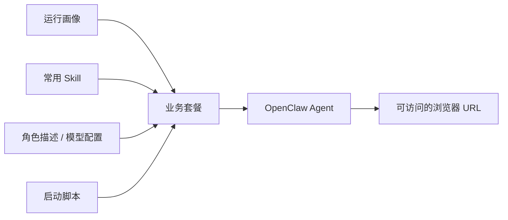

# 02. 快速启动一个自带浏览器、技能和角色设定的 OpenClaw

## 本章场景

从业务负责人的视角看，你现在最关心的通常不是某个 CRD 叫什么名字，而是：

- 我怎么尽快把一个 OpenClaw 跑起来？
- 它能不能一启动就自带常用 Skill？
- 我能不能先给它定义一个默认角色描述？
- 我能不能顺手把模型配置也注入进去，让它开箱即用？

这一章解决的就是这个问题：

> 用一份完整 YAML，一次性把 OpenClaw 本体、常用 Skill、角色描述和模型配置都准备好。

---

## 前置章节

请先完成：
- [00. 准备集群环境并部署 Operator](./00-prepare-cluster-and-deploy-operator.md)
- [01. 准备 Tencent Agent Runtime 基础设施](./01-prepare-tencent-agent-runtime.md)

---

## 为什么这一章这样组织

如果一开始只教用户“创建一个 Agent”，客户很快就会碰到这些问题：
- Agent 启动了，但没有默认 Skill
- Agent 能打开，但没有明确角色设定
- Agent 容器里缺少模型配置文件，还要再补一次

所以更贴近业务场景的做法不是只讲“怎么创建对象”，而是直接把下面四件事一起准备好：

1. **OpenClaw 本体怎么运行**
2. **它默认自带哪些 Skill**
3. **它应该扮演什么角色**
4. **它如何自动拿到模型配置**

这样业务负责人第一次创建 OpenClaw 时，得到的就是一个更接近可用状态的结果，而不是一个还要继续手工补配置的空壳。

---

## 原理说明

这一章虽然底层会用到 `AgentProfile`、`AgentTemplate` 和 `Agent` 三类对象，但你可以把它们理解成三层不同职责：

- **运行画像**：定义 OpenClaw 镜像如何启动、对外怎么暴露、命令默认用哪个用户执行
- **业务预设**：定义默认 Skill、角色描述、模型配置注入等“开箱即用能力”
- **实例对象**：真正创建一个可以访问的 OpenClaw

也就是说：
- `AgentProfile` 更像“运行底座”
- `AgentTemplate` 更像“业务套餐”
- `Agent` 才是“真正上线的那个实例”

这样分层后，你后面要做网络防护、配置复用和灰度发布时，会自然很多。

---

## 场景示意图



## 你需要填写的参数

这一章大多数内容可以直接复制。你只需要按实际情况替换：

| 参数 | 是否必填 | 示例 |
|---|---|---:|
| namespace | 是 | `default` |
| 模型配置 | 否 | 如需替换默认 provider，请修改 manifest 中的 `openclaw-model-config` |
| 模型 API Key | 否 | 可通过 `MODEL_API_KEY` 环境变量覆盖 |
| 角色描述 | 否 | 可以先使用文档里的默认值 |
| Skill 列表 | 否 | `self-improving`、`find-skills`、`summarize`、`github` |

---

## 这一步最终会得到什么

执行完本章后，你会得到一组示例 OpenClaw Agent：
- 运行在 Tencent Agent Runtime 上的 OpenClaw
- 自带浏览器访问能力
- 预装一组常用 Skill
- 自带默认角色描述
- 已经注入模型配置文件
- 可以直接拿 URL 打开
- 可以通过 `Agent` 名称直接进入对应 AGS 实例的 shell

---

## 使用 manifest

你可以直接使用旁边的 manifest 文件：`./manifests/02-openclaw-browser-agent.yaml`

如果你只是想直接执行，可以用：

```bash
kubectl apply -f ./openclaw-browser-on-TencentAGS/manifests/02-openclaw-browser-agent.yaml
```

YAML 内容以上文链接的 `manifests/` 文件为唯一事实来源，本文不再重复维护。

示例 manifest 中的 `volumeMounts` 支持声明多个持久化目录；如需复用同一个 CFS/COS 根路径下的精确目录，可以为每个挂载项设置 `subPath`。

> 显式存储方案：需要让不同目录使用不同 CFS/COS root，或让多个 Agent 按约定共享同一个后端目录时，使用 `storageSources[]` + `volumeMounts[].storageSource/subPath`。详细示例见 [11. 显式声明 OpenClaw 的存储挂载](./11-use-explicit-agent-storage.md)。

> 说明：当 `AgentTemplate` 和 `Agent` 同时声明 `env` 时，最终会按 `key` merge。
> 这个例子里：
> - 模板默认提供 `MODEL_API_KEY=sk-from-template` 和 `OPENCLAW_MODE=browser`
> - `Agent` 再把 `MODEL_API_KEY` 覆盖成 `sk-override-from-agent`
> - 同时新增 `OPENCLAW_DEBUG=true`
> 所以最终内联到 `Agent.spec.env` 的结果会是：
> - `MODEL_API_KEY=sk-override-from-agent`
> - `OPENCLAW_MODE=browser`
> - `OPENCLAW_DEBUG=true`

---

## 这一份 YAML 里分别完成了什么

为了让你能边复制边理解，我把它拆成业务视角来解释：

### 1. 让 OpenClaw 本体能跑起来

`AgentProfile` 里定义了：
- 浏览器镜像
- 访问端口
- 健康检查
- 存储目录

这部分决定的是：

> 这个 OpenClaw 作为“运行时”应该怎样启动、存活和对外提供访问。

### 2. 给 OpenClaw 预装一组常用 Skill

`bootstrapScripts + skillPacks` 一起完成了两件事：
- 先安装 SkillHub
- 再安装一组常用 Skill

这让你的 OpenClaw 第一次起来时，就已经具备基础能力，而不是还要人工进入容器里补安装。

### 3. 给 OpenClaw 一个默认角色描述

`fileInjects` 中写入 `AGENT.md`，本质上就是在给 OpenClaw 提供默认工作说明。

这样做的意义是：
- 不同业务团队可以给不同 OpenClaw 预设不同人格和任务边界
- 第一次打开时，它就知道自己大概要做什么

### 4. 自动注入模型配置

同样通过 `fileInjects`，我们把模型配置文件写进 `/openclaw/.openclaw/openclaw.json`。

这一步解决的问题是：

> OpenClaw 不只是“能打开”，还应该一启动就知道去哪里调用模型。

所以业务负责人不需要在 OpenClaw 启动后再手工去补模型连接配置。

### 5.（可选）暴露额外的对外端口

`AgentProfile.spec.access.port` 声明的是 Agent 的**主访问端口**（OpenClaw 网关 9000），Agent 运行起来后 AgentWay 会把这个端口的 URL 放到 `agent.status.accessURL`。

但实际业务里，沙箱容器可能同时暴露多个端口：例如 5900（VNC 远程桌面）、9100（Prometheus metrics）、6080（noVNC Web 端），它们也需要从公网访问。

对这种场景，在 profile 里用 `ports:` 列出来即可：

```yaml
spec:
  image: ccr.ccs.tencentyun.com/yaominxia/sandbox-openclaw-browser:v1.12
  access:
    port: 9000
    path: /
  ports:
    - name: vnc
      port: 5900
      protocol: TCP
    - name: metrics
      port: 9100
      protocol: TCP
```

使用 Tencent AGS provider 时，operator 会把这些端口合并到 AGS `CustomConfiguration.Ports` 一起申请（在 `envd(49983)` 和 `access.port` 之后追加），AGS 平台会为每个端口分配一个独立的公网访问域名：

```
https://{port}-{sandboxId}.{region}.tencentags.com
```

例如 `sandboxId=sbx-abcd1234`、`region=ap-shanghai`、声明了 `vnc/5900` 后，就可以通过 `https://5900-sbx-abcd1234.ap-shanghai.tencentags.com` 直连容器内 5900 端口的服务。

几个容易踩坑的点：

- `name` 必须是 DNS label（小写字母开头、只含 `a-z0-9-`），且**不能叫 `envd` 或 `http`**，这两个名字被 operator 内部保留用来表示"envd sidecar"和"主访问端口"。
- `port` 不能是 `49983`——该端口固定给 envd sidecar 使用。
- `protocol` 目前仅支持 `TCP`，留空时默认就是 TCP。
- 只有 **Tencent AGS provider** 会读取这个字段；使用 K8s provider（本地 k3d / 自建集群）时 `ports` 会被静默忽略，不报错也不建 Service。

### 选择是否关闭访问 token（`spec.authMode`）

AGS 默认会为每个 sandbox 实例分配一个 access token，访问 `status.accessURL` 时必须在 HTTP header 中带 `X-Access-Token: <token>` 才能通过。这份默认策略对大部分业务是合理的，但在下列场景里会成为阻碍：

- 想把 `AccessURL` 直接分享给同事、客户或嵌入到外部系统里，不希望使用方额外处理 token。
- 已经在网关侧 / 业务侧自建访问控制（SSO、WAF、SPN 等），平台再加一层 token 校验反而冗余。
- 单纯做演示或 demo 页面，要求"打开链接即可使用"。

这时可以在 `Agent.spec.authMode` 声明：

```yaml
spec:
  authMode: none   # 默认 default，改成 none 代表不下发 token（DEFAULT / NONE 也都接受）
```

字段说明：
- `default`（或留空）：保持现有行为，AGS 下发 token，Operator 回填到 `status.gatewayToken`。
- `none`：AGS 不下发 token，`status.gatewayToken` 为空，`status.accessURL` 不带 `access_token` 查询参数，直接访问即可。
- 取值大小写均可：`default`/`DEFAULT` 等价，`none`/`NONE` 等价。推荐使用小写。
- 改动 `authMode` 会触发 sandbox **实例重建**，短暂不可用。
- `authMode` 仅定义在 `Agent.spec` 上；`AgentProfile` 不再承载该字段。
- 仅 Tencent AGS provider 读取；K8s provider 当前不支持此语义，该字段会被静默忽略。

> 安全提醒：`authMode: none` 意味着平台不再提供访问保护，必须由你自己保证访问来源可信（VPN、网关白名单、公网授权等），否则会构成未授权访问。

---

## 执行步骤

```bash
kubectl apply -f ./openclaw-browser-on-TencentAGS/manifests/02-openclaw-browser-agent.yaml
```

等待 Agent Ready：

```bash
kubectl get agent openclaw-browser-agent -n default -w
```

获取访问 URL：

```bash
kubectl get agent openclaw-browser-agent -n default -o jsonpath='{.status.accessURL}'
```

---

## 如何直接进入这个 Agent 的 shell

如果你在第 00 章增量应用了 `00-01-connect.yaml`，集群里会部署 `agent-way-connect` 服务，并注册 Agent connect API：`connect.agentway.io/v1alpha1`。

它的目标就是让你**不需要手工查询 sandbox ID**，只要知道：

- `Agent` 所在 namespace
- `Agent` 名称

就能登录到对应 AGS 实例里做验证或排障。

### 1. 先确认 Agent connect API 已就绪

如果还没有开启 AA/connect 服务，先执行：

```bash
kubectl apply -f ./openclaw-browser-on-TencentAGS/manifests/00-01-connect.yaml
kubectl rollout status deployment/agent-way-connect -n agent-way-system
```

```bash
kubectl get apiservice v1alpha1.connect.agentway.io
```

你应该看到 `AVAILABLE=True`。

### 2. 安装并使用 `kubectl agent exec` 进入 shell

首次使用时，在仓库根目录执行：

```bash
cd operator
go build -o ./bin/kubectl-agent ./cmd/kubectl-agent
mkdir -p "$HOME/.local/bin"
install -m 755 ./bin/kubectl-agent "$HOME/.local/bin/kubectl-agent"
export PATH="$HOME/.local/bin:$PATH"

kubectl agent exec -n default openclaw-browser-agent
```

默认会进入：

```text
/bin/bash -i
```

也就是说，你现在只需要给出 `Agent` 名称 `openclaw-browser-agent`，插件会自动：

1. 启动本地 `kubectl proxy`
2. 连接 `connect.agentway.io/v1alpha1`
3. 由 `agent-way-connect` 在集群内把你的终端输入转发到对应 AGS 实例

### 3. 如果只想执行一条命令

```bash
kubectl agent exec -n default openclaw-browser-agent -- bash -lc 'id && pwd && ls -la /openclaw'
```

这个模式很适合做“实例是否真的起来了”的快速验证。

### 4. 权限要求

调用方需要具备下面这个 Kubernetes 权限：

- API Group: `agent.agentway.io`
- Resource: `agents/exec`
- Verb: `create`

如果你使用的是集群管理员账号，通常已经具备该权限。

---

## 预期效果

做完后，你应该看到：
- `status.phase=Running`
- `status.accessURL` 非空
- bootstrap、skill、file inject 都有状态记录
- `kubectl agent exec` 能通过 `Agent` 名称直接进入实例 shell

换句话说，你拿到的不只是一个“创建成功的对象”，而是一个已经具备初始业务能力的 OpenClaw。

---

## 如何验证

```bash
kubectl get agent openclaw-browser-agent -n default -o yaml
```

重点看：
- `status.phase`
- `status.message`
- `status.accessURL`
- `status.bootstrapStatus`
- `status.skillStatus`
- `status.fileInjectStatus`

如果这些都正常，你就可以把 `status.accessURL` 复制到浏览器打开。

如果你还想进一步确认实例内部状态，可以直接进入 shell：

```bash
kubectl agent exec -n default openclaw-browser-agent
```

---

## 下一章

完成后，继续：
- [03. 保护 OpenClaw 只访问你允许的目标](./03-build-secure-network-access-policy.md)
