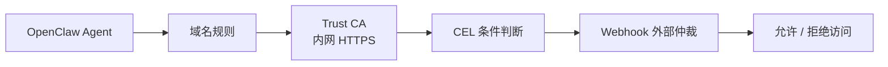
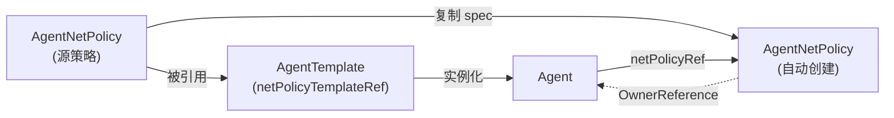

# 03. 构建安全的网络访问控制策略

## 本章场景

你的 OpenClaw 浏览器 Agent 已经可以运行了。现在你希望逐步给它增加网络防护能力：

1. **最简单**：先限制它只能访问哪些域名
2. **企业内网 HTTPS**：当允许访问的域名使用企业私有 CA 时，补充 Trust CA
3. **更灵活**：再根据请求方法、路径等条件做更细粒度判断
4. **最强能力**：最后把高风险请求交给外部系统仲裁

这也是客户最常见的理解顺序：
- 先学会“限制访问范围”
- 再学会“目标域名能访问，但证书链不被信任时怎么办”
- 再学会“按条件判断”
- 最后再学会“接入外部安全系统”

---

## 前置章节

请先完成：
- [02. 创建一个可访问的 OpenClaw 浏览器 Agent](./02-create-openclaw-browser-agent.md)

---

## 为什么这章要按层次讲

如果一开始就直接讲 Webhook，客户通常会有两个问题：
- 我为什么需要一个外部服务？
- 这和最简单的 allow / deny 有什么区别？

所以这章按几个层次递进：

1. **域名级规则**：先理解最基本的“允许谁、拒绝谁”
2. **Trust CA**：再理解“域名已允许，但 HTTPS 上游证书为什么仍可能失败”
3. **CEL 条件**：再理解“同一个域名下，不同请求为什么要区别处理”
4. **Webhook 仲裁**：最后理解“为什么有些请求不能在本地规则里直接决定，而要交给外部系统”

这样客户不仅知道怎么配，还能理解为什么能力会一层一层增强。

---

## 原理说明

`AgentNetPolicy` 描述 Agent 的网络访问策略，但不同方向的绑定范围不同：

- 出站字段（`rules`、`defaultDecision`、`trustCARefs`、`webhookArbiters`）保持既有行为，支持 `netPolicyRef` 和 `selector`。
- AGS 入站字段 `accessPolicy` 只对显式设置同 namespace `Agent.spec.netPolicyRef` 的 Agent 生效；`selector` 不会绑定 AccessPolicy。

这层逻辑通常分三步：

1. **先确定作用对象**：本章主要使用 `Agent.spec.netPolicyRef`，让 Agent 主动引用一条策略
2. **再匹配请求**：根据 host / path / method / detector 判断当前请求是否命中规则
3. **最后做决策**：
   - 可以直接 `allow`
   - 可以直接 `deny`
   - 也可以交给 `webhook` 做最终决策

如果目标服务是 HTTPS，且服务端证书由企业私有 CA 或自签 CA 签发，那么还需要额外解决一件事：

> 访问规则允许了这个域名，不等于代理链路已经信任这个域名的服务端证书。

因此，本章也补充 `trustCARefs` 的产品形态。它解决的是“信任上游服务端 CA”，不是客户端证书，也不是跳过证书校验。

这篇文档统一使用 `netPolicyRef` 来讲解：先定义一条策略，再让一个 Agent 明确引用它。

所以你可以把这一章理解成：
- 不是“给 Agent 增加一个字段”
- 而是“给 Agent 增加一个访问控制层”

---

# 03.1 允许指定 VPC 或 CIDR 访问 AGS 沙箱

AGS AccessPolicy 是 SandboxInstance 的内嵌入站策略，不是一个独立云资源。推荐新建一条不带 `selector` 的 `AgentNetPolicy`，并只让新增 Agent 通过单值 `spec.netPolicyRef` 引用：

```yaml
apiVersion: agent.agentway.io/v1alpha1
kind: AgentNetPolicy
metadata:
  name: openclaw-browser-office-access
  namespace: default
spec:
  accessPolicy:
    rules:
      - action: ALLOW
        ports: ["9000"]
        vpcIds: ["<YOUR_VPC_ID>"]
---
apiVersion: agent.agentway.io/v1alpha1
kind: Agent
metadata:
  name: openclaw-browser-agent-office-access
  namespace: default
spec:
  templateRef: openclaw-browser-template
  sandboxProviderRef: openclaw-tencent-runtime
  netPolicyRef: openclaw-browser-office-access
```

这里有两个容易配错的边界：

- 使用 `vpcIds` 时，调用方必须走对应内网入口，例如 Sandbox 的 `https://9000-<sandbox-id>.<region>.internal.tencentags.com` 或 AgentService 的 `https://9000-<gateway-id>.<region>.internal.agents.tencentags.com`。公开 `ingressURL` 不携带客户 VPC 身份，在该规则下预期被拒绝。
- `ports` 匹配内网域名 Host 前缀所表示的 Sandbox 业务端口。例如访问 `9000-...` 就配置 `"9000"`；它不是 HTTPS 连接使用的 TLS 端口 `443`。

同一条策略可以同时声明出站字段和 `accessPolicy`。创建时两者随同一个 `StartSandboxInstance` 请求下发；修改或移除被引用策略的 `accessPolicy` 时，Operator 对原 Sandbox 执行 `UpdateSandboxInstance`，不会因为该变更重建 Sandbox。

可执行示例见 [`manifests/03-6-access-policy.yaml`](./manifests/03-6-access-policy.yaml)。

---

# 03.2 最简单的出站方式：基于域名限制访问范围

## 这一节解决什么问题

你希望 OpenClaw 只允许访问某些指定站点，而不是随便访问任何外部域名。

这是最容易理解、也最适合作为第一步的网络防护方式。

同时，这一节也顺便演示最直接的绑定方式：

> 直接让 `Agent.spec.netPolicyRef` 主动引用一条 `AgentNetPolicy`

---

## 为什么先从域名级规则开始

因为这是客户最容易验证的一层规则：
- 域名是明确的
- 规则直观
- 出问题也容易排查

对于很多客户来说，第一层安全目标就是：

> “这个 Agent 只能访问公司允许的站点。”

在这个阶段，你不需要先理解 CEL，也不需要先准备 Webhook 服务。
你只需要先掌握两件事：

1. 怎么写一条最简单的 allow 规则
2. 怎么让某个 Agent 显式绑定这条策略

---

## 场景示意图



## 你需要填写的参数

| 参数 | 是否必填 | 示例 |
|---|---|---:|
| 目标域名 | 是 | `api.github.com` |
| Agent 名称 | 是 | `openclaw-browser-agent-direct` |

---

## 使用 manifest

你可以直接复制旁边的 manifest 文件 `./manifests/03-1-domain-policy.yaml`，把 `<YOUR_ALLOWED_HOST>` 换成你允许访问的域名。

如果你想直接 apply，执行：

```bash
kubectl apply -f ./openclaw-browser-on-TencentAGS/manifests/03-1-domain-policy.yaml
```

YAML 内容以上文链接的 `manifests/` 文件为唯一事实来源，本文不再重复维护。

---

## 执行步骤

先确认你已经完成了 [02. 创建一个可访问的 OpenClaw 浏览器 Agent](./02-create-openclaw-browser-agent.md)，并且集群里已经存在 `openclaw-browser-template`。

```bash
kubectl apply -f ./openclaw-browser-on-TencentAGS/manifests/03-1-domain-policy.yaml
```

---

## 预期效果

做完后：
- Agent `openclaw-browser-agent-direct` 会主动引用 `openclaw-browser-allow-one-host`
- 访问命中的域名时，会被允许
- 没命中的访问，会按 `defaultDecision: deny` 被拒绝

---

## 如何验证

```bash
kubectl get agent openclaw-browser-agent-direct -o jsonpath='{.spec.netPolicyRef}'
kubectl describe agentnetpolicy openclaw-browser-allow-one-host
```

如果你的环境已经接入了真实的网络访问控制链路，可以在 Agent 内尝试：
- 访问允许域名
- 访问未列入白名单的域名

对比两者行为是否不同。

## 补充说明：`selector` 是什么

除了 `netPolicyRef` 这种一对一绑定方式，`AgentNetPolicy` 也可以通过 `selector.matchLabels` 按标签自动匹配一批 Agent。

你可以这样快速区分：
- `netPolicyRef`：某个 Agent 明确引用某一条策略
- `selector`：某条策略自动作用到一批带特定标签的 Agent

本章不展开 `selector` 的具体配置方式，先聚焦最直接的一对一绑定。

---

# 03.3 访问使用企业私有 CA 的内网 HTTPS 服务

## 这一节解决什么问题

有些客户允许 Agent 访问自己的内网 HTTPS 服务，例如：

- `internal-api.example.com`
- `git.internal.company.com`
- `service.corp.example.com`

这些服务通常使用企业私有 CA 或自签 CA。此时即使 `AgentNetPolicy` 已经允许访问对应域名，HTTPS 连接仍可能因为证书链不被信任而失败。

在 AGS provider 下，出站访问会经过 ZeroProxy。这个场景需要让 AgentWay 把客户提供的上游 Trust CA 下发给 AGS 出站代理链路。

## 这不是什么

`trustCARefs` 只表示“信任这些 CA 签发的上游服务端证书”。

它不是：

- 客户端证书
- mTLS 身份凭证
- Header Token
- `insecureSkipVerify`
- 放行规则本身

因此你仍然需要在 `rules` 中显式允许目标 host；Trust CA 只解决 HTTPS 证书链信任问题。

---

## 你需要填写的参数

| 参数 | 是否必填 | 示例 |
|---|---|---:|
| Operator system namespace | 是 | `agent-way-system` |
| CA Secret 名称 | 是 | `corp-internal-ca` |
| CA Secret key | 否 | `ca.crt` |
| 内网 HTTPS 域名 | 是 | `internal-api.example.com` |
| Agent 名称 | 是 | `openclaw-browser-agent-internal-https` |

---

## 使用 manifest

你可以直接复制旁边的 manifest 文件 `./manifests/03-5-trust-ca-policy.yaml`，并替换：

- `REPLACE_WITH_YOUR_PEM_CA_CERTIFICATE`
- `internal-api.example.com`

如果你想直接 apply，执行：

```bash
kubectl apply -f ./openclaw-browser-on-TencentAGS/manifests/03-5-trust-ca-policy.yaml
```

YAML 内容以上文链接的 `manifests/` 文件为唯一事实来源，本文不再重复维护。

---

## 配置形态

CA 证书材料放在 Operator `systemNamespace` 的 Kubernetes Secret 中。Cookbook 默认 `systemNamespace` 是 `agent-way-system`：

```yaml
apiVersion: v1
kind: Secret
metadata:
  name: corp-internal-ca
  namespace: agent-way-system
  labels:
    agentway.io/secret-type: trust-ca
type: Opaque
stringData:
  ca.crt: |
    -----BEGIN CERTIFICATE-----
    ...
    -----END CERTIFICATE-----
```

CA bundle 必须满足以下条件：

- 只包含 PEM 编码的 `CERTIFICATE` block 和空白字符，不能包含私钥、注释或其他 block
- 每张证书的 `BasicConstraints` 必须声明 `CA:TRUE`
- 如果证书声明了 `KeyUsage`，必须包含证书签发用途
- 证书必须已经生效且未过期
- 去重后最多 16 张 CA 证书，PEM 总大小不超过 48 KiB

如果上游直接使用一张没有 `CA:TRUE` 的自签名服务器证书，不能把它直接作为 Trust CA；应使用 CA 证书签发带正确 DNS SAN 或 IP SAN 的服务器证书。

`AgentNetPolicy` 可以继续放在业务 namespace，`trustCARefs` 只保存 Secret 的 `name/key`，不允许指定 namespace：

```yaml
spec:
  defaultDecision: deny
  trustCARefs:
    - name: corp-internal-ca
      key: ca.crt
  rules:
    - name: allow-internal-https
      hosts:
        - internal-api.example.com
      protocol: https
      port: 443
      action: allow
```

---

## 预期效果

配置生效后：

- Agent `openclaw-browser-agent-internal-https` 会引用 `openclaw-browser-internal-https`
- `internal-api.example.com:443` 会被策略允许
- AGS ZeroProxy 会获得 `corp-internal-ca` 中的 CA bundle
- CA Secret 内容更新后，引用该 Secret 的策略会重新 reconcile
- Running AGS Agent 会通过 `UpdateSandboxInstance` 热更新，不需要重建 SandboxTool

如果 Secret 不存在、key 不存在或 CA bundle 非法，策略会进入 `Failed`，受影响的 Running AGS Agent 会标记为 `NetworkPolicyStale=true`，不会在省略 CA 后继续报告同步成功。

可以在 Agent 内直接验证，不要增加 `-k` 或 `--insecure`：

```bash
curl -sS -o /dev/null \
  -w '%{http_code}\n' \
  --connect-timeout 10 \
  --max-time 20 \
  https://internal-api.example.com/health
```

---

# 03.4 进阶方式：用 CEL 表达更细的判断条件

## 这一节解决什么问题

你会很快发现：
- 只按域名限制还不够
- 同一个域名下，不同请求可能风险不同

例如：
- `GET` 查询可以允许
- `POST /delete` 这种写操作可能需要更严格控制

这时候就需要更细粒度的判断条件。

---

## 为什么要引入 CEL

CEL（Common Expression Language）适合用来做**轻量、可读、可审计**的规则表达。

它特别适合这种场景：
- 不想引入外部服务
- 但又不满足于只按 host 粗粒度判断
- 想根据请求方法、请求路径等信息做更细的控制

也就是说，CEL 解决的是：

> “不只是访问哪个站点重要，怎么访问也同样重要。”

---

## 你需要填写的参数

| 参数 | 是否必填 | 示例 |
|---|---|---:|
| 目标域名 | 是 | `git.internal.company.com` |
| CEL 表达式 | 是 | `request.method in ["POST", "PUT", "DELETE"]` |
| Agent 名称 | 是 | `openclaw-browser-agent-cel` |

---

## 使用 manifest

你可以直接复制旁边的 manifest 文件 `./manifests/03-2-cel-policy.yaml`，并按你的场景修改 host 和 CEL 表达式。

如果你想直接 apply，执行：

```bash
kubectl apply -f ./openclaw-browser-on-TencentAGS/manifests/03-2-cel-policy.yaml
```

YAML 内容以上文链接的 `manifests/` 文件为唯一事实来源，本文不再重复维护。

这里的 `scriptDetector.source` 在 AGS provider 下会被 Operator 翻译到 yunapi 的 `Expression` 字段中。你在 CR 里写的是 `scriptDetector`，最终送到 AGS 的是表达式本身。

---

## 执行步骤

```bash
kubectl apply -f ./openclaw-browser-on-TencentAGS/manifests/03-2-cel-policy.yaml
```

---

## 预期效果

做完后：
- Agent `openclaw-browser-agent-cel` 会主动引用 `openclaw-browser-cel-guard`
- 命中指定域名且满足 CEL 条件的请求会被拒绝
- 没命中 CEL 条件的请求，则按 `defaultDecision: allow` 或后续规则继续处理

这意味着你已经不再是“只按域名控制”，而是开始根据请求行为本身做判断。

---

## 如何验证

```bash
kubectl get agent openclaw-browser-agent-cel -n default -o jsonpath='{.spec.netPolicyRef}'
kubectl describe agentnetpolicy openclaw-browser-cel-guard -n default
```

如果你的环境已经接通真实链路，可以测试：
- 对目标域名发起 `GET`
- 对目标域名发起 `POST` / `PUT` / `DELETE`

观察两类请求是否被区别对待。

---

# 03.5 高级方式：通过 Webhook 做外部仲裁

## 这一节解决什么问题

有些访问不能只靠本地规则静态判断。

例如：
- 这次请求是不是命中了高风险操作？
- 这个用户当前是否在审批白名单里？
- 这个目标系统是不是处于变更冻结窗口？
- 是否需要接入公司的统一安全网关或审计系统？

这些问题往往需要把决策交给一个外部系统，而不是只在 `AgentNetPolicy` 里写死。

---

## 为什么 Webhook 是最后一层能力

因为 Webhook 的优势不是“更简单”，而是“更强”。

它适合：
- 需要和企业内部审批系统联动
- 需要查外部风控/审计系统
- 需要按实时上下文做最终判定

但它也意味着：
- 你要准备一个可用的 HTTP 服务
- 你要维护这个服务的高可用和超时策略
- 网络控制链路里会多一个外部依赖

所以最合理的学习顺序是：
1. 先掌握域名规则
2. 再掌握 CEL 表达式
3. 最后再接入 Webhook

---

## 你需要填写的参数

| 参数 | 是否必填 | 示例 |
|---|---|---:|
| 目标域名 | 是 | `git.internal.company.com` |
| Webhook URL | 是 | `http://10.10.10.10:8080/webhook` |
| Agent 名称 | 是 | `openclaw-browser-agent-webhook` |

---

## 使用 manifest

你可以直接复制旁边的 manifest 文件 `./manifests/03-3-webhook-policy.yaml`，把两个占位符：

- `<YOUR_REVIEW_WEBHOOK_URL>`
- `<YOUR_AUDIT_WEBHOOK_URL>`

换成你自己的 Webhook 地址。

如果你想直接 apply，执行：

```bash
kubectl apply -f ./openclaw-browser-on-TencentAGS/manifests/03-3-webhook-policy.yaml
```

YAML 内容以上文链接的 `manifests/` 文件为唯一事实来源，本文不再重复维护。

这份示例同时展示了两类 hook：
- `deny-logger` 是全局 hook，不需要被任何 rule 引用
- `internal-review` 是规则级 hook，只在命中该 rule 时触发

其中：
- `captureBody: true` 表示在 hook payload 中包含请求体
- `notifyTriggerDecisions` 表示只在指定决策结果出现时才通知 webhook
- 对于全局 hook，常见用法是只监听 `deny`
- `category: notify` 表示该 hook 只负责接收通知，不会阻塞请求

---

## 执行步骤

```bash
kubectl apply -f ./openclaw-browser-on-TencentAGS/manifests/03-3-webhook-policy.yaml
```

---

## 预期效果

做完后：
- Agent `openclaw-browser-agent-webhook` 会主动引用 `openclaw-browser-webhook-guard`
- 命中指定 host 且满足 CEL 条件的请求，会触发 `internal-review` 对应的规则级通知
- 所有被拒绝的请求，会额外触发全局 `deny-logger`
- 这样你既能按具体规则记录重点访问，也能对所有拒绝流量做统一审计

这意味着你的网络控制能力已经从“静态规则”升级成“可与企业外部系统联动的可观测决策链路”。

---

## 如何验证

```bash
kubectl get agent openclaw-browser-agent-webhook -n default -o jsonpath='{.spec.netPolicyRef}'
kubectl describe agentnetpolicy openclaw-browser-webhook-guard -n default
```

如果你的 Webhook 服务已经就绪，可以实际发起一类命中请求，并观察：
- Webhook 是否收到了回调
- 规则级 hook 是否只在命中对应 rule 时触发
- 全局 deny hook 是否只在请求被拒绝时触发

---

# 03.6 当网络策略是模板标配时：让 Template 引用现有策略并在实例化时复制

## 这一节解决什么问题

前面三节你已经学会了如何单独创建 `AgentNetPolicy`。但在真实交付里，客户经常会遇到一个更实际的问题：

> 每次从模板创建 Agent 后，还要再补一条 NetPolicy，步骤多，而且容易漏。

如果某套安全规则本来就是这类 Agent 的默认配置，更合适的方式是：

> **先把 NetPolicy 独立保存，再让 `AgentTemplate` 用 `netPolicyTemplateRef` 去引用它；实例创建时由 Operator 自动复制一份并完成绑定。**

---

## 什么时候应该用“引用并复制”方式

这种方式适合这些场景：
- 这个模板创建出来的 Agent 都应该带同一套默认安全策略
- 你希望模板本身就是“可直接交付”的，不想让使用者再额外补安全配置
- 你可能会让多个模板复用同一份策略来源

不太适合的场景是：
- 你只想给单个 Agent 临时绑定一条策略，此时直接写 `Agent.spec.netPolicyRef` 更简单
- 你希望多批 Agent 按标签自动匹配一条共享策略，此时 selector 方式更直接

---

## 三种绑定方式的对比

在 AgentWay 中，常见的网络策略绑定方式有三种：

| 方式 | 适用场景 | 优势 | 劣势 |
|---|---|---|---|
| 独立 CR + selector 匹配 | 多个 Agent 共享同一策略 | 一条策略可覆盖多个 Agent | 需要维护 label 匹配 |
| 独立 CR + `netPolicyRef` | 一对一精确绑定 | 绑定关系明确 | 需要先创建 CR 再引用 |
| **Template 引用既有策略并自动复制** | 模板默认带一套策略，但不想内联大段 YAML | 模板更短，可复用策略来源 | 仍需先准备一条源策略 |

你可以这样理解：
- 前三节讲的是“策略内容怎么写”
- 这一节讲的是“策略写好后，怎么和 Agent 建立关系”

---

## 原理说明

`AgentTemplate` 支持可选字段 `spec.netPolicyTemplateRef`，用于引用一条已经存在的 `AgentNetPolicy`。

当你从这个 Template 创建 Agent 时，Operator 会自动：

1. 创建一个 `AgentNetPolicy` CR，名称通常为 `<agent-name>-netpolicy`
2. 将被引用源策略的 `spec` 复制进去
3. 自动把 Agent 的 `spec.netPolicyRef` 指向新创建的策略
4. 给该策略打上 OwnerReference，使它跟随 Agent 生命周期自动清理



---

## 使用 manifest

你可以直接使用 manifest 文件 `./manifests/03-4-agenttemplate-inline-netpolicy.yaml`。

如果你想直接 apply，执行：

```bash
kubectl apply -f ./openclaw-browser-on-TencentAGS/manifests/03-4-agenttemplate-inline-netpolicy.yaml
```

YAML 内容以上文链接的 `manifests/` 文件为唯一事实来源，本文不再重复维护。

---

## 执行步骤

### 1. 应用 Template 与相关资源

```bash
kubectl apply -f ./openclaw-browser-on-TencentAGS/manifests/03-4-agenttemplate-inline-netpolicy.yaml
```

### 2. 验证 Agent 是否自动引用了 NetPolicy

```bash
kubectl get agent openclaw-secure-agent -n default -o jsonpath='{.spec.netPolicyRef}'
```

预期输出类似：

```text
openclaw-secure-agent-netpolicy
```

### 3. 验证 Operator 是否自动创建了策略 CR

```bash
kubectl get agentnetpolicy openclaw-secure-agent-netpolicy -n default -o yaml
```

### 4. 验证自动创建的策略是否跟随 Agent 生命周期

```bash
kubectl get agentnetpolicy openclaw-secure-agent-netpolicy -n default \
  -o jsonpath='{.metadata.ownerReferences[0].name}'
```

预期输出类似：

```text
openclaw-secure-agent
```

---

## 预期效果

部署完成后：
- Agent 创建时会自动生成对应的 `AgentNetPolicy`
- Agent 的 `spec.netPolicyRef` 会自动指向该策略
- `api.github.com`、`api.openai.com` 的访问会被允许
- `git.internal.company.com` 的访问会触发规则级 `git-audit` 通知
- 其他未命中的访问默认放行
- 如果后续请求被规则显式拒绝，仍会触发全局 `deny-logger` hook

---

## 与独立 AgentNetPolicy 的关系

Template 引用方式不会创造一种新的策略类型。

它最终生成的仍然是标准的 `AgentNetPolicy` CR。区别只在于：
- **手动方式**：你自己创建 CR，再通过 selector 或 `netPolicyRef` 绑定
- **Template**：Operator 自动创建 CR 并完成绑定

所以你完全可以把内联方式理解为：

> “把第 03 章前面学到的网络策略能力，以引用的形式打包进模板交付流程。”

---

## 本章你学到了什么

完成这章后，你应该已经理解：

1. **域名规则**适合先做第一层边界控制
2. **Trust CA**适合解决企业内网 HTTPS 服务端证书链不被信任的问题
3. **CEL**适合在本地做轻量、可读、可审计的细粒度判断
4. **Webhook**适合把高风险访问交给企业自己的外部系统做最终仲裁
5. **Template 引用并复制**适合把网络策略做成模板默认能力，同时避免模板内联过长 YAML

也就是说，`AgentNetPolicy` 不是只有一种写法，而是一套可以从简单到复杂逐步增强的网络控制能力。

---

## 下一章

继续阅读：
- [04. 通过外部引用减少 Agent 创建时的配置复杂度](./04-reduce-agent-config-with-external-references.md)
