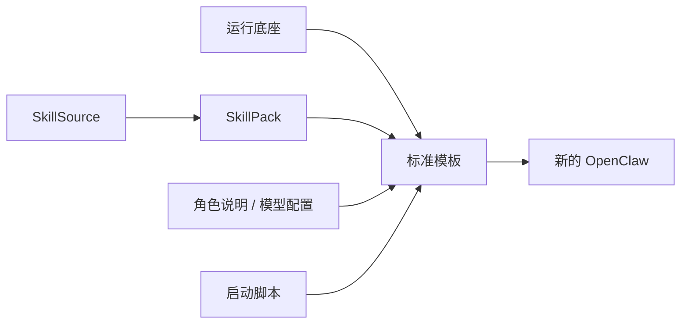

# 04. 沉淀一套可复制的 OpenClaw 标准配置

## 本章场景

当你的第一个 OpenClaw 已经验证可用后，业务负责人接下来最常见的诉求通常不是“再学一个 CRD”，而是：

- 把这套好用的 Skill 组合固定下来
- 把角色描述沉淀成团队标准
- 把启动脚本和模型配置也一起固定下来
- 以后新的 OpenClaw 直接复用这套标准配置

所以这一章真正要解决的问题是：

> **如何把一个已经验证过、可用的 OpenClaw，沉淀成团队可复制的标准配置。**

---

## 前置章节

建议先完成：
- [02. 快速启动一个自带浏览器和角色设定的 OpenClaw](./02-create-openclaw-browser-agent.md)

---

## 为什么这一章很重要

很多团队第一次把 OpenClaw 跑起来后，很快就会发现：

- 每次新建都重复写一遍 Skill
- 每次新建都重复写一遍角色说明
- 每次新建都重复写一遍模型配置
- 同一个团队内部很容易出现多个“不完全一致”的 OpenClaw

这会带来两个直接问题：

1. **复制成本越来越高**：每次都要重新拼一遍配置
2. **团队标准越来越乱**：不同人建出来的 OpenClaw 能力不一致

所以更合理的方式不是继续手工复制，而是先把这套能力整理成一个“标准配置套餐”。

---

## 原理说明

你可以把这一章理解成：

> 先把 OpenClaw 的通用能力整理成标准件，再用这些标准件去快速复制新的 OpenClaw。

这些“标准件”通常包括：

- **运行底座**：镜像、启动命令、健康检查、访问端口
- **技能来源**：团队统一从哪里安装 Skill
- **技能套餐**：一组团队常用 Skill
- **角色说明**：默认的 `AGENT.md`
- **模型配置**：默认模型路由和 Provider 预设
- **启动准备动作**：例如安装 SkillHub

底层实现会使用 ref 去组织这些标准件，但你可以先不用把重点放在“引用”这个技术词上。对客户来说，更重要的是理解：

- 这一步是在**组织团队标准能力**
- 不是在学习更多零散对象

同时一定要记住：

> 这些标准件在 Agent 创建后，会被自动展开到实际生效的内部 Spec 中。

也就是说：
- 创建时更简单
- 运行时仍然是确定、清晰、可排查的实际配置

---

## 场景示意图



## 你需要填写的参数

| 参数 | 是否必填 | 示例 |
|---|---|---:|
| 标准运行画像名 | 是 | `openclaw-browser-profile-ref` |
| 标准技能来源名 | 是 | `tencent-skill-hub` |
| 标准技能包名 | 是 | `openclaw-browser-skills` |
| 标准角色/模型配置包名 | 是 | `openclaw-browser-agent-rules` |
| 标准启动脚本名 | 是 | `openclaw-browser-bootstrap` |
| 模型配置 | 否 | 如需替换默认 provider，请修改 manifest 中的 `openclaw-browser-model-config` |
| 模型 API Key | 是 | `vk-xxxxxxxx` |

---

## 这一步最终会得到什么

执行完本章后，你会得到一套团队可复用的 OpenClaw 标准配置：

- 一个统一的运行底座
- 一个统一的技能来源
- 一组统一的常用 Skill
- 一份统一的角色说明
- 一份统一的模型配置
- 一段统一的启动准备脚本
- 一个把这些能力组合起来的模板

以后新的 OpenClaw 就不需要每次从零开始拼装了。

---

## 使用 manifest

你可以直接使用旁边的 manifest 文件：`./manifests/04-openclaw-standard-bundle.yaml`

如果你只是想直接执行，可以用：

```bash
kubectl apply -f ./openclaw-browser-on-TencentAGS/manifests/04-openclaw-standard-bundle.yaml
```

YAML 内容以上文链接的 `manifests/` 文件为唯一事实来源，本文不再重复维护。

---

## 这份 YAML 在业务上意味着什么

### 1. 固定一套统一的运行底座

`AgentProfile` 负责统一：
- 镜像
- 启动方式
- 健康检查
- 浏览器访问入口

它解决的是：

> 团队以后所有这一类 OpenClaw，运行方式都一致。

### 2. 先定义团队统一的 Skill 来源

`SkillSource` 负责统一：
- 技能从哪里装
- 安装命令模板是什么

它解决的是：

> 团队以后所有 OpenClaw，都从同一个受控来源安装 Skill。

### 3. 再固定一套统一的常用 Skill

`SkillPack` 负责统一：
- 默认 Skill 列表
- 这些 Skill 应该使用哪个 `SkillSource` 安装

它解决的是：

> 团队以后新建的 OpenClaw，默认能力集合一致，而且安装来源一致。

### 4. 固定角色说明和模型配置

`FileInjects` 负责统一注入：
- `AGENT.md`
- `/openclaw/.openclaw/openclaw.json`

它解决的是：

> 团队以后新建的 OpenClaw，不仅行为边界一致，连默认模型接入方式都一致。

### 5. 固定启动准备动作

`Bootscript` 负责统一安装 SkillHub 这类准备动作。

它解决的是：

> 新 OpenClaw 不用每次临时补环境准备步骤。

### 6. 最后把标准件组合成一个可直接复用的套餐

`AgentTemplate` 做的事情不是承载所有细节，而是：

> 把前面的标准件拼成一个团队可以重复使用的 OpenClaw 套餐。

---

## 执行步骤

```bash
kubectl apply -f ./openclaw-browser-on-TencentAGS/manifests/04-openclaw-standard-bundle.yaml
```

---

## 预期效果

做完后：
- 你已经沉淀出一套团队可复用的 OpenClaw 标准配置
- 后续创建新的 OpenClaw 时，可以直接复用这套标准配置
- 团队内部新建出来的 OpenClaw 会更一致

---

## 如何验证

```bash
kubectl get agentprofile,skillsource,skillpack,fileinjects,bootscript,agenttemplate,agent -n default
kubectl get agent openclaw-browser-agent-ref -n default -o yaml
```

重点理解：
- 创建阶段，你看到的是一套标准件和组合关系
- 运行阶段，系统会把这些标准件展开成实际生效配置

也就是说，这一步带来的不是“多学了几个 CRD”，而是：

> 你已经有能力把一个好用的 OpenClaw 变成团队标准套餐。

---

## 下一章

完成后，继续：
- [05. 用 Tags 给不同业务线做分账归属](./05-use-tags-for-chargeback.md)
