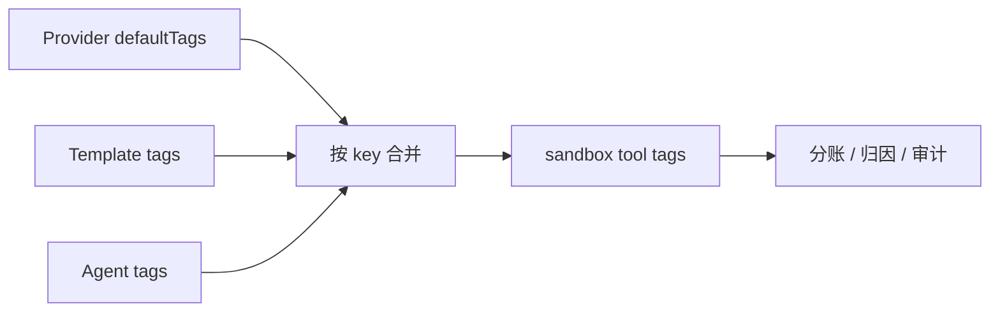

# 05. 用 Tags 给不同业务线做分账归属

## 本章场景

当你的 OpenClaw 开始被多个团队、多个业务线共同使用后，平台负责人通常很快会遇到一个现实问题：

- 哪些 OpenClaw 属于搜索业务？
- 哪些 OpenClaw 属于客服业务？
- 哪些 OpenClaw 是测试环境，哪些是正式环境？
- 后续如果要按业务线做成本统计、资源归因、账单拆分，靠什么字段来区分？

这一章要解决的就是这个问题：

> **在创建 OpenClaw 时，把业务归属信息写成 Tags，并让这些 Tags 跟随到 Tencent Agent Runtime 的 sandbox tool 上。**

这样做完之后，你的 OpenClaw 不只是“能跑”，还会带着明确的归属标记，方便后续做分账、审计、统计和平台治理。

---

## 前置章节

建议先完成：
- [01. 准备 Tencent Agent Runtime 基础设施](./01-prepare-tencent-agent-runtime.md)
- [02. 快速启动一个自带浏览器和角色设定的 OpenClaw](./02-create-openclaw-browser-agent.md)
- [04. 沉淀一套可复制的 OpenClaw 标准配置](./04-reduce-agent-config-with-external-references.md)

---

## 为什么这一章要放在灰度发布前面

因为分账归属解决的是：

- **这个 OpenClaw 属于谁**
- **这类 OpenClaw 应该算到哪个成本中心**
- **后续平台侧怎么按业务维度做统计**

而灰度发布解决的是：

- **如何给已经运行的 OpenClaw 批量升级**

先把“归属信息”定义好，再去做存量升级，会更符合真实客户的操作顺序。

---

## 原理说明

这套 Tags 能力有三层来源：

1. **Tencent Agent Runtime 基础设施默认 Tags**
   - 由 `AgentSandboxProvider.spec.defaultTags` 提供
   - 适合写平台统一标签，例如：
     - `platform=agentway`
     - `environment=prod`

2. **模板级 Tags**
   - 写在 `AgentTemplate.spec.agentSpecTemplate.tags`
   - 适合写某一类 OpenClaw 的默认归属，例如：
     - `workload=openclaw-browser`
     - `costCenter=search`

3. **单个 Agent 自己补充的 Tags**
   - 写在 `Agent.spec.tags`
   - 适合写某一个实例自己的归属，例如：
     - `owner=alice`
     - `costCenter=search-exp`

合并顺序是：

```text
defaultTags → template tags → agent tags
```

如果出现同一个 key：

- **后者覆盖前者**
- 也就是：
  - Agent 自己写的值优先级最高

### 这一步为什么能用于分账

因为在 Tencent Agent Runtime 模式下，这些最终合并后的 tags 会被下发到：

> **sandbox tool tags**

这意味着：
- 平台统一标签会被带过去
- 模板归属标签会被带过去
- 单个实例的业务归属标签也会被带过去

从平台治理的视角看，这就是一套天然适合做：

- 分账
- 审计
- 资源归因
- 业务线统计

的标记体系。

### 这一步不会改变什么

要特别说明的是：

- 在 **Kubernetes provider** 下，这些 tags 目前**不会带来额外行为**
- 它们不会改变 Pod 调度
- 也不会直接改网络或资源限制

当前这项能力的重点是：

> **让 Tencent Agent Runtime 场景下的 sandbox tool 带上可治理、可归属的标签。**

---

## 场景示意图



## 你需要填写的参数

| 参数 | 是否必填 | 示例 | 说明 |
|---|---|---:|---|
| 平台默认环境标签 | 是 | `environment=prod` | 所有 OpenClaw 共享 |
| 平台默认平台标签 | 是 | `platform=agentway` | 所有 OpenClaw 共享 |
| 业务线标签 | 是 | `costCenter=search` | 模板或单个 Agent 归属 |
| 工作负载标签 | 是 | `workload=openclaw-browser` | 标识这类 OpenClaw |
| 实例负责人标签 | 否 | `owner=alice` | 单个 Agent 独有 |

---

## 这一步最终会得到什么

执行完本章后，你会得到：

- 一个带默认 Tags 的 Tencent Agent Runtime Provider
- 一个带业务归属 Tags 的 OpenClaw 模板
- 一个带实例级归属 Tags 的 OpenClaw Agent

最终效果是：

> 这三个层级的 Tags 会被合并，并一起体现在 Tencent Agent Runtime 的 sandbox tool 上。

---

## 使用 manifest

你可以直接使用旁边的 manifest 文件：

- `./manifests/05-agent-tags-chargeback.yaml`

如果你只是想直接执行，可以用：

```bash
kubectl apply -f ./openclaw-browser-on-TencentAGS/manifests/05-agent-tags-chargeback.yaml
```

YAML 内容以上文链接的 `manifests/` 文件为唯一事实来源，本文不再重复维护。

---

## 这份 YAML 在业务上意味着什么

### 1. 平台先给所有 OpenClaw 打上默认归属

这一段：

```yaml
defaultTags:
  - key: platform
    value: agentway
  - key: environment
    value: prod
```

表示：
- 只要用了这个 Tencent Agent Runtime Provider
- 默认都会带上平台级标签

这适合写那些**所有实例都应该继承**的信息。

### 2. 模板给这类 OpenClaw 定义业务归属

这一段：

```yaml
tags:
  - key: workload
    value: openclaw-browser
  - key: costCenter
    value: search
```

表示：
- 这类模板创建出来的 OpenClaw
- 默认属于 `search` 这个成本中心

这适合写**某一类 OpenClaw 的默认业务归属**。

### 3. 单个 Agent 可以覆盖自己的归属

这一段：

```yaml
tags:
  - key: costCenter
    value: search-exp
  - key: owner
    value: alice
```

表示：
- 这个具体实例虽然来自 `search` 模板
- 但它的实际归属，要覆盖成 `search-exp`
- 同时再补一个负责人

这适合写**单个实例级的精细归属**。

---

## 最终合并后的效果是什么

根据上面的规则，最终实际生效的 tags 会是：

```yaml
- key: platform
  value: agentway
- key: environment
  value: prod
- key: workload
  value: openclaw-browser
- key: costCenter
  value: search-exp
- key: owner
  value: alice
```

注意这里：

- `costCenter`
  - provider 没写
  - template 写了 `search`
  - agent 写了 `search-exp`
  - **最终以 Agent 的 `search-exp` 为准**

这就是为什么它很适合做分账：

> 平台可以提供默认归属，模板可以提供业务默认值，而单个实例还能在需要时做精细覆盖。

---

## 执行步骤

### 第一步：应用 YAML

```bash
kubectl apply -f ./openclaw-browser-on-TencentAGS/manifests/05-agent-tags-chargeback.yaml
```

### 第二步：等待 Agent 运行成功

```bash
kubectl get agent openclaw-browser-agent-chargeback -n default -w
```

当你看到：

```text
STATUS   Running
```

就说明这一步已经成功。

### 第三步：查看 Agent 当前声明的 tags

```bash
kubectl get agent openclaw-browser-agent-chargeback -n default -o yaml
```

重点看：

```yaml
spec:
  tags:
```

以及：

```yaml
spec:
  templateRef: openclaw-browser-template-chargeback
```

### 第四步：查看 Provider 默认 tags

```bash
kubectl get agentsandboxprovider openclaw-tencent-runtime -o yaml
```

重点看：

```yaml
spec:
  defaultTags:
```

---

## 做完后的效果

如果一切正常，你会得到：

- 一个运行正常的 OpenClaw
- 一个带平台默认 Tags 的 Tencent Agent Runtime Provider
- 一个带业务归属 Tags 的模板
- 一个带实例级覆盖 Tags 的 Agent

从产品视角看，等于你已经有了一套：

> **可以用于分账归属的标签体系**

---

## 怎么验证成功

### 验证 1：Agent 正常运行

```bash
kubectl get agent openclaw-browser-agent-chargeback -n default
```

期望：

```text
Running
```

### 验证 2：Agent 上的实例级 tags 已声明

```bash
kubectl get agent openclaw-browser-agent-chargeback -n default -o yaml
```

期望看到：

```yaml
tags:
  - key: costCenter
    value: search-exp
  - key: owner
    value: alice
```

### 验证 3：模板级 tags 已声明

```bash
kubectl get agenttemplate openclaw-browser-template-chargeback -n default -o yaml
```

期望看到：

```yaml
tags:
  - key: workload
    value: openclaw-browser
  - key: costCenter
    value: search
```

### 验证 4：Provider 默认 tags 已声明

```bash
kubectl get agentsandboxprovider openclaw-tencent-runtime -o yaml
```

期望看到：

```yaml
defaultTags:
  - key: platform
    value: agentway
  - key: environment
    value: prod
```

---

## 这一章和“把配置打包复用”的关系

上一章重点是：

- 如何把 Skill、角色、模型配置和启动脚本沉淀成标准配置

这一章重点是：

- 如何在这些标准配置之上，再补一层**归属信息**

也就是说：

- 上一章更关注“怎么把 OpenClaw 组织好”
- 这一章更关注“这个 OpenClaw 最终归谁、算到哪条业务线上”

---

## 下一章你会做什么

完成这一步后，你已经具备了：

- 一套可复用的 OpenClaw 标准配置
- 一套可用于分账归属的 Tags 体系

下一步就可以开始处理真正的存量变更场景：

- [06. 在不删除实例的前提下暂停与恢复你的 OpenClaw](./06-pause-and-resume-openclaw.md)
- [07. 为存量 OpenClaw 批量增加 Skill](./07-roll-out-existing-agents-gradually.md)
