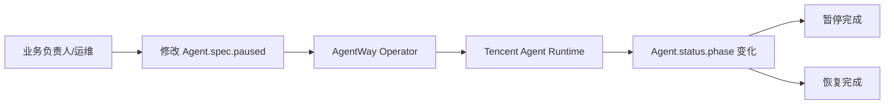

# 06. 在不删除实例的前提下暂停与恢复你的 OpenClaw

## 本章场景

当你的 OpenClaw 已经上线后，常见的运维诉求不只有“创建”与“升级”，还包括：

- 临时停止一批 OpenClaw，避免继续消耗运行资源
- 在排障、停机窗口、夜间节流或人工审批期间，先把实例挂起
- 需要的时候再恢复回来，而不是重新创建一个新的 OpenClaw

这一章讲的不是抽象的 `paused` 字段，而是一个更接近客户现场的动作：

> **如何在保留现有 OpenClaw 对象和配置的前提下，临时暂停它，再在需要时恢复它。**

---

## 前置章节

建议先完成：
- [02. 快速启动一个自带浏览器、技能和角色设定的 OpenClaw](./02-create-openclaw-browser-agent.md)
- [05. 用 Tags 给不同业务线做分账归属](./05-use-tags-for-chargeback.md)

如果你还没有一个正在运行的 OpenClaw，可以先回到第 2 章把它创建出来。

---

## 为什么要用“暂停/恢复”，而不是删掉重建

删除再重建当然也能达到“先停下来、之后再跑起来”的效果，但在真实生产环境里，这么做往往成本更高：

- 你会失去当前实例的运行上下文
- 用户访问链接可能变化
- 容易把“临时停机”误做成“重新发布”
- 操作链路更长，出错面也更大

暂停/恢复的价值在于：

> **把 OpenClaw 当成一个正在服务中的业务实例来管理，而不是把它当成一次性的测试对象。**

这样做更符合客户对“运行中实例”的直觉：
- 要用的时候恢复
- 暂时不用的时候先挂起
- 配置本身不丢，业务身份也不变

---

## 原理说明

这一章背后的原理其实很简单：

- `spec.paused: false` 表示 OpenClaw 正常运行
- `spec.paused: true` 表示要求 Operator 暂停底层运行时

对这条 OpenClaw 主线来说，底层运行时是 **Tencent Agent Runtime**。所以你在 Agent 上改的是一个统一字段，但真正执行暂停/恢复的是底层 provider。

也就是说：

1. 你改的是 `Agent.spec.paused`
2. Operator 观察到这个变更
3. Operator 调用 Tencent Agent Runtime 对应的暂停/恢复能力
4. `status.phase` 会反映出当前状态变化

你可以把它理解成：

> `spec.paused` 是“你的意图”，
> `status.phase` 是“平台当前已经执行到哪一步”。

---

## 场景示意图



---

## 你需要填写的参数

| 参数 | 是否必填 | 示例 |
|---|---|---:|
| Agent 名称 | 是 | `openclaw-browser-agent` |
| namespace | 否 | `default` |

> 本章默认继续使用前面章节里创建在 `default` namespace 下的 OpenClaw。

---

## 这一步最终会得到什么

执行完本章后，你会得到两个能力：

1. **暂停你的 OpenClaw**
   - 适合节流、维护、审批等待、夜间停机

2. **恢复你的 OpenClaw**
   - 适合恢复业务访问，而不需要重新创建一个新实例

换句话说，这一章帮你获得的是：

> **把已经运行起来的 OpenClaw，当作长期实例来运维的能力。**

---

## 第一步：先确认你的 OpenClaw 正在运行

如果你沿着前面的章节操作，当前应该已经有一个运行中的 OpenClaw：

```bash
kubectl get agent -n default
```

你应该看到类似结果：

```text
NAME                     PHASE
openclaw-browser-agent   Running
```

如果它还没进入 `Running`，请先回到：
- [02. 快速启动一个自带浏览器、技能和角色设定的 OpenClaw](./02-create-openclaw-browser-agent.md)

---

## 第二步：暂停你的 OpenClaw

这里推荐你直接对**已有的 Agent 对象做 patch**，而不是重新 apply 一个只包含 `paused` 字段的极简 YAML。

推荐命令：

```bash
kubectl patch agent openclaw-browser-agent -n default --type merge -p '{"spec":{"paused":true}}'
```

如果你只是想理解这次 patch 的目标内容，旁边也保留了一份示意 manifest：

- `./manifests/06-pause-openclaw.yaml`

对应内容如下：

```yaml
spec:
  paused: true
```

### 这一步在做什么

这不是在重建一个 Agent，也不是重新提交一份完整配置，而是在向平台表达一个明确意图：

> **把这个已经存在的 OpenClaw 暂时挂起。**

### 预期效果

随后你可以观察状态：

```bash
kubectl get agent openclaw-browser-agent -n default -o yaml
```

通常会经历类似过程：

- `Running`
- `Pausing`
- `Paused`

在 `Pausing` 过程中，访问 URL 可能会短暂返回 `504`。这代表底层运行时正在挂起，对客户来说属于预期现象。

你重点关注：

```yaml
status:
  phase: Paused
```

---

## 第三步：恢复你的 OpenClaw

当你准备重新启用它时，直接把 `paused` 改回 `false`。

推荐命令：

```bash
kubectl patch agent openclaw-browser-agent -n default --type merge -p '{"spec":{"paused":false}}'
```

如果你只是想理解恢复时改动的目标内容，旁边也保留了一份示意 manifest：

- `./manifests/06-resume-openclaw.yaml`

对应内容如下：

```yaml
spec:
  paused: false
```

### 这一步在做什么

这一步表达的是：

> **这台 OpenClaw 可以重新开始对外提供服务了。**

这里使用 `patch` 的原因很重要：你只是在修改一个已有 Agent 的运行状态，不应该用一份只包含 `paused` 字段的极简 YAML 去覆盖整份对象。

### 预期效果

状态通常会经历：

- `Paused`
- `Resuming`
- `Provisioning`
- `Running`

你可以用下面命令观察：

```bash
kubectl get agent openclaw-browser-agent -n default -w
```

也就是说，恢复并不是瞬间直接跳回 Running，而是会先回到“重新确认底层沙箱和访问状态”的阶段。

恢复完成后，应再次看到：

```text
Running
```

同时，访问 URL 应重新返回 `200`，页面可以再次正常打开。

---

## 如何验证它真的恢复了

如果你的 OpenClaw 在暂停前已经能访问，那么恢复后应当重新变成可访问状态。

你可以再次读取访问地址：

```bash
kubectl get agent openclaw-browser-agent -n default -o jsonpath='{.status.accessURL}'
```

然后在浏览器中打开这个 URL。

如果页面能再次正常打开，你就完成了这次暂停/恢复验证。

---

## 补充：什么时候用 restart，什么时候用 recreate

暂停/恢复解决的是“先挂起，之后再继续跑”的问题；但真实运维里，你还会遇到另外两种动作：

- **restart**：重启当前 sandbox，适合刷新运行中进程状态，同时尽量保留容器 rw 层里的现场
- **recreate**：销毁旧 sandbox 并创建一个新的，适合明确要求**清空内存和容器 rw 层**

最常用的触发方式分别是：

```bash
# 保留当前 sandbox 的 rw 层，执行一次 restart
kubectl annotate agent openclaw-browser-agent -n default agentway.io/restart=true --overwrite

# 销毁旧 sandbox 并新建一个，清空内存和容器 rw 层
kubectl annotate agent openclaw-browser-agent -n default agentway.io/recreate=true --overwrite
```

你可以这样理解两者差别：

- `restart` 更像“在原实例上重启”
- `recreate` 更像“保留 Agent 对象，但把运行沙箱换成一台新的”

需要特别注意：

- `recreate` 会让 `status.sandboxID` 变化，这是预期行为
- 如果你的工作区已经挂在 COS / CBS / CFS 这类持久化存储上，外挂载数据仍按持久化语义保留；被清掉的是**内存**和**容器 rw 层**
- 这两个注解都是一次性开关，Operator 处理完成后会自动清掉

如果你的目标只是临时停机，优先用本章的 `paused`。只有在你明确需要“重启当前运行态”或“彻底换一个新 sandbox”时，才应该使用这两个注解。

---

## 什么时候适合用这个能力

这个能力最适合这些真实场景：

- 夜间不希望继续占用运行资源
- 某批 OpenClaw 正在等待人工审批
- 需要暂时冻结实例，避免继续对外访问
- 需要在不删除对象的情况下做临时停机

不太适合的场景是：

- 你要发布新技能或新配置
- 你要对存量实例做分批升级

这类事情更适合下一章里的 rollout。

---

## 下一章读什么

如果你已经学会了如何把正在运行的 OpenClaw 暂停和恢复，下一步通常就是：

> **如何给一批已经在运行的 OpenClaw 分批推送新能力，而不是一次性全量变更。**

继续阅读：
- [07. 为存量 OpenClaw 分批升级技能组合](./07-roll-out-existing-agents-gradually.md)
