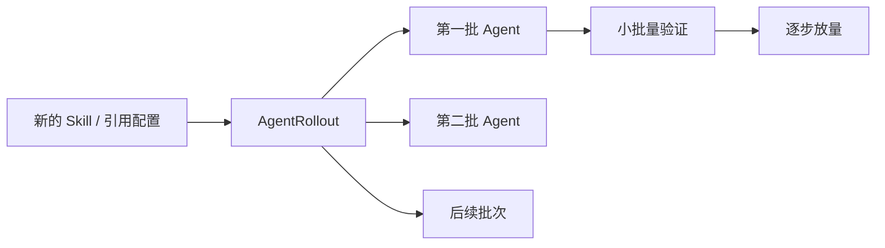

# 07. 为存量 OpenClaw 分批升级技能组合

## 本章场景

当你的 OpenClaw 已经被多个团队成员用起来之后，最常见的新增需求通常不是“重做一个新的 OpenClaw”，而是：

- 给现有 OpenClaw 统一补上一组新 Skill
- 但不要一下子影响全部实例
- 希望先小批量验证，再逐步放大范围

所以这一章聚焦的不是抽象的“发布机制”，而是一个非常具体的客户动作：

> **如何为已经上线的 OpenClaw，分批升级一组新的技能组合。**

---

## 前置章节

建议先完成：
- [02. 快速启动一个自带浏览器和角色设定的 OpenClaw](./02-create-openclaw-browser-agent.md)
- [04. 沉淀一套可复制的 OpenClaw 标准配置](./04-reduce-agent-config-with-external-references.md)
- [05. 用 Tags 给不同业务线做分账归属](./05-use-tags-for-chargeback.md)
- [06. 在不删除实例的前提下暂停与恢复你的 OpenClaw](./06-pause-and-resume-openclaw.md)

---

## 为什么这一步要放在最后

因为这个场景成立的前提是：
- 你已经会创建 OpenClaw
- 你已经有一批正在运行的 OpenClaw
- 你已经把常用能力整理成了可复用标准件

只有这样，“给存量 OpenClaw 批量加 Skill”才是一个真实存在的问题。

否则，客户很容易把下面几件事混在一起：
- 新建一个 OpenClaw
- 修改一份标准配置
- 给已经在跑的 OpenClaw 推送升级

这三件事都和“变更”有关，但不是一回事。

---

## 原理说明

这一步的本质不是“再造一个新模板”，而是：

> 用一个 `AgentRollout`，把一份变更按批次逐步推送到一批已经在运行的 OpenClaw 上。

新的 rollout patch 模型有一个更容易记忆的心智：

- **默认不写指令**：表示 `merge`
- **想整体替换**：写 `$patch: replace`
- **想删除某些内容**：写 `$patch: delete`

这套写法是**受 Kubernetes Strategic Merge Patch 启发**设计出来的：

你可以继续沿用自己熟悉的 Kubernetes patch 直觉来理解 rollout。所以对大多数已经熟悉 Kubernetes 的用户来说，这一套 spec 会比旧的 `agentSpecPatch` / `agentSpecMerge` / `agentSpecDelete` 更容易接受和记忆。

不过也要注意一点：

> 它是“受 Kubernetes SMP 启发”的 AgentRollout 专用 patch 语法，
> 不是 `kubectl patch --type strategic` 对目标 Agent 的原生直通执行。

你可以把它理解成：

1. 默认情况下，rollout 会尽量做“局部变更”
2. 只有你显式写了 `$patch: replace`，系统才会整体替换对应字段
3. 只有你显式写了 `$patch: delete`，系统才会删除对应项或清空对应字段

### 1. 默认行为是 merge，不再是“顶层字段自动整体覆盖”

例如你现在只想更新 `profile.image`，可以直接写：

```yaml
spec:
  agentSpecStrategicPatch:
    profile:
      image: ccr.ccs.tencentyun.com/ags-image/sandbox-openclaw-browser:v1.13
```

它的意思是：

- 更新 `profile.image`
- 保留 `profile` 里未出现的其他字段

这和旧 `agentSpecPatch.profile = {...}` 的“整块替换 `profile`”已经不同了。

### 2. 想整体切换 ref，就显式写 `$patch: replace`

对于 `skillPackRefs`、`pluginBundleRefs`、`fileInjectRefs` 这类 ref 列表，推荐把它们当成“发布单元”来切换。

例如把一批 OpenClaw 的技能组合从旧 ref 切到新 ref：

```yaml
spec:
  agentSpecStrategicPatch:
    skillPackRefs:
      $patch: replace
      items:
        - openclaw-browser-skills-v2
```

这时的意思就非常直接：

- 不做 merge
- 直接把 `skillPackRefs` 整体替换成新值

### 3. 想删除内容，就显式写 `$patch: delete`

例如删除一个 env：

```yaml
spec:
  agentSpecStrategicPatch:
    env:
      - $patch: delete
        key: HTTP_PROXY
```

或者删除某个 skillPack 下的一个 skill：

```yaml
spec:
  agentSpecStrategicPatch:
    skillPacks:
      - name: starter-skills
        skills:
          $patch: delete
          items:
            - browser
```

### 4. 仍然推荐“发布标准件时优先切 ref”

虽然新设计已经支持更细粒度的 merge/delete，但对于面向团队的稳定发布场景，仍然推荐优先：

- 准备新的 `SkillPack` / `AgentProfile` / `FileInjects` 等标准件
- 然后通过 rollout 去切换对应的 `*Ref`

这样做的好处仍然是：

- rollout 更短
- 回滚更直接
- 版本边界更清晰
- 更适合团队共享

### 5. rollout 推出去的 ref，最终仍会展开成实际生效配置

rollout 中发的是：

- `skillPackRefs`
- `profileRef`
- `fileInjectRefs`

但运行时 Operator 仍然会把这些 ref 解析成真正生效的内部配置。

所以推荐做法仍然是：

- **发布时发 ref**
- **排查时看展开后的真实效果**

---

## 场景示意图



## 你需要填写的参数

| 参数 | 是否必填 | 示例 |
|---|---|---:|
| 目标 OpenClaw 标签 | 是 | `app: openclaw-browser` |
| rollout 变更类型 | 是 | `replace skillPackRefs` / `merge skillPacks` / `update profile.image` |
| 新的 skillPackRef | 否 | `openclaw-browser-skills-v2` |
| 新增或升级的 skill | 否 | `github@1.0.0` / `browser@1.1.0` |
| 新镜像 | 否 | `ccr.ccs.tencentyun.com/ags-image/sandbox-openclaw-browser:v1.13` |
| batchSize | 是 | `20%` |
| maxUnavailable | 是 | `1` |
| updateMode | 否 | `RollingUpgrade` |
| lifecycle hook | 否 | `preUpgrade` / `postUpgrade` |

其中：

- 如果你要发布一套新的技能标准件，就填“新的 skillPackRef”
- 如果你要直接给现有 pack 加 skill，就填“新增或升级的 skill”
- 如果你要升级运行镜像，就填“新镜像”
- 如果你希望镜像升级尽量减少中断，就显式设置 `updateMode: RollingUpgrade`
- 如果升级前后需要做一次性数据迁移，就配置 `lifecycle.preUpgrade` 和 `lifecycle.postUpgrade`

`RollingUpgrade` 的顺序是：先在旧实例执行 `preUpgrade`，再创建 replacement sandbox；replacement 进入 Running 并完成初始化后，在新实例执行 `postUpgrade`；只有 hook 成功后才切换访问入口，最后清理旧 sandbox。`batchSize` 同时控制本批最多会有多少 replacement sandbox，`maxUnavailable` 只约束用户可见不可用数量。

虽然这里把 hook 用在“一次性数据迁移”场景，但脚本本身仍然要按可重入方式设计。后续如果某一批升级失败并由人工触发重试，系统可能重新执行失败 Agent 的升级流程；`preUpgrade` 也可能再次运行，以便重新导出旧 sandbox 的最新状态。脚本应避免依赖“只执行一次”的副作用，例如覆盖前先检查备份目录、输出文件使用固定且可覆盖的位置、重复执行清理或恢复命令不会破坏已有数据。

使用 `RollingUpgrade` 时，旧实例和 replacement 会同时挂载同一个 `profile.volumeMounts` 目录。不要把频繁写入、文件锁语义不明确，或不支持并发安全访问的目录配置为持久化挂载目录；如果应用会持续写工作目录，需要在 `preUpgrade` 中完成 flush、暂停写入或切只读，并在 `postUpgrade` 中完成校验。老版本的 `profile.storage` 仍兼容，但新配置建议使用 `profile.volumeMounts`。

---

## 这一步最终会得到什么

执行完本章后，你会得到：
- 一份新的技能组合标准件
- 一个用于分批推广新技能的 rollout
- 一批被逐步升级的存量 OpenClaw

也就是说，你不是“重新造了一批 OpenClaw”，而是：

> **在不一次性打扰全部用户的前提下，为已有 OpenClaw 逐步增加新能力。**

---

## 第一步：先准备新的技能组合

假设你当前所有 OpenClaw 都在用：
- `openclaw-browser-skills`

现在你希望给它们统一升级到一个新版本：
- `openclaw-browser-skills-v2`

`openclaw-browser-skills-v2` 已在旁边的 [`manifests/07-00-rollout-add-skills.yaml`](./manifests/07-00-rollout-add-skills.yaml) 中维护，并作为该文件的第一个 YAML document 创建。

如果你想直接 apply，请使用下一步的 rollout manifest；它会同时创建新的 `SkillPack` 并发起分批 rollout。YAML 内容以上文链接的 `manifests/` 文件为唯一事实来源，本文不再重复维护。

真正验证 rollout 是否成功时，不要只看 `AgentRollout` 的 `Completed` 状态。更可靠的做法是：

- 看目标 Agent 的 `status.message` 是否仍有技能安装失败信息
- 进入实例检查 `/openclaw/.openclaw/workspace/skills/browser` 是否真的存在

---

## 第二步：分批切换到新的 skillPackRef

这是最推荐的 rollout 用法：先准备好新的技能标准件，再在存量实例上切换 ref。

下面这个例子会把命中的 OpenClaw：

- 从旧的 `skillPackRefs`
- 切换到新的 `openclaw-browser-skills-v2`

YAML 内容以 [`manifests/07-00-rollout-add-skills.yaml`](./manifests/07-00-rollout-add-skills.yaml) 为准，本文不再重复维护。

如果你确认要开始正式 rollout，执行：

```bash
kubectl apply -f ./openclaw-browser-on-TencentAGS/manifests/07-00-rollout-add-skills.yaml
```

---

## 第三步：先用 dryRun 预演影响范围

如果你还不想马上动线上 OpenClaw，可以先执行一个 dryRun rollout。

YAML 内容以 [`manifests/07-00-rollout-dryrun-preview.yaml`](./manifests/07-00-rollout-dryrun-preview.yaml) 为准，本文不再重复维护。

这个 dryRun 用例会：

- 正常匹配目标 OpenClaw
- 计算哪些 Agent 会被变更
- 把预演统计写进 `AgentRollout.status`
- 给 `AgentRollout` 打 Event
- **但不会修改任何 Agent**

这样你可以先确认影响范围，再决定是否执行正式 rollout。

---

## 第四步：如果你不想切 ref，也可以直接 merge skill

有些时候你不是要切整套标准件，而是只想：

- 给现有 `skillPack` 新增一个 skill
- 或把某个 skill 升级到新版本

这时可以直接利用默认 merge 语义。

例如，给 `starter-skills` 增加一个 `github@1.0.0`：

```yaml
apiVersion: agent.agentway.io/v1alpha1
kind: AgentRollout
metadata:
  name: openclaw-browser-add-github-skill
  namespace: default
spec:
  selector:
    matchLabels:
      app: openclaw-browser
  agentSpecStrategicPatch:
    skillPacks:
      - name: starter-skills
        skills:
          - github@1.0.0
  strategy:
    type: Rolling
    batchSize: 20%
    maxUnavailable: 1
    intervalSeconds: 30
```

如果目标 Agent 当前已经有：

```yaml
spec:
  skillPacks:
    - name: starter-skills
      skills:
        - browser@1.0.0
        - summarize@1.0.0
```

那么 rollout 后会变成：

```yaml
spec:
  skillPacks:
    - name: starter-skills
      skills:
        - browser@1.0.0
        - summarize@1.0.0
        - github@1.0.0
```

如果你把 `github@1.0.0` 换成 `browser@1.1.0`，则表示对同一逻辑 skill 做版本升级，而不是简单追加一个新字符串。

---

## 第五步：分批更新 `image` 字段

新 rollout 设计还有一个很实用的能力：

> 你可以只更新 `profile.image`，而不需要把整个 `profile` 一起重写。

### 用法 A：直接更新 `profile.image`

如果你的 Agent 主要靠 inline `profile` 运行，可以直接写：

```yaml
apiVersion: agent.agentway.io/v1alpha1
kind: AgentRollout
metadata:
  name: openclaw-browser-image-rollout
  namespace: default
spec:
  selector:
    matchLabels:
      app: openclaw-browser
  agentSpecStrategicPatch:
    profile:
      image: ccr.ccs.tencentyun.com/ags-image/sandbox-openclaw-browser:v1.13
  strategy:
    type: Rolling
    batchSize: 20%
    maxUnavailable: 1
    intervalSeconds: 30
```

它的效果是：

- 更新 `profile.image`
- 保留 `profile.command`
- 保留 `profile.env`
- 保留 `profile.access`
- 保留 `profile` 下你没有显式改动的其他字段

这正是新 patch 设计相对旧 `agentSpecPatch` 最大的改进之一。

### 用法 B：如果你本来就在用共享 profile，仍然更推荐切 `profileRef`

如果你已经有一套共享的 `AgentProfile` 管理方式，更推荐先创建一个新的 profile，例如：

- `openclaw-browser-profile-v2`

然后通过 rollout 只替换 `profileRef`：

```yaml
apiVersion: agent.agentway.io/v1alpha1
kind: AgentRollout
metadata:
  name: openclaw-browser-profile-rollout
  namespace: default
spec:
  selector:
    matchLabels:
      app: openclaw-browser
  agentSpecStrategicPatch:
    profileRef: openclaw-browser-profile-v2
  strategy:
    type: Rolling
    batchSize: 20%
    maxUnavailable: 1
    intervalSeconds: 30
```

这个方式更适合：

- 团队共享统一运行时标准
- 需要版本化管理 profile
- 希望回滚时直接切回旧 ref

### 用法 C：滚动更新平滑镜像升级

如果你升级的是 `profile.image` 这类会触发 sandbox 重建的字段，普通 rollout 可能会经历：

```text
停止旧 sandbox -> 创建新 sandbox -> 等新 sandbox ready
```

这段时间里用户访问会中断。

`RollingUpgrade` 模式会把顺序改成：

```text
旧 sandbox 继续服务
  -> 在旧 sandbox 执行 preUpgrade（如果配置了）
  -> 创建新 sandbox
  -> 等新 sandbox Running，并完成初始化、资产重放和健康检查
  -> 在新 sandbox 执行 postUpgrade（如果配置了）
  -> 切换 accessURL / 访问入口到新 sandbox
  -> 删除旧 sandbox
```

完整 YAML 示例：

你可以直接参考示例文件：

```bash
kubectl apply -f ./openclaw-browser-on-TencentAGS/manifests/07-01-rolling-upgrade-image-rollout.yaml
```

```yaml
apiVersion: agent.agentway.io/v1alpha1
kind: AgentRollout
metadata:
  name: openclaw-browser-smooth-image-rollout
  namespace: default
spec:
  selector:
    matchLabels:
      app: openclaw-browser
  agentSpecStrategicPatch:
    profile:
      image: ccr.ccs.tencentyun.com/ags-image/sandbox-openclaw-browser:v1.13
  strategy:
    type: Rolling
    updateMode: RollingUpgrade
    batchSize: 20%
    maxUnavailable: 1
    intervalSeconds: 30
```

这个例子表达的是：

- 仍然按 `20%` 分批推进
- `batchSize` 控制 RollingUpgrade 并发；每批最多为命中的 20% Agent 创建 replacement sandbox
- `maxUnavailable: 1` 只限制用户可见不可用的旧服务入口数量；旧 sandbox 仍健康服务时，replacement 创建中不算 unavailable
- 每个进入当前批次的 Agent 最多创建 1 个 replacement sandbox，因此 RollingUpgrade 临时新增的 sandbox 数量由 `batchSize` 控制
- 对每个 Agent，先创建新 sandbox
- 新 sandbox 完成初始化、资产重放和健康检查后再切换访问入口
- 切换成功后删除旧 sandbox；旧 sandbox 清理完成或确认已经不存在后，该 Agent 才算本批 ready

### 用法 D：lifecycle hook，用于一次性数据迁移

有些升级不是单纯换镜像，还需要处理工作区数据。例如：

- 旧版本把状态写在 `/root/.openclaw`
- 新版本需要先从备份恢复工作区
- 升级前需要打包旧状态
- 升级后需要执行一次兼容脚本

这时可以在 rollout 里配置 lifecycle hook：

下面的例子把 `profile.volumeMounts[].mountPath` 配成独立的 `/mnt/persist`，避免把 `/openclaw` 这种频繁写入、并发不安全的应用目录直接挂到持久化存储。`preUpgrade` 在旧 sandbox 中把 `/openclaw` 打包到 `/mnt/persist` 并写入校验和；`postUpgrade` 在 replacement sandbox 中校验归档、解压到新的 `/openclaw`，再检查恢复后的数据完整性。

被选中的 Agent/Profile 应先使用类似的存储配置：

```yaml
profile:
  volumeMounts:
    - name: persist
      mountPath: /mnt/persist
```

```yaml
apiVersion: agent.agentway.io/v1alpha1
kind: AgentRollout
metadata:
  name: openclaw-browser-smooth-image-rollout
  namespace: default
spec:
  selector:
    matchLabels:
      app: openclaw-browser
  agentSpecStrategicPatch:
    profile:
      image: ccr.ccs.tencentyun.com/ags-image/sandbox-openclaw-browser:v1.13
  strategy:
    type: Rolling
    updateMode: RollingUpgrade
    batchSize: 20%
    maxUnavailable: 1
    intervalSeconds: 30
  lifecycle:
    preUpgrade:
      exec:
        command:
          - /bin/bash
          - -c
          - |
            set -e
            persist=/mnt/persist
            src=/openclaw
            backup="$persist/openclaw-rolling-upgrade"
            mkdir -p "$backup"
            test -d "$src/.openclaw"
            tar -C "$src" -czf "$backup/openclaw.tgz" .
            (cd "$backup" && sha256sum openclaw.tgz > openclaw.tgz.sha256)
            sync
            cat "$backup/openclaw.tgz.sha256"
            echo 'preUpgrade success'
      timeoutSeconds: 600
    postUpgrade:
      exec:
        command:
          - /bin/bash
          - -c
          - |
            set -e
            persist=/mnt/persist
            dst=/openclaw
            backup="$persist/openclaw-rolling-upgrade"
            test -s "$backup/openclaw.tgz"
            (cd "$backup" && sha256sum -c openclaw.tgz.sha256)
            rm -rf "$dst"
            mkdir -p "$dst"
            tar -C "$dst" -xzf "$backup/openclaw.tgz"
            test -d "$dst/.openclaw"
            (cd "$backup" && cat openclaw.tgz.sha256)
            echo 'postUpgrade success'
      timeoutSeconds: 600
```

这里的执行语义是：

- `preUpgrade` 在旧 sandbox 里执行，适合先让应用 flush/停写，再把 `/openclaw` 归档到 `/mnt/persist`。
- 新 sandbox 创建并 Running 后，执行 `postUpgrade`。
- `postUpgrade` 在新 sandbox 里执行，适合从 `/mnt/persist` 校验并恢复 `/openclaw`，再做迁移、兼容性修正。
- 任意 hook 失败或超时，本批 Agent 不会进入 promotion。
- hook 命令输出会进入受限的状态摘要或事件摘要，不要在脚本里打印 token、secret、password、access key 等敏感信息。

需要特别注意持久化目录：

> RollingUpgrade 会让旧 sandbox 和 replacement 在切流前同时访问 `profile.volumeMounts` 中声明的持久化目录。

因此，不要在 `profile.volumeMounts` 中指定频繁写入、依赖本地文件锁、或应用自身不支持并发安全访问的目录。更推荐像上面这样把 `mountPath` 设为 `/mnt/persist` 这类专用持久化目录，由 `preUpgrade` 把 `/openclaw` 的状态归档进去，`postUpgrade` 再校验并恢复到 replacement 的 `/openclaw`。hook 返回非零时 Operator 不会 promotion。

## 第六步：运行态重启的版本边界

固定版本 CRD 不包含 `AgentRollout.spec.agentMetadataStrategicPatch` 或 `agentReplicaSetName`，因此本章不提供通过 rollout 批量写入 restart-key 的可执行步骤。副本集重启的规划示例见[第 08 章](./08-publish-openclaw-service-with-agentreplicaset.md#场景四按批重启副本规划当前版本不支持)。

单个 Agent 的人工重启可使用固定版本支持的注解，执行前确认允许该实例短暂中断：

```bash
kubectl annotate agent openclaw-browser-agent -n default agentway.io/restart=true --overwrite
```

## 一个完整例子：从 ref 发布到最终实际生效

假设你当前已经有一个 OpenClaw：

```yaml
apiVersion: agent.agentway.io/v1alpha1
kind: Agent
metadata:
  name: openclaw-browser-agent-a
  namespace: default
  labels:
    app: openclaw-browser
spec:
  profileRef: openclaw-browser-profile-ref
  skillPackRefs:
    - openclaw-browser-skills
  fileInjectRefs:
    - openclaw-browser-agent-rules
```

然后你执行本章的 rollout：

```yaml
spec:
  selector:
    matchLabels:
      app: openclaw-browser
  agentSpecStrategicPatch:
    skillPackRefs:
      $patch: replace
      items:
        - openclaw-browser-skills-v2
```

那么 rollout 推进后，这个 OpenClaw 的目标状态会变成：

```yaml
spec:
  profileRef: openclaw-browser-profile-ref
  skillPackRefs:
    - openclaw-browser-skills-v2
  fileInjectRefs:
    - openclaw-browser-agent-rules
```

这里发生了两件事：

1. 因为显式写了 `$patch: replace`，`skillPackRefs` 被整体替换成新值
2. `openclaw-browser-skills-v2` 这个 ref 后续会被系统自动展开，进入 Agent 实际生效的内部 Spec

这就是为什么我前面一直强调：
- rollout 层面更推荐发 ref
- 运行层面最终看展开后的实际效果

---

## 预期效果

做完后：
- 系统不会一次性替换所有 OpenClaw
- 会按 `batchSize` 分批推进
- 命中的 OpenClaw 会逐步把 `skillPackRefs` 切换为 `openclaw-browser-skills-v2`
- 新的技能组合会在后续运行中实际生效
- 如果你选择的是镜像 rollout，命中的 OpenClaw 会逐步把 `profile.image` 或 `profileRef` 切到新值

---

## 如何验证

```bash
kubectl get agentrollout -n default
kubectl describe agentrollout openclaw-browser-skills-rollout -n default
kubectl get agent -n default -l app=openclaw-browser -o yaml
```

你可以重点观察：
- rollout 是否按批次推进
- `matchedAgents` / `updatedAgents` / `readyAgents` 是否逐步变化
- 目标 OpenClaw 的 `spec.skillPackRefs` 是否已经切到新值
- 如果做的是 skill merge，`spec.skillPacks` 是否出现了新增或升级后的 skill
- 如果做的是 image rollout，`spec.profile.image` 或 `spec.profileRef` 是否已更新

如果你还想继续确认“展开后的实际效果”，可以继续查看该 Agent 的状态和运行结果，确认新技能组合或新镜像已经被实际应用。

---

## 如果某一批升级失败，如何手动重试

`RollingUpgrade` 的设计目标是“宁可暂停，也不要把有问题的变更继续扩散”。因此，如果某个 Agent 在当前批次里执行失败，例如：

- `preUpgrade` 或 `postUpgrade` 脚本返回非零
- replacement sandbox 没有按预期准备好
- 迁移脚本依赖的文件、目录或权限暂时不满足

那么 `AgentRollout` 会进入降级状态，并暂停后续批次。已经在服务的旧 sandbox 会继续保留，后续还没进入 rollout 的 Agent 不会被继续修改。

你可以先查看失败原因：

```bash
kubectl describe agentrollout <rollout-name> -n default
kubectl get agent -n default -l app=openclaw-browser -o wide
kubectl describe agent <failed-agent-name> -n default
```

处理完失败原因后，不需要修改 rollout 的目标配置，也不需要重新创建 `AgentRollout`。只需要给这个 rollout 写入一个新的重试标记：

```bash
kubectl annotate agentrollout <rollout-name> \
  -n default \
  agentway.io/retry-generation="$(date +%Y%m%d%H%M%S)" \
  --overwrite
```

这个值只需要和上一次不同即可，可以用时间戳、流水线编号或 UUID，不要求是连续递增的数字。

触发后，系统会先重试当前 rollout 中已经失败的 Agent。重试完成前，后续批次仍然不会继续推进；如果这批重试成功，`AgentRollout` 会回到原来的分批策略，继续处理后续 Agent。

你可以继续观察：

```bash
kubectl get agentrollout <rollout-name> -n default -w
kubectl get agent -n default -l app=openclaw-browser -w
```

如果同一个问题再次失败，先继续排查并修复原因，然后再写入一个新的 `agentway.io/retry-generation` 值即可。

---

## 到这里你已经完成了什么

做到这里，你已经掌握了这条主线里的完整能力：
- 准备环境
- 准备 Tencent Agent Runtime 基础设施
- 快速启动一个自带浏览器和角色设定的 OpenClaw
- 保护 OpenClaw 只访问你允许的目标
- 沉淀一套可复制的 OpenClaw 标准配置
- 为存量 OpenClaw 分批升级技能组合

同时你也理解了一个非常关键的发布原则：

> rollout 默认是 merge；
> 想整体替换时显式写 `$patch: replace`；
> 想删除时显式写 `$patch: delete`；
> 面向团队发布标准件时，仍然优先切换 ref。
