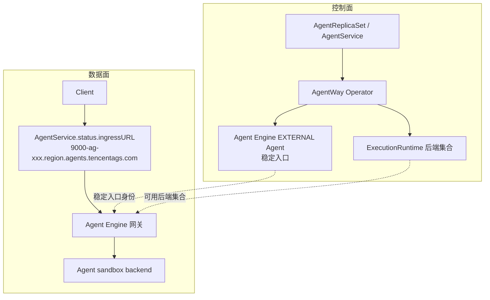
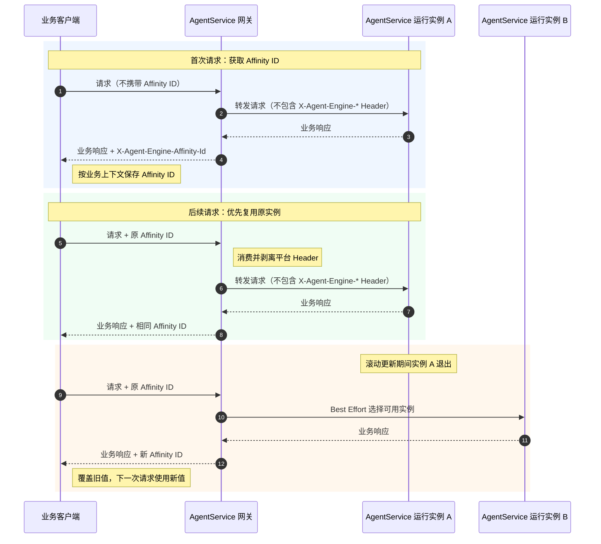

# 08. 使用 AgentReplicaSet 和 AgentService 发布服务型 Agent

这一章介绍如何把 OpenClaw 从单实例 Agent，发布成具备稳定入口和多副本能力的服务型 Agent。

## 本章场景

当一个 Agent 从“个人使用的单实例”变成“面向业务系统或大量用户的服务”时，通常会遇到这些问题：

- 我能不能像使用 Kubernetes `Service` 一样，为 Agent 暴露一个稳定入口？
- 我能不能像使用 Kubernetes `ReplicaSet` 一样，声明需要几个同类 Agent 副本？
- 我能不能在 RollingUpgrade 时保持服务入口不变，让底层后端自动轮换？
- 我是不是还需要在自己的 Kubernetes 集群里部署和维护入口网关？

AgentWay 的服务型 Agent 能力提供了这样的使用方式：

> Kubernetes 集群里不需要维护七层入网组件。AgentWay Operator 会为服务型 Agent 申请 Agent Engine 网关入口，并把稳定访问地址写回 `AgentService.status.ingressURL`。

使用方式仍然是 Kubernetes 风格的 CRD 声明：

- `AgentReplicaSet`：声明一组同配置 Agent，需要多少个副本。
- `AgentService`：声明哪些 Agent 组成一个服务，并获得稳定访问入口。
- `AgentRollout`：声明如何更新 Agent。RollingUpgrade 模式下，服务入口保持不变，底层后端自动切换。

---

## 前置章节

建议先完成：

- [00. 准备集群环境并部署 Operator](./00-prepare-cluster-and-deploy-operator.md)
- [01. 准备 Tencent Agent Runtime 基础设施](./01-prepare-tencent-agent-runtime.md)
- [02. 快速启动一个自带浏览器、技能和角色设定的 OpenClaw](./02-create-openclaw-browser-agent.md)

不需要在 Kubernetes 集群里额外安装七层入口组件。

---

## 使用心智模型

可以按 Kubernetes 的三个对象来类比：


| Kubernetes 对象 | AgentWay 对象       | 负责什么                 |
| ------------- | ----------------- | -------------------- |
| `Pod`         | `Agent`           | 一个真实运行的 Agent 实例     |
| `ReplicaSet`  | `AgentReplicaSet` | 自动创建并维持一组同配置 Agent   |
| `Service`     | `AgentService`    | 选择一组 Agent，并暴露稳定服务入口 |


底层云资源不需要手动维护。创建 `AgentService` 后，Operator 会在 Agent Engine 网关（AGS 托管网关）中为它创建一个 `EXTERNAL Agent` 作为稳定入口，并把访问地址写回 `AgentService.status.ingressURL` 和 `status.ports[]`：



几个关键点：

- 一个 `AgentService` 对应一个 Agent Engine 网关 `EXTERNAL Agent`，这个对象代表稳定入口身份。
- `AgentService` 命中的 Ready backend 会作为 `ExecutionRuntime` 加入该入口的后端集合。
- 多端口由 Agent Engine 网关识别并转发，不需要客户在集群里为每个端口维护入口对象。
- `AgentService.status.ingressURL` 是首个声明端口的稳定入口；其它端口入口在 `status.ports[].ingressURL` 中查看。

使用时主要关注 CRD 和 `status.ingressURL`。入口分配、可用副本更新和健康状态维护由 AgentWay 与 Agent Engine 网关完成。

---

## 你需要填写的参数


| 参数         | 是否必填                | 示例                                                                |
| ---------- | ------------------- | ----------------------------------------------------------------- |
| namespace  | 是                   | `default`                                                         |
| 服务标签       | 是                   | `app: claim-bot`                                                  |
| 副本数        | 多副本场景必填             | `3`                                                               |
| Agent 默认直连端口 | 否；仅在需要 `Agent.status.accessURL` 时配置 `AgentProfile.spec.access.port` | `9000`                                                           |
| 示例镜像       | 可按需替换               | `ccr.ccs.tencentyun.com/ags-image/sandbox-openclaw-browser:v1.12` |
| 升级镜像或配置    | RollingUpgrade 场景必填 | `ccr.ccs.tencentyun.com/ags-image/claim-bot:v2`                   |


---

## 先应用示例运行配置

下面的示例会创建一个可被后续 `Agent` 和 `AgentReplicaSet` 直接引用的运行配置。你可以先原样测试；如果要接入自己的业务 Agent，只需要替换镜像、启动命令和环境变量。

```yaml
apiVersion: agent.agentway.io/v1alpha1
kind: AgentProfile
metadata:
  name: claim-bot-profile
  namespace: default
spec:
  image: ccr.ccs.tencentyun.com/ags-image/sandbox-openclaw-browser:v1.12
  command: ["/init"]
  access:
    port: 9000
    path: /
  ports:
    - name: extra-9001
      port: 9001
      protocol: TCP
  startupProbe:
    httpGet:
      path: /ping
      port: 9000
---
apiVersion: agent.agentway.io/v1alpha1
kind: AgentTemplate
metadata:
  name: claim-bot-template
  namespace: default
spec:
  version: v1
  agentSpecTemplate:
    profileRef: claim-bot-profile
    resources:
      cpu: "2"
      memory: "4Gi"
    env:
      - key: OPENCLAW_MODE
        value: "browser"
```

应用：

```bash
kubectl apply -f <your-agent-template-file>.yaml
```

如果你只想直接体验 `AgentReplicaSet` 主路径，可以使用本目录提供的完整示例：

```bash
kubectl apply -f manifests/08-00-agentreplicaset-claim-bot.yaml
```

该文件包含 `AgentProfile`、`AgentTemplate` 和一个 2 副本 `AgentReplicaSet`。示例把 child Agent 设置为 `authMode: none`，便于你直接验证多副本负载均衡，不会因为每个 Agent 的独立 token 导致随机 401。

默认示例暴露两个应用端口：

- `9000`：OpenClaw 原生入口，`/ping` 返回 `{"status":"ok","message":"pong"}`。
- `9001`：cookbook 通过 `bootstrapScripts` 额外启动的测试 HTTP 服务，`/ping` 会返回 `port`、`instance` 和 `path`，便于直接观察请求是否被分发到多个 Agent 副本。

等待两个副本进入 Running：

```bash
kubectl get agent -n default -l app=claim-bot -w
```

然后创建稳定入口：

```bash
kubectl apply -f manifests/08-01-agentservice-claim-bot.yaml
```

该文件只包含一个 `AgentService`，selector 与 `08-00-agentreplicaset-claim-bot.yaml` 中的副本标签一致。

查看 Operator 写出的入口资源：

```bash
kubectl get agentservice claim-bot -n default
kubectl get agentservice claim-bot -n default \
  -o jsonpath='{.status.ingressURL}{"\n"}{range .status.ports[*]}{.name}{" "}{.port}{" "}{.ingressURL}{"\n"}{end}'
```

命令返回后，`READY` 为 `True`，`status.ingressURL` 和 `status.ports[].ingressURL` 都是 Agent Engine 网关分配的 HTTPS 地址。地址形态如下：

```text
https://9000-ag-xxxxxxxx.ap-guangzhou.agents.tencentags.com
https://9001-ag-xxxxxxxx.ap-guangzhou.agents.tencentags.com
```

访问默认展示入口，也就是 `spec.ports` 中第一个端口对应的 `status.ingressURL`：

```bash
INGRESS_URL="$(kubectl get agentservice claim-bot -n default -o jsonpath='{.status.ingressURL}')"
for i in $(seq 1 30); do
  curl -k -sS -w " %{http_code}\n" "${INGRESS_URL%/}/ping"
done
```

连续请求返回 `200`，响应体为 OpenClaw 原生 `pong`。由于 9000 响应体不包含实例标识，它只能证明入口链路可达。

再访问 9001 测试端口，统计响应中的 `instance` 字段：

```bash
PORT_9001_URL="$(
  kubectl get agentservice claim-bot -n default -o json \
  | jq -r '.status.ports[] | select(.port == 9001) | .ingressURL'
)"
for i in $(seq 1 30); do
  curl -k -sS "${PORT_9001_URL%/}/ping"
  echo
done
```

每次请求返回 `{"status":"ok","port":9001,"instance":"...","path":"/ping"}`。如果多次请求中的 `instance` 出现两个不同值，说明请求已经被 Agent Engine 网关负载均衡到多个 Agent backend。

---

## 通过 Ingress 暴露 AgentService

新 `ags-managed` 模式不要求客户集群内维护 Kubernetes Ingress 或其它七层入口组件。默认使用 `AgentService.status.ingressURL` 中的 Agent Engine 网关地址对外服务。

如果业务必须使用自有域名，应在域名层或网关产品能力中把业务域名 CNAME / 反向代理到 `status.ports[].ingressURL` 对应的 Agent Engine 网关入口。当前 `AgentService.spec` 不提供自定义 host 字段，也不再生成可供 Ingress 直接引用的 `p<port>-as-<name>` Service。

---

## 场景一：给单个 Agent 暴露稳定入口

如果你已经有一个正在运行的 Agent，并希望它在升级前后都有一个稳定访问地址，可以先给这个 Agent 打上明确标签：

```yaml
apiVersion: agent.agentway.io/v1alpha1
kind: Agent
metadata:
  name: claim-bot-primary
  namespace: default
  labels:
    app: claim-bot
    service.agentway.io/name: claim-bot
spec:
  templateRef: claim-bot-template
```

然后创建 `AgentService`：

```yaml
apiVersion: agent.agentway.io/v1alpha1
kind: AgentService
metadata:
  name: claim-bot
  namespace: default
spec:
  selector:
    matchLabels:
      app: claim-bot
      service.agentway.io/name: claim-bot
  ports:
    - name: http-9000
      protocol: HTTP
      port: 9000
    - name: http-9001
      protocol: HTTP
      port: 9001
```

资源创建后：

- Operator 选择标签匹配的 `claim-bot-primary` 作为 backend。
- Operator 为该服务申请或更新 Agent Engine 网关入口。
- 托管入口指向该 Agent 当前可服务的运行实例。
- `AgentService.status.ingressURL` 返回稳定访问入口。

`AgentService.spec.ports[]` 中的端口是并列的。为了兼容已有消费方，Operator 会把第一个声明端口的访问地址同步写到 `status.ingressURL`，作为默认展示入口；所有端口的访问地址都可以在 `status.ports[].ingressURL` 中查看。通常可以把第一个端口设置为 `AgentProfile.spec.access.port`，其它端口需要在 `AgentProfile.spec.ports` 中声明。Operator 会为同一个 `AgentService` 维护一个 Agent Engine 网关 `EXTERNAL Agent`，并为每个端口生成独立的入口地址；用户不需要也不能在 `AgentService` 中填写域名。

查看状态：

```bash
kubectl get agentservice claim-bot -n default
kubectl describe agentservice claim-bot -n default
```

示例状态：

```yaml
status:
  ingressURL: https://9000-ag-xxxxxxxx.ap-guangzhou.agents.tencentags.com
  gatewayServiceName: ag-xxxxxxxx
  ports:
    - name: http-9000
      protocol: HTTP
      port: 9000
      ingressURL: https://9000-ag-xxxxxxxx.ap-guangzhou.agents.tencentags.com
      gatewayServiceName: ag-xxxxxxxx
    - name: http-9001
      protocol: HTTP
      port: 9001
      ingressURL: https://9001-ag-xxxxxxxx.ap-guangzhou.agents.tencentags.com
      gatewayServiceName: ag-xxxxxxxx
  backends:
    - agentName: claim-bot-primary
      backendHost: 9000-<sandbox-id>.ap-shanghai.tencentags.com
      phase: Ready
      serving: true
      reason: Ready
  conditions:
    - type: Ready
      status: "True"
      reason: ManagedIngressReady
```

后续访问生产服务时，应使用 `AgentService.status.ingressURL`，不要再把 `Agent.status.accessURL` 当作长期对外入口。

`ingressURL` 是 Agent Engine 网关公开 HTTPS 地址，Host 形态为 `<port>-<gateway-id>.<region>.agents.tencentags.com`。它不会包含 AGS `access_token`；`Agent.status.accessURL` 仍是底层单个沙箱的临时访问入口，不应作为对外稳定入口传播。

---

## 场景二：RollingUpgrade 时保持服务入口不变

当某个 `AgentService` 只匹配一个特定 Agent 时，它可以作为这个 Agent 的稳定入口。后续对这个 Agent 做 RollingUpgrade 时，调用方继续访问同一个 `ingressURL`，底层后端实例由系统自动切换。

### 基础用法

如果你想直接体验“单个 Agent + AgentService 稳定入口 + RollingUpgrade”的完整路径，可以先创建单 Agent 和对应的 AgentService：

```bash
kubectl apply -f manifests/08-02-single-agentservice.yaml
```

这个 manifest 只包含两个对象，便于你先确认稳定入口可用：

- 一个带稳定标签的 `Agent`：`claim-bot-primary`
- 一个只匹配该 Agent 的 `AgentService`：`claim-bot-primary`

等待 Agent 和 AgentService 就绪：

```bash
kubectl get agent claim-bot-primary -n default -w
kubectl get agentservice claim-bot-primary -n default
```

确认 `Agent` 进入 `Running`，且 `AgentService` 的 `READY` 为 `True` 后，再单独应用 rollout：

```bash
kubectl apply -f manifests/08-02-single-agentservice-rolling-upgrade.yaml
```

下面这个 rollout 会升级 `claim-bot-primary` 使用的镜像，并要求平台按 RollingUpgrade 方式处理底层运行实例：

```yaml
apiVersion: agent.agentway.io/v1alpha1
kind: AgentRollout
metadata:
  name: claim-bot-image-rollout
  namespace: default
spec:
  selector:
    matchLabels:
      app: claim-bot-primary
      service.agentway.io/name: claim-bot-primary
  agentSpecStrategicPatch:
    profile:
      image: ccr.ccs.tencentyun.com/yaominxia/sandbox-openclaw-browser:v1.12-rollout
  strategy:
    type: Rolling
    updateMode: RollingUpgrade
    batchSize: "1"
    maxUnavailable: 0
    intervalSeconds: 30
```

默认情况下，`preUpgrade` 执行期间旧 sandbox 仍作为 AgentService backend 服务流量。若升级前脚本需要先停止接收新请求，再保存旧实例状态，可以设置：

```yaml
strategy:
  type: Rolling
  updateMode: RollingUpgrade
  agentServiceOldBackendDetachTiming: PreUpgrade
```

`agentServiceOldBackendDetachTiming` 表示 AgentService 摘除旧 sandbox backend 的时间点，默认 `PostPromotion` 会保持旧行为：旧 backend 在 replacement promotion 后再被移除。设置为 `PreUpgrade` 时，AgentService 会先摘除旧 backend，再执行旧实例上的 `preUpgrade`。如果 `preUpgrade`、replacement 创建或 `postUpgrade` 在 promotion 前失败，旧 sandbox 不会被删除，AgentService 会重新发布旧 sandbox backend，避免旧实例仍可恢复但入口不可访问。

### 升级流程

升级过程可以理解成：

1. 原运行实例继续通过 `AgentService` 对外服务。
2. Operator 创建新的运行实例，并等待它完成初始化和健康检查。
3. 如果配置了 `postUpgrade`，系统会先执行并确认成功。
4. 系统先把新的运行实例加入 `AgentService` 的托管网关后端集合。
5. 系统停止把新请求分配给旧运行实例。
6. 旧运行实例上的存量请求结束后，系统再清理旧运行实例。

这个过程中，`AgentService.status.ingressURL` 不应变化。

失败时的行为：

- 新运行实例创建失败：原运行实例继续服务。
- 新运行实例健康检查失败：原运行实例继续服务。
- 服务入口切换失败：原运行实例继续服务，rollout 标记失败或阻塞。
- 原运行实例不会在服务入口切换确认前被删除。

### 旧实例连接排空

当需要保护长连接或长任务时，可在 `AgentRollout` 中显式启用连接排空。新实例加入托管网关后端集合后，网关停止把新请求分配给旧实例，并等待旧实例上已经存在的请求自然结束，再清理旧实例。未配置该策略时，RollingUpgrade 不会自动等待连接排空。

对应配置如下：

```yaml
strategy:
  # ...保留前面示例里的 type / updateMode / batchSize / maxUnavailable / intervalSeconds
  drain:
    enabled: true
    timeoutSeconds: 1800
```

该配置表达的是：

- `enabled: true`：服务入口切到新实例后，旧实例进入连接排空流程，不再接新请求。未配置时默认 `false`。
- `timeoutSeconds: 0`：不设置强制截止时间，持续等待旧实例上的存量请求自然结束；连接归零后继续清理旧实例。
- `timeoutSeconds: 1800`：最多等待 30 分钟；超时仍有活跃连接时记录 Warning Event，并强制继续清理，可能中断剩余连接。

---

## 场景三：用 AgentReplicaSet 创建多副本服务型 Agent

当你希望同一种 Agent 同时服务多个用户或上游系统时，不需要手工创建多个 `Agent`。可以声明一个 `AgentReplicaSet`：

```yaml
apiVersion: agent.agentway.io/v1alpha1
kind: AgentReplicaSet
metadata:
  name: claim-bot
  namespace: default
spec:
  replicas: 3
  selector:
    matchLabels:
      app: claim-bot
      service.agentway.io/name: claim-bot
  template:
    metadata:
      labels:
        app: claim-bot
        service.agentway.io/name: claim-bot
    spec:
      templateRef: claim-bot-template
```

`AgentReplicaSet` 的职责类似 Kubernetes `ReplicaSet`：

- 根据 `spec.replicas` 自动创建对应数量的 `Agent`。
- 为每个 child Agent 设置统一标签和 owner reference。
- 持续观察 child Agent 状态，缺少副本时自动补齐。
- 删除 `AgentReplicaSet` 时，系统会清理它管理的 child Agent。

创建后查看：

```bash
kubectl get agentreplicaset claim-bot -n default
kubectl get agent -n default -l app=claim-bot,service.agentway.io/name=claim-bot
```

示例状态：

```yaml
status:
  replicas: 3
  readyReplicas: 3
  observedGeneration: 1
  conditions:
    - type: Ready
      status: "True"
      reason: AllReplicasReady
```

### 更新 AgentReplicaSet 管理的多副本 Agent

更新 `AgentReplicaSet` 管理的多副本服务时，推荐使用 `spec.agentReplicaSetName` 显式指定目标 `AgentReplicaSet`：

```yaml
apiVersion: agent.agentway.io/v1alpha1
kind: AgentRollout
metadata:
  name: claim-bot-rollout
  namespace: default
spec:
  agentReplicaSetName: claim-bot
  agentSpecStrategicPatch:
    profile:
      image: ccr.ccs.tencentyun.com/ags-image/claim-bot:v2
  strategy:
    type: Rolling
    updateMode: RollingUpgrade
    batchSize: "1"
    maxUnavailable: 0
    intervalSeconds: 30
```

关键语义：

- `selector` 与 `agentReplicaSetName` 互斥，必须且只能设置一个。
- 使用 `agentReplicaSetName` 时，Operator 先同步 `AgentReplicaSet.spec.template`，再对同步时刻固定快照内的 child `Agent` 分批 rollout。
- `batchSize` 只控制推进节奏，不裁剪 `agentReplicaSetName` 模式下的目标范围。
- template 同步后扩容或故障重建出来的新 child 会继承新 template，但不会回填到已创建 rollout 的 completion 统计。
- 如果 snapshot member 被删除并由 `AgentReplicaSet` 重建，当前 rollout 会进入失败状态；需要创建 follow-up rollout 重新收敛，或按业务策略人工回滚。

从旧 selector manifest 迁移时，把原来用于匹配 child 的 `spec.selector` 改成目标 `AgentReplicaSet` 名称即可：

```yaml
spec:
  agentReplicaSetName: claim-bot
  # 保留原有 agentSpecStrategicPatch / strategy
```

继续使用 `selector` 时，Operator 会升级所有匹配到的 `Agent`，包括 `AgentReplicaSet` 管理的 child，但不会更新 `AgentReplicaSet.spec.template`。如果你希望后续扩容、补建或重建出来的 child 都继承新配置，请改用 `spec.agentReplicaSetName`。

---

## 场景四：按批重启 AgentReplicaSet 管理的副本

如果只是希望让 `AgentReplicaSet` 管理的副本做一次运行态重启，可以用 `agentMetadataStrategicPatch` 写入新的 `restart-key`：

```yaml
apiVersion: agent.agentway.io/v1alpha1
kind: AgentRollout
metadata:
  name: claim-bot-restart
  namespace: default
spec:
  agentReplicaSetName: claim-bot
  agentMetadataStrategicPatch:
    annotations:
      agentway.io/restart-key: restart-claim-bot-20260717-001
  strategy:
    type: Rolling
    batchSize: "1"
    maxUnavailable: 1
    intervalSeconds: 30
```

检查完成水位、再次提交新 key、扩容后新 child 的行为，参考 [第 07 章的“只触发运行态重启”](./07-roll-out-existing-agents-gradually.md#第六步只触发运行态重启)。

---

## 场景五：给 AgentReplicaSet 暴露负载均衡入口

`AgentReplicaSet` 只负责创建和维持 Agent，不负责暴露入口。要对外服务，需要再创建一个 `AgentService` 匹配这些 child Agent：

```yaml
apiVersion: agent.agentway.io/v1alpha1
kind: AgentService
metadata:
  name: claim-bot
  namespace: default
spec:
  selector:
    matchLabels:
      app: claim-bot
      service.agentway.io/name: claim-bot
  ports:
    - name: http-9000
      protocol: HTTP
      port: 9000
    - name: http-9001
      protocol: HTTP
      port: 9001
```

资源创建后：

- Operator 选择 `AgentReplicaSet` 创建出的所有 Ready Agent。
- Operator 为该 `AgentService` 创建或复用一个 Agent Engine 网关 `EXTERNAL Agent`。
- Operator 将这些 Ready Agent 作为 `ExecutionRuntime` 后端加入该 `AgentService` 对应的 `EXTERNAL Agent`，并由 Agent Engine 网关对这些后端做七层负载均衡。
- 单个后端不可用时，系统应把它从可用后端集合中移除。

查看服务后端：

```bash
kubectl describe agentservice claim-bot -n default
```

示例状态：

```yaml
status:
  ingressURL: https://9000-ag-xxxxxxxx.ap-guangzhou.agents.tencentags.com
  gatewayServiceName: ag-xxxxxxxx
  ports:
    - name: http-9000
      protocol: HTTP
      port: 9000
      ingressURL: https://9000-ag-xxxxxxxx.ap-guangzhou.agents.tencentags.com
      gatewayServiceName: ag-xxxxxxxx
    - name: http-9001
      protocol: HTTP
      port: 9001
      ingressURL: https://9001-ag-xxxxxxxx.ap-guangzhou.agents.tencentags.com
      gatewayServiceName: ag-xxxxxxxx
  backends:
    - agentName: claim-bot-7f4d2
      backendHost: 9000-<sandbox-a>.ap-shanghai.tencentags.com
      phase: Ready
      serving: true
      reason: Ready
    - agentName: claim-bot-c9b81
      backendHost: 9000-<sandbox-b>.ap-shanghai.tencentags.com
      phase: Ready
      serving: true
      reason: Ready
    - agentName: claim-bot-f226a
      backendHost: 9000-<sandbox-c>.ap-shanghai.tencentags.com
      phase: Ready
      serving: true
      reason: Ready
  conditions:
    - type: Ready
      status: "True"
      reason: ManagedIngressReady
```

---

## 场景六：使用 Affinity ID 维持多副本亲和

当同一业务上下文的连续请求需要尽量由同一个 Agent 运行实例处理时，客户端可以通过 AgentService 网关提供的 Affinity ID 使用运行时亲和能力。

Affinity ID 使用固定 HTTP Header：

```http
X-Agent-Engine-Affinity-Id: <平台返回的值>
```

你不需要修改 `AgentService.spec`。确认当前 AgentService 平台版本支持 Affinity ID 后，客户端只需保存响应中的值，在同一业务上下文的后续请求中原样回传，并始终以最新响应值覆盖本地旧值。

### BEST_EFFORT 语义

Affinity ID 提供的是 `BEST_EFFORT` 运行时亲和：

- 已绑定的运行实例仍然健康、可调度且有容量时，后续请求优先复用该实例。
- 已绑定实例不可用、被升级替换或已退出时，平台选择其他可用实例，并在响应中返回新的 Affinity ID。
- Affinity ID 无效或已过期时，平台优先保证请求通过普通调度获得可用实例，并返回新的 Affinity ID。

Affinity ID 不是“永远不切换实例”的硬绑定，也不保证请求直接切换到新版本。它的目标是在实例可用时维持亲和，在实例不可用时优先保证服务可用。

> **Affinity ID 只维护运行时路由亲和，不迁移运行实例内存中的业务状态。** 需要跨实例或跨升级保留的状态应写入外部共享存储；无法持久化时，应在替换旧实例前结束对应业务上下文。连接排空只能保护已经到达旧实例、尚未完成的请求。

### 使用时序



### 获取并回传 Affinity ID

首次请求不要设置 `X-Agent-Engine-Affinity-Id`：

```bash
INGRESS_URL="$(
  kubectl get agentservice claim-bot -n default \
    -o jsonpath='{.status.ingressURL}'
)"

curl -i "${INGRESS_URL%/}/<your-path>"
```

平台成功选择运行实例后，会在响应中返回：

```http
X-Agent-Engine-Affinity-Id: <平台返回的值>
```

客户端应保存完整 Header 值，并把它当作不透明值。不要自行生成、解析、截断、规范化或拼接 Affinity ID。

同一业务上下文的后续请求原样回传最新响应值：

```bash
AFFINITY_ID="<上一次响应返回的值>"

curl -i \
  -H "X-Agent-Engine-Affinity-Id: ${AFFINITY_ID}" \
  "${INGRESS_URL%/}/<your-path>"
```

客户端应遵循以下规则：

- 每个独立业务上下文分别保存自己的 Affinity ID。
- 每次响应都检查 `X-Agent-Engine-Affinity-Id`；存在非空值时，用它覆盖当前业务上下文保存的旧值。
- 不应只在 `2xx` 响应时保存。平台成功选择运行实例后，即使应用返回业务错误，响应中仍可能包含可信的 Affinity ID。
- 业务网关必须同时透传请求和响应中的 `X-Agent-Engine-Affinity-Id`。
- 浏览器跨域调用需要在 CORS 策略中暴露 `X-Agent-Engine-Affinity-Id`，否则浏览器脚本无法读取该响应 Header。
- Affinity ID 不是鉴权凭证；调用方仍需使用原有鉴权方式。
- 不要把完整 Affinity ID 写入普通业务日志、监控标签或错误响应。

不保存或不回传 Affinity ID 的旧客户端仍可继续访问。请求和响应 body、原有业务状态码以及 `AgentService.status.ingressURL` 均不改变；旧客户端忽略新增响应 Header 即可继续使用普通调度。

### `X-Agent-Engine-*` Header 不会进入后端 RS

所有以 `X-Agent-Engine-` 开头的 Header 都属于 AgentService 平台协议，由 AgentService 网关消费或剥离，不会转发给后端 RS。这包括：

```http
X-Agent-Engine-Affinity-Id: <Affinity ID>
```

因此：

- 后端 RS 和业务应用不能读取 Affinity ID，也不能依赖它传递业务上下文。
- 如果后端 RS 返回同名 Header，AgentService 网关会删除该值；最终响应中的 Affinity ID 只使用平台生成的可信值。
- 业务应用需要接收自定义上下文时，应使用自己的业务 Header，不要使用 `X-Agent-Engine-*` 前缀。

### 滚动更新期间的亲和行为

使用 `AgentRollout.spec.agentReplicaSetName` 更新多副本 Agent 时：

1. 旧运行实例继续提供服务，已有 Affinity ID 仍优先命中原实例。
2. Operator 创建替代运行实例，并等待初始化和健康检查完成。
3. 新实例成为 AgentService 可用后端。
4. 旧实例停止接收新请求，已经到达旧实例的请求按 drain 配置继续执行。
5. 客户端下一次携带旧 Affinity ID 请求时，平台发现原实例已经不可用。
6. 平台选择另一个可用实例，并在响应中返回对应的新 Affinity ID。
7. 客户端保存新 Affinity ID，并从下一次请求开始回传新值。

整个过程中，`AgentService.status.ingressURL`、`AgentService.spec`、Header 名称和客户端调用方式保持不变。分批升级尚未完成时，被选中的可用实例可能是替代实例，也可能是仍在服务的其他旧版本副本；只有 rollout 完成后，所有可用副本才会收敛到新版本。

Affinity ID 和连接排空的职责不同：

- Affinity ID 决定下一次请求优先选择哪个运行实例，并在原实例不可用时切换到可用实例。
- `drain` 保护已经到达旧实例、尚未结束的 HTTP、SSE、WebSocket 或长轮询请求。

只使用 Affinity ID 不能替代连接排空。滚动更新的完整配置参见[“更新 AgentReplicaSet 管理的多副本 Agent”](#更新-agentreplicaset-管理的多副本-agent)和[“旧实例连接排空”](#旧实例连接排空)。

### 兼容性与失效处理

- Affinity ID 是可选请求 Header，不新增 `AgentService.spec` 字段，也不要求重建 `AgentService`。
- 已有 `AgentReplicaSet`、`AgentService` 和 `AgentRollout` YAML 可以继续使用。
- 新客户端可以逐步保存并回传 Header，不要求全量同时升级。
- 停止回传 Header 即可退出亲和使用，无需修改或回滚 AgentService CR。
- Affinity ID 无效、过期或对应实例不可用时，平台按 `BEST_EFFORT` 选择可用实例，并在成功响应中返回新值。
- 当前平台默认使用 7 天绝对有效期，请求成功不会延长已有 Affinity ID 的有效期。客户端不需要计算过期时间，只需持续保存和回传最新响应值。

---

## 场景七：扩容和缩容

业务高峰前，可以把副本数从 3 调到 5：

```bash
kubectl patch agentreplicaset claim-bot -n default --type merge -p '{"spec":{"replicas":5}}'
```

副本数调大后：

- `AgentReplicaSet` 创建 2 个新的 child Agent。
- 新 Agent Ready 后，`AgentService` 自动把它们加入托管入口后端集合。
- 新请求可以被负载均衡到新增后端。

业务低峰时，可以缩容到 2：

```bash
kubectl patch agentreplicaset claim-bot -n default --type merge -p '{"spec":{"replicas":2}}'
```

默认缩容会删除多余 child Agent，并由 `AgentService` 在后续 reconcile 中收敛 backend 集合。需要保护长连接或长任务时，可在 `AgentReplicaSet.spec.scaleDown.drain` 中显式启用连接排空：

```yaml
spec:
  scaleDown:
    drain:
      enabled: true
      timeoutSeconds: 1800
```

启用后，服务入口停止把新连接分配给待缩容副本，并等待其活跃连接自然结束。`timeoutSeconds: 0` 表示不设置强制截止时间，连接归零后继续删除对应 Agent；正数表示超时后记录 Warning Event 并强制继续缩容，可能中断剩余连接。未配置该策略时默认 `enabled=false`。

当前版本不提供自动扩缩容。如果连续请求需要运行时亲和，请按场景六保存并回传最新 Affinity ID；如果业务存在长连接或长任务，请在正式上线前显式启用连接排空策略。

---

## 推荐使用方式

### 单实例生产入口

如果你已经有一个长期运行的 Agent，只想让它拥有稳定入口：

1. 给该 Agent 设置稳定标签。
2. 创建一个只匹配它的 `AgentService`。
3. 让调用方使用 `AgentService.status.ingressURL`。
4. 后续通过 `AgentRollout.strategy.updateMode=RollingUpgrade` 更新它。

### 多副本服务型 Agent

如果你要发布一个系统型 Agent 或服务型 Agent：

1. 先应用本文提供的示例运行配置，或替换为自己的业务 Agent 配置。
2. 创建 `AgentReplicaSet`，声明副本数和 child Agent 标签。
3. 创建 `AgentService`，用 selector 匹配 `AgentReplicaSet` 管理的 child Agent。
4. 让调用方使用 `AgentService.status.ingressURL`。
5. 连续请求需要运行时亲和时，按业务上下文保存并回传最新 Affinity ID。
6. 通过 `AgentRollout.spec.agentReplicaSetName` 更新多副本配置，确保存量 child 和后续新增 child 使用同一目标 template。
7. 通过调整 `AgentReplicaSet.spec.replicas` 做手动扩缩容。

---

## 如何验证

创建资源后，先看 CRD 状态：

```bash
kubectl get agentreplicaset,agentservice,agent -n default
kubectl describe agentreplicaset claim-bot -n default
kubectl describe agentservice claim-bot -n default
```

重点观察：

- `AgentReplicaSet.status.readyReplicas` 是否达到期望副本数。
- `AgentService.status.ingressURL` 是否已生成。
- `AgentService.status.backends` 是否包含期望 Agent。
- `AgentService.status.conditions[Ready]` 是否为 `True`。
- `AgentRollout.status.conditions[TemplateSynced]` 是否为 `True`。
- `AgentRollout.status.conditions[RolloutBlocked]` 是否在同一 `AgentReplicaSet` 多 rollout 竞争时从 `True` 恢复到 `False`。
- RollingUpgrade 期间 `ingressURL` 是否保持不变。
- RollingUpgrade 失败时原运行实例是否仍可访问。

再按实际网络策略访问服务入口：

```bash
INGRESS_URL="$(kubectl get agentservice claim-bot -n default -o jsonpath='{.status.ingressURL}')"
curl -i "${INGRESS_URL%/}/ping"

PORT_9001_URL="$(
  kubectl get agentservice claim-bot -n default -o json \
  | jq -r '.status.ports[] | select(.port == 9001) | .ingressURL'
)"
curl -i "${PORT_9001_URL%/}/ping"
```

访问地址以 `AgentService.status.ingressURL` 和 `status.ports[].ingressURL` 为准，不需要在 `AgentService` 中配置域名。

---

## 注意事项

- `AgentReplicaSet` 负责创建和维持 Agent 副本，不负责暴露访问入口。
- `AgentService` 负责稳定入口和后端管理，不负责创建 Agent。
- 托管入口由 Agent Engine 网关提供；`AgentService.status.ingressURL` 指向 Agent Engine 网关公开 HTTPS 地址。
- 访问生产服务时应优先使用 `AgentService.status.ingressURL`。
- `AgentService.status.ingressURL` 不包含底层沙箱 `access_token`；不要把 `Agent.status.accessURL` 当作稳定入口对外传播。
- 多副本提供基础负载均衡能力；连续请求需要运行时亲和时，客户端应保存并回传最新 Affinity ID。
- RollingUpgrade 和缩容均可显式启用连接排空，未配置时默认关闭；当前版本不提供自动扩缩容。
