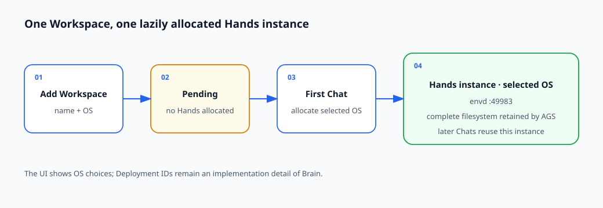

# Run stateless DeepSeek Harness Brain with persistent Hands on AGS

English | [中文](./README_zh.md)

This example separates reasoning from command execution:


Text equivalent: Requests enter interchangeable Brain replicas in `ap-shanghai`. Brain stores DSH session state in MySQL and reaches Hands through E2B. Hands runs `envd` on port `49983`, and AGS retains the instance filesystem across `PAUSE` and resume.

Brain contains DeepSeek Harness (DSH), the TokenHub model adapter, and the HTTP API. MySQL stores Brain session state. Hands provides `envd` and command-line tools, while AGS retains the complete filesystem of each Hands instance across `PAUSE` and resume. `/workspace` is the default working directory exposed by this cookbook's Brain tools, not the AGS persistence boundary.

This reference deployment uses one operator-configured `BRAIN_WORKSPACE_USER_ID`.

## State and routing views

MySQL stores Brain session state, while AGS retains the complete filesystem attached to each Hands instance:



Text equivalent: Brain replicas are stateless and read or write DSH session state in MySQL. Brain sends E2B operations to Hands. AGS retains the complete Hands instance filesystem across `PAUSE` and resume; `/workspace` is the Brain tool root inside that filesystem.

## Prerequisites

- `agr` v0.6.6 or later.
- An Agent Runtime CAM role ARN. The two published images below are public; add repository pull permission only if you replace them with images from your own private CCR or TCR repository.
- A reachable MySQL 8 instance and an account allowed to create and use the `dsh-cookbook` database. Every Brain replica must use the same endpoint and credentials.
- Tencent Cloud credentials that may call [`AcquireDeploymentToken`](https://cloud.tencent.com/document/api/1814/136842) for the Hands Deployment.
- A Tencent Cloud TokenHub API key for `deepseek-v4-flash`.

## 1. Prepare MySQL

Create the database once:

```sql
CREATE DATABASE `dsh-cookbook`
  CHARACTER SET utf8mb4
  COLLATE utf8mb4_0900_ai_ci;
```

Brain initializes the database schema at startup and exposes `/readyz` when initialization completes.

## 2. Use the published images

- Brain: `ccr.ccs.tencentyun.com/ags.dev/deepseek-harness:brain-v0.1.0-rc.8-ags.1`
- Hands: `ccr.ccs.tencentyun.com/ags.dev/deepseek-harness:hands-envd-v0.6.13-ags.1`

The Tool definitions below use these published tags directly. To build and push a copy to your own registry, see [BUILD.md](./BUILD.md).

## 3. Create the persistent Hands Deployment

Set names and the Agent Runtime role:

```bash
export AGR_REGION=ap-shanghai
export AGR_ROLE_ARN='qcs::cam::uin/100000000001:roleName/replace-me'
export HANDS_TOOL_NAME='dsh-hands-your-name'
export HANDS_DEPLOYMENT_NAME='dsh-hands-your-name'
```

Create the Tool:

```bash
agr tool create \
  --region "$AGR_REGION" \
  --tool-name "$HANDS_TOOL_NAME" \
  --tool-type custom \
  --persistent \
  --role-arn "$AGR_ROLE_ARN" \
  --network-configuration '{"NetworkMode":"PUBLIC"}' \
  --custom-configuration '{
    "Image": "ccr.ccs.tencentyun.com/ags.dev/deepseek-harness:hands-envd-v0.6.13-ags.1",
    "ImageRegistryType": "personal",
    "Command": ["/usr/bin/envd"],
    "Args": ["-port", "49983"],
    "Ports": [{"Name":"envd","Port":49983,"Protocol":"TCP"}],
    "Resources": {"CPU":"2000m","Memory":"4Gi"},
    "Probe": {
      "HttpGet": {"Path":"/health","Port":49983,"Scheme":"HTTP"},
      "ReadyTimeoutMs":30000,
      "ProbeTimeoutMs":3000,
      "ProbePeriodMs":5000,
      "SuccessThreshold":1,
      "FailureThreshold":6
    }
  }' \
  --wait
```

Copy the real Tool ID from the create output:

```bash
export HANDS_TOOL_ID='sdt-replace-me'
```

Create an exclusive, pause-on-idle Deployment:

```bash
agr deployment create \
  --region "$AGR_REGION" \
  --deployment-name "$HANDS_DEPLOYMENT_NAME" \
  --tool-id "$HANDS_TOOL_ID" \
  --scaling-configuration '{
    "MinInstanceCount":0,
    "MaxInstanceCount":20,
    "MaxInstanceRequestConcurrency":200
  }' \
  --lifecycle-configuration '{
    "IdleTimeoutSeconds":300,
    "IdleAction":"PAUSE"
  }' \
  --affinity-configuration '{
    "Mode":"EXCLUSIVE",
    "HeaderName":"X-Tencent-Agr-Affinity-Id"
  }'
```

Copy the real Deployment ID from the create output:

```bash
export HANDS_DEPLOYMENT_ID='dpl-replace-me'
```

`MaxInstanceCount` is also the maximum number of simultaneously active exclusive workspaces. Size it for the expected number of active users or sessions. `MaxInstanceRequestConcurrency` limits simultaneous Deployment requests or connections inside one active Hands instance. This reference uses `200`; tune it from observed concurrent RPC and streaming-connection demand. Brain coordinates each session through MySQL independently of this capacity field.

## 4. Create the stateless Brain Deployment

The Tool definition below contains every required Brain value; replace each placeholder. Every replica must reach the same MySQL endpoint. Use your platform's secret workflow for production credentials.

```bash
export BRAIN_TOOL_NAME='dsh-brain-your-name'

agr tool create \
  --region "$AGR_REGION" \
  --tool-name "$BRAIN_TOOL_NAME" \
  --tool-type custom \
  --persistent \
  --role-arn "$AGR_ROLE_ARN" \
  --network-configuration '{"NetworkMode":"PUBLIC"}' \
  --custom-configuration '{
    "Image":"ccr.ccs.tencentyun.com/ags.dev/deepseek-harness:brain-v0.1.0-rc.8-ags.1",
    "ImageRegistryType":"personal",
    "Command":["node","/app/dist/brain/server.js"],
    "Env":[
      {"Name":"MYSQL_HOST","Value":"mysql.example.com"},
      {"Name":"MYSQL_PORT","Value":"3306"},
      {"Name":"MYSQL_USER","Value":"dsh_brain"},
      {"Name":"MYSQL_PASSWORD","Value":"replace-me"},
      {"Name":"MYSQL_DATABASE","Value":"dsh-cookbook"},
      {"Name":"BRAIN_WORKSPACE_USER_ID","Value":"replace-me"},
      {"Name":"AGS_REGION","Value":"ap-shanghai"},
      {"Name":"HANDS_DEPLOYMENT_ID","Value":"'"$HANDS_DEPLOYMENT_ID"'"},
      {"Name":"TENCENTCLOUD_SECRET_ID","Value":"replace-me"},
      {"Name":"TENCENTCLOUD_SECRET_KEY","Value":"replace-me"},
      {"Name":"TOKENHUB_API_KEY","Value":"replace-me"}
    ],
    "Ports":[{"Name":"http","Port":8080,"Protocol":"TCP"}],
    "Resources":{"CPU":"2000m","Memory":"4Gi"},
    "Probe":{"HttpGet":{"Path":"/readyz","Port":8080,"Scheme":"HTTP"}}
  }' \
  --wait
```

AGS requires a Tool to be marked `persistent` before it can back a Deployment. Brain remains stateless because its session state and workspace bindings are stored in MySQL.

Copy the real Brain Tool ID from the create output and set a Deployment name:

```bash
export BRAIN_TOOL_ID='sdt-replace-me'
export BRAIN_DEPLOYMENT_NAME='dsh-brain-your-name'
```

Create a non-affine, multi-replica Deployment:

```bash
agr deployment create \
  --region "$AGR_REGION" \
  --deployment-name "$BRAIN_DEPLOYMENT_NAME" \
  --tool-id "$BRAIN_TOOL_ID" \
  --scaling-configuration '{
    "MinInstanceCount":2,
    "MaxInstanceCount":4,
    "MaxInstanceRequestConcurrency":200
  }' \
  --lifecycle-configuration '{
    "IdleTimeoutSeconds":300,
    "IdleAction":"STOP"
  }'
```

Copy the real Brain Deployment ID from the create output:

```bash
export BRAIN_DEPLOYMENT_ID='dpl-replace-me'
```

Do not configure Brain session affinity. Any replica can accept any request because MySQL owns the session history and workspace bindings.

## 5. Exercise the API

Keep the earlier shell as Terminal A. In Terminal B, set the same real Brain Deployment ID copied above, start the local proxy, and leave it running:

```bash
export AGR_REGION=ap-shanghai
export BRAIN_DEPLOYMENT_ID='dpl-replace-me'
agr deployment proxy "$BRAIN_DEPLOYMENT_ID" 18080:8080 --region "$AGR_REGION"
```

Back in Terminal A, create a `user`-mode session. This mode shares one Hands workspace across this cookbook user's sessions. Run the walkthrough requests one at a time.

```bash
curl --fail-with-body --silent --show-error \
  --request POST \
  --header 'content-type: application/json' \
  --data '{"workspaceMode":"user"}' \
  http://127.0.0.1:18080/v1/sessions
```

Copy the returned `sessionId`, then ask Hands to create a recognizable file:

```bash
export DSH_WRITE_SESSION_ID='replace-with-session-id'

curl --fail-with-body --silent --show-error \
  --request POST \
  --header 'content-type: application/json' \
  --data '{"message":"Run exactly this one Hands command and reply only with stdout: printf \"ags-cookbook-persistence-ok\\n\" > /workspace/pause-proof.txt; cat /workspace/pause-proof.txt"}' \
  "http://127.0.0.1:18080/v1/sessions/$DSH_WRITE_SESSION_ID/turns"
```

The response's `text` field should contain `ags-cookbook-persistence-ok`.

Stop sending turns for at least 300 seconds, then inspect Hands. Reclamation is asynchronous; repeat the command until the instance is `PAUSED`:

```bash
agr instance list --tool-id "$HANDS_TOOL_ID" --region "$AGR_REGION"
```

Record the paused instance ID for the continuity check and cleanup:

```text
ID                    TOOL                    STATUS  TIMEOUT  EXPIRES  MOUNTS  CREATED
<masked-instance-id>  dsh-hands-your-name    PAUSED  0s       -        -       <masked-time>
```

```bash
export HANDS_INSTANCE_ID='replace-with-paused-instance-id'
```

Create a second `user`-mode session with the same curl command used above, then copy its returned `sessionId`:

```bash
export DSH_READ_SESSION_ID='replace-with-second-session-id'
```

Read the old file through the second session:

```bash
curl --fail-with-body --silent --show-error \
  --request POST \
  --header 'content-type: application/json' \
  --data '{"message":"Use Hands to run exactly: cat /workspace/pause-proof.txt. Reply only with stdout."}' \
  "http://127.0.0.1:18080/v1/sessions/$DSH_READ_SESSION_ID/turns"
```

The response should again contain `ags-cookbook-persistence-ok`.

Run `agr instance list` again and confirm that the resumed instance still has `HANDS_INSTANCE_ID`. The text confirms that the test file survived `PAUSE`; the matching ID confirms that the request returned to the same Hands instance.

## Cleanup

Stop the proxy with `Ctrl-C` in Terminal B. Delete the Brain Deployment and list its instances:

```bash
agr deployment delete "$BRAIN_DEPLOYMENT_ID" --region "$AGR_REGION" --wait
agr instance list --tool-id "$BRAIN_TOOL_ID" --region "$AGR_REGION"
```

Copy each current `RUNNING` or `PAUSED` Brain instance ID and run the delete command for each one:

```bash
export BRAIN_INSTANCE_ID='replace-with-instance-id'
agr instance delete "$BRAIN_INSTANCE_ID" --region "$AGR_REGION" --yes --wait
```

Delete the Brain Tool, the Hands instance captured above, and the Hands resources:

```bash
agr tool delete "$BRAIN_TOOL_ID" --region "$AGR_REGION" --yes --wait
agr instance delete "$HANDS_INSTANCE_ID" --region "$AGR_REGION" --yes --wait
agr deployment delete "$HANDS_DEPLOYMENT_ID" --region "$AGR_REGION" --wait
agr tool delete "$HANDS_TOOL_ID" --region "$AGR_REGION" --yes --wait
```

Delete `dsh-cookbook` only when no other Brain Deployment uses it. If you built and published your own image copies, remove those copies when they are no longer needed; do not remove the shared example images.
