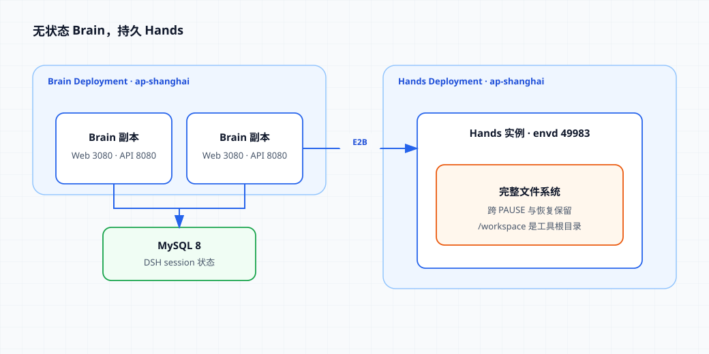
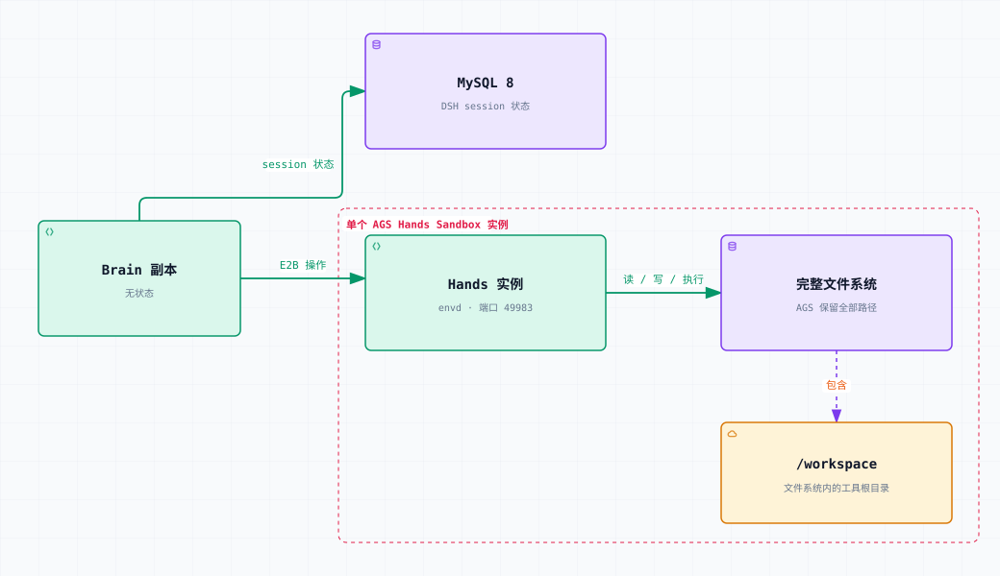

# 在 AGS 上运行无状态 DeepSeek Harness Brain 与持久 Hands

[English](./README.md) | 中文

本示例把推理与命令执行拆开：



文字等价说明：请求进入 `ap-shanghai` 中可互换的 Brain 副本。Brain 把 DSH session 状态保存到 MySQL，并通过 E2B 访问 Hands。Hands 的 `envd` 监听 `49983` 端口，AGS 会在 `PAUSE` 和恢复之间保留实例文件系统。

Brain 包含 DeepSeek Harness（DSH）、TokenHub 模型 adapter 和 HTTP API，session 状态保存在 MySQL。Hands 提供 `envd` 与常用命令行工具，AGS 会在 Hands `PAUSE` 和恢复之间保留整个实例文件系统。`/workspace` 是本 cookbook 的 Brain 工具所暴露的默认工作目录，并不是 AGS 的持久化边界。

这个参考部署使用一个由部署者配置的 `BRAIN_WORKSPACE_USER_ID`。

## 状态与路由视图

MySQL 保存 Brain session 状态，AGS 则保留每个 Hands 实例挂载的完整文件系统：



文字等价说明：Brain 副本无状态，在 MySQL 中读写 DSH session 状态。Brain 把 E2B 操作发送到 Hands。AGS 跨 `PAUSE` 和恢复保留 Hands 实例的完整文件系统；`/workspace` 是该文件系统中的 Brain 工具根目录。

## 前置条件

- `agr` v0.6.6 或更高版本。
- Agent Runtime CAM 角色 ARN。下方两个已发布镜像是公共镜像；只有改用自己私有 CCR 或 TCR 仓库中的镜像时，才需要额外授予仓库拉取权限。
- 可访问的 MySQL 8 实例，以及有权创建并使用 `dsh-cookbook` 数据库的账号；所有 Brain 副本必须使用同一个 endpoint 和同一组凭证。
- 可为 Hands Deployment 调用 [`AcquireDeploymentToken`](https://cloud.tencent.com/document/api/1814/136842) 的腾讯云凭证。
- 可调用 `deepseek-v4-flash` 的腾讯云 TokenHub API Key。

## 1. 准备 MySQL

只需创建一次数据库：

```sql
CREATE DATABASE `dsh-cookbook`
  CHARACTER SET utf8mb4
  COLLATE utf8mb4_0900_ai_ci;
```

Brain 启动时初始化数据库结构，完成后开放 `/readyz`。

## 2. 使用已发布镜像

- Brain：`ccr.ccs.tencentyun.com/ags.dev/deepseek-harness:brain-v0.1.0-rc.8-ags.1`
- Hands：`ccr.ccs.tencentyun.com/ags.dev/deepseek-harness:hands-envd-v0.6.13-ags.1`

下方 Tool 定义直接使用这两个已发布 tag。如需构建并推送副本到自己的 registry，请参见 [BUILD_zh.md](./BUILD_zh.md)。

## 3. 创建持久 Hands Deployment

设置名称与 Agent Runtime role：

```bash
export AGR_REGION=ap-shanghai
export AGR_ROLE_ARN='qcs::cam::uin/100000000001:roleName/replace-me'
export HANDS_TOOL_NAME='dsh-hands-your-name'
export HANDS_DEPLOYMENT_NAME='dsh-hands-your-name'
```

创建 Tool：

```bash
agr tool create \
  --region "$AGR_REGION" \
  --tool-name "$HANDS_TOOL_NAME" \
  --tool-type custom \
  --persistent \
  --role-arn "$AGR_ROLE_ARN" \
  --network-configuration '{"NetworkMode":"PUBLIC"}' \
  --custom-configuration '{
    "Image": "ccr.ccs.tencentyun.com/ags.dev/deepseek-harness:hands-envd-v0.6.13-ags.1",
    "ImageRegistryType": "personal",
    "Command": ["/usr/bin/envd"],
    "Args": ["-port", "49983"],
    "Ports": [{"Name":"envd","Port":49983,"Protocol":"TCP"}],
    "Resources": {"CPU":"2000m","Memory":"4Gi"},
    "Probe": {
      "HttpGet": {"Path":"/health","Port":49983,"Scheme":"HTTP"},
      "ReadyTimeoutMs":30000,
      "ProbeTimeoutMs":3000,
      "ProbePeriodMs":5000,
      "SuccessThreshold":1,
      "FailureThreshold":6
    }
  }' \
  --wait
```

从 create 输出中复制真实 Tool ID：

```bash
export HANDS_TOOL_ID='sdt-replace-me'
```

创建独占 affinity、空闲暂停的 Deployment：

```bash
agr deployment create \
  --region "$AGR_REGION" \
  --deployment-name "$HANDS_DEPLOYMENT_NAME" \
  --tool-id "$HANDS_TOOL_ID" \
  --scaling-configuration '{
    "MinInstanceCount":0,
    "MaxInstanceCount":20,
    "MaxInstanceRequestConcurrency":200
  }' \
  --lifecycle-configuration '{
    "IdleTimeoutSeconds":300,
    "IdleAction":"PAUSE"
  }' \
  --affinity-configuration '{
    "Mode":"EXCLUSIVE",
    "HeaderName":"X-Tencent-Agr-Affinity-Id"
  }'
```

从 create 输出中复制真实 Deployment ID：

```bash
export HANDS_DEPLOYMENT_ID='dpl-replace-me'
```

`MaxInstanceCount` 同时限制并发活跃的独占 workspace 数量，应按活跃用户或 session 数配置。`MaxInstanceRequestConcurrency` 限制一个活跃 Hands 实例内同时存在的 Deployment request 或 connection。本参考配置使用 `200`；应根据实际观测到的并发 RPC 与流式连接需求调整。Brain 通过 MySQL 协调每个 session，不依赖这个容量字段。

## 4. 创建无状态 Brain Deployment

下方 Tool 定义包含 Brain 的全部必填参数，请替换每个占位符。所有副本必须能连接同一个 MySQL endpoint。生产凭证请使用部署环境提供的 secret 流程。

```bash
export BRAIN_TOOL_NAME='dsh-brain-your-name'

agr tool create \
  --region "$AGR_REGION" \
  --tool-name "$BRAIN_TOOL_NAME" \
  --tool-type custom \
  --persistent \
  --role-arn "$AGR_ROLE_ARN" \
  --network-configuration '{"NetworkMode":"PUBLIC"}' \
  --custom-configuration '{
    "Image":"ccr.ccs.tencentyun.com/ags.dev/deepseek-harness:brain-v0.1.0-rc.8-ags.1",
    "ImageRegistryType":"personal",
    "Command":["node","/app/dist/brain/server.js"],
    "Env":[
      {"Name":"MYSQL_HOST","Value":"mysql.example.com"},
      {"Name":"MYSQL_PORT","Value":"3306"},
      {"Name":"MYSQL_USER","Value":"dsh_brain"},
      {"Name":"MYSQL_PASSWORD","Value":"replace-me"},
      {"Name":"MYSQL_DATABASE","Value":"dsh-cookbook"},
      {"Name":"BRAIN_WORKSPACE_USER_ID","Value":"replace-me"},
      {"Name":"AGS_REGION","Value":"ap-shanghai"},
      {"Name":"HANDS_DEPLOYMENT_ID","Value":"'"$HANDS_DEPLOYMENT_ID"'"},
      {"Name":"TENCENTCLOUD_SECRET_ID","Value":"replace-me"},
      {"Name":"TENCENTCLOUD_SECRET_KEY","Value":"replace-me"},
      {"Name":"TOKENHUB_API_KEY","Value":"replace-me"}
    ],
    "Ports":[{"Name":"http","Port":8080,"Protocol":"TCP"}],
    "Resources":{"CPU":"2000m","Memory":"4Gi"},
    "Probe":{"HttpGet":{"Path":"/readyz","Port":8080,"Scheme":"HTTP"}}
  }' \
  --wait
```

AGS 要求关联 Deployment 的 Tool 标记为 `persistent`。Brain 的 session 状态和 workspace binding 保存在 MySQL，因此 Brain 副本仍然无状态。

从 create 输出中复制真实 Brain Tool ID，并设置 Deployment 名称：

```bash
export BRAIN_TOOL_ID='sdt-replace-me'
export BRAIN_DEPLOYMENT_NAME='dsh-brain-your-name'
```

创建无 affinity 的多副本 Deployment：

```bash
agr deployment create \
  --region "$AGR_REGION" \
  --deployment-name "$BRAIN_DEPLOYMENT_NAME" \
  --tool-id "$BRAIN_TOOL_ID" \
  --scaling-configuration '{
    "MinInstanceCount":2,
    "MaxInstanceCount":4,
    "MaxInstanceRequestConcurrency":200
  }' \
  --lifecycle-configuration '{
    "IdleTimeoutSeconds":300,
    "IdleAction":"STOP"
  }'
```

从 create 输出中复制真实 Brain Deployment ID：

```bash
export BRAIN_DEPLOYMENT_ID='dpl-replace-me'
```

不要给 Brain 配置 session affinity。MySQL 保存 session 历史与 workspace binding，因此任意副本都能处理任意请求。

## 5. 调用 API

保留前面使用的 shell 作为终端 A。在终端 B 设置上一步复制的同一个真实 Brain Deployment ID，启动本地 proxy，并让它持续运行：

```bash
export AGR_REGION=ap-shanghai
export BRAIN_DEPLOYMENT_ID='dpl-replace-me'
agr deployment proxy "$BRAIN_DEPLOYMENT_ID" 18080:8080 --region "$AGR_REGION"
```

回到终端 A，创建 `user` 模式 session。该模式让当前 cookbook 用户的多个 session 共享一个 Hands workspace。本教程中的请求请逐个执行。

```bash
curl --fail-with-body --silent --show-error \
  --request POST \
  --header 'content-type: application/json' \
  --data '{"workspaceMode":"user"}' \
  http://127.0.0.1:18080/v1/sessions
```

复制返回的 `sessionId`，然后让 Hands 创建一个内容清晰可辨的文件：

```bash
export DSH_WRITE_SESSION_ID='replace-with-session-id'

curl --fail-with-body --silent --show-error \
  --request POST \
  --header 'content-type: application/json' \
  --data '{"message":"Run exactly this one Hands command and reply only with stdout: printf \"ags-cookbook-persistence-ok\\n\" > /workspace/pause-proof.txt; cat /workspace/pause-proof.txt"}' \
  "http://127.0.0.1:18080/v1/sessions/$DSH_WRITE_SESSION_ID/turns"
```

响应的 `text` 字段应包含 `ags-cookbook-persistence-ok`。

至少 300 秒不要发送 turn，然后查询 Hands。回收是异步的，请重复执行命令，直到实例进入 `PAUSED`：

```bash
agr instance list --tool-id "$HANDS_TOOL_ID" --region "$AGR_REGION"
```

记录暂停实例 ID，供连续性检查与清理使用：

```text
ID                    TOOL                    STATUS  TIMEOUT  EXPIRES  MOUNTS  CREATED
<masked-instance-id>  dsh-hands-your-name    PAUSED  0s       -        -       <masked-time>
```

```bash
export HANDS_INSTANCE_ID='replace-with-paused-instance-id'
```

用上面相同的 curl 命令创建第二个 `user` 模式 session，再复制返回的 `sessionId`：

```bash
export DSH_READ_SESSION_ID='replace-with-second-session-id'
```

通过第二个 session 读取旧文件：

```bash
curl --fail-with-body --silent --show-error \
  --request POST \
  --header 'content-type: application/json' \
  --data '{"message":"Use Hands to run exactly: cat /workspace/pause-proof.txt. Reply only with stdout."}' \
  "http://127.0.0.1:18080/v1/sessions/$DSH_READ_SESSION_ID/turns"
```

响应应再次包含 `ags-cookbook-persistence-ok`。

再次执行 `agr instance list`，确认恢复后的实例仍是 `HANDS_INSTANCE_ID`。文本内容确认测试文件跨 `PAUSE` 保留下来；实例 ID 一致确认请求回到了同一个 Hands 实例。

## 清理

先在终端 B 按 `Ctrl-C` 停止 proxy，然后删除 Brain Deployment 并列出它的实例：

```bash
agr deployment delete "$BRAIN_DEPLOYMENT_ID" --region "$AGR_REGION" --wait
agr instance list --tool-id "$BRAIN_TOOL_ID" --region "$AGR_REGION"
```

复制每个当前处于 `RUNNING` 或 `PAUSED` 状态的 Brain 实例 ID，并逐个执行删除命令：

```bash
export BRAIN_INSTANCE_ID='replace-with-instance-id'
agr instance delete "$BRAIN_INSTANCE_ID" --region "$AGR_REGION" --yes --wait
```

删除 Brain Tool、前面记录的 Hands 实例和 Hands 资源：

```bash
agr tool delete "$BRAIN_TOOL_ID" --region "$AGR_REGION" --yes --wait
agr instance delete "$HANDS_INSTANCE_ID" --region "$AGR_REGION" --yes --wait
agr deployment delete "$HANDS_DEPLOYMENT_ID" --region "$AGR_REGION" --wait
agr tool delete "$HANDS_TOOL_ID" --region "$AGR_REGION" --yes --wait
```

只有确认没有其他 Brain Deployment 使用时，才能删除 `dsh-cookbook`。如果自行构建并发布了镜像副本，请在不再需要时删除这些副本；不要删除共享的示例镜像。
