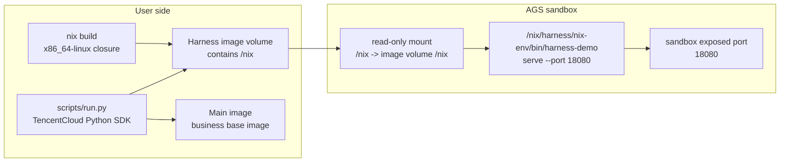

# Harness Nix Volume

This example shows how to package Harness dependencies with Nix, publish them as an AGS image volume, and mount that volume into a custom main image.

The pattern is useful when a Harness needs a pinned CLI, Node.js, Python, JVM, native tools, or shared libraries, but you do not want to rebuild every customer main image with those dependencies baked in.

## How It Works



The demo Harness is intentionally concrete: the Nix image volume contains the complete Claude Code npm package, its Linux x64 native payload, and the Node.js/Python runtime needed by the wrapper service. The sandbox starts an HTTP service from the mounted Nix runtime and reports `claude --version`, `node --version`, and Python. The main image does not install Claude Code or Node.js; those come from the mounted `/nix` tree.

## Files

| Path | Purpose |
|---|---|
| `nix/default.nix` | Default build definition used by the containerized Nix builder. |
| `nix/flake.nix` | Defines the self-contained `x86_64-linux` Harness runtime. |
| `nix/src/harness_server.py` | Tiny demo Harness service. Replace this with your real Harness entrypoint. |
| `scripts/build-harness-volume.sh` | Builds the Nix closure and packages `/nix` into an image volume. |
| `images/main/Dockerfile` | Minimal main image used by the sandbox. |
| `pyproject.toml` | Python SDK helper dependencies. |
| `scripts/run.py` | Creates an AGS custom tool, mounts the image volume, starts a sandbox, and verifies the service. |
| `scripts/cleanup.py` | Stops the sandbox and optionally deletes the tool. |

## Prerequisites

- Docker.
- `uv` for the local Python SDK helper.
- Network access to pull the `nixos/nix` builder image and Nix packages. Local Nix installation is not required.
- A container registry that AGS can pull from.
- Tencent Cloud credentials and an AGS role ARN that can pull the configured images.
- The Harness runtime must be built for `x86_64-linux`, because AGS sandboxes run Linux x86 containers.

## Configure

```bash
cp .env.example .env
```

Set at least:

```bash
TENCENTCLOUD_SECRET_ID=...
TENCENTCLOUD_SECRET_KEY=...
TENCENTCLOUD_REGION=ap-guangzhou
ROLE_ARN=qcs::cam::uin/<your-uin>:roleName/ags-image-volume-role

MAIN_IMAGE_REF=ccr.ccs.tencentyun.com/your-namespace/harness-nix-main:20260630
HARNESS_VOLUME_IMAGE_REF=ccr.ccs.tencentyun.com/your-namespace/harness-nix-volume:20260630
```

Use registry image references that AGS can pull. Local-only tags such as `localhost/...` are useful for local Docker checks, but they cannot be used by the AGS sandbox.

`MAIN_IMAGE_REGISTRY_TYPE` and `HARNESS_VOLUME_IMAGE_REGISTRY_TYPE` default to `personal`.

## Build And Push Images

```bash
make build-images
docker push "$MAIN_IMAGE_REF"
docker push "$HARNESS_VOLUME_IMAGE_REF"
```

Both images must be pushed before `make run`. `MAIN_IMAGE_REF` is the sandbox's custom main image, and `HARNESS_VOLUME_IMAGE_REF` is mounted as the read-only `/nix` image volume.

`scripts/build-harness-volume.sh` uses a Linux `nixos/nix` builder container, so the generated closure matches the sandbox's `x86_64-linux` environment. Users do not need to install Nix on the host machine.

The Harness image volume contains:

- `/nix/store/...` for the Nix closure
- `/nix/harness/nix-env` as the stable runtime profile
- `/nix/harness/nix-env/bin/claude` from the complete Claude Code npm package plus its Linux x64 native payload
- `/nix/harness/nix-env/bin/harness-demo` as the demo service entrypoint

Mount the image volume at `/nix`. Nix store references are absolute paths, so mounting the same files elsewhere will break many executables.

## Run

```bash
make setup
make run
```

`make run` does the following:

1. Calls `CreateSandboxTool` with `ToolType=custom`.
2. Uses `MAIN_IMAGE_REF` as the custom tool main image.
3. Adds a read-only image mount:

   ```text
   name: harness-nix
   mountPath: /nix
   image: HARNESS_VOLUME_IMAGE_REF
   subPath: /nix
   ```

4. Starts the Harness process directly:

   ```text
   /nix/harness/nix-env/bin/harness-demo serve --host 0.0.0.0 --port 18080
   ```

5. Exposes sandbox port `18080`.
6. Calls `/health` and `/run` through the sandbox exposed port.

Expected `.state/runtime-report.json`:

```json
{
  "ok": true,
  "claude": "2.1.196 (Claude Code)",
  "python": "3.12.7",
  "node": "v22.10.0"
}
```

## Cleanup

```bash
make cleanup
```

By default this stops the sandbox and keeps the tool for reuse. To delete the tool as well:

```bash
DELETE_TOOL=1 make cleanup
```

## Adapting To A Real Harness

For an npm-based Harness, update `nix/claude-code/package.json`, regenerate `nix/claude-code/package-lock.json`, and then update `npmDepsHash` in `nix/default.nix` from the hash mismatch reported by `nix-build`. The example uses `buildNpmPackage` so the npm dependency layout is produced by npm and Nix, instead of being assembled by hand.

For a non-npm Harness, replace the `claudeCode` derivation in `nix/default.nix` with your real binary or launcher. If your Harness needs more runtimes, add them to the `runtimeEnv.paths` list, for example:

```nix
pkgs.nodejs_22
pkgs.jdk_headless
pkgs.python312
pkgs.git
pkgs.chromium
```

Keep writable state outside the image volume, such as `/tmp`, `/workspace`, or a separate AGS storage mount. Image volumes should be treated as read-only runtime dependencies.

If the main image already has its own Node.js, Java, or Python, call the Harness through the absolute `/nix/harness/nix-env/bin/...` path and avoid prepending the mounted Harness `bin` directory to the global `PATH` of unrelated user workloads. This keeps the mounted Harness runtime from accidentally shadowing the main image's tools.
