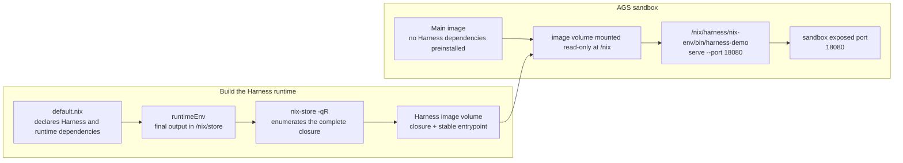

# Harness Nix Volume: Isolate Runtime Dependencies with a Minimal Closure

## Why Package A Harness With Nix

Nix does not install software and its dependencies into shared locations such as `/usr` or `/usr/local`. Instead, every build output lives at an immutable, hash-addressed path such as `/nix/store/<hash>-nodejs-22.x`. Starting from the final Harness runtime output, Nix can enumerate its complete dependency closure: the Harness itself and every interpreter, CLI, shared library, and other transitive dependency that the output references at runtime.

This example packages only that closure and a stable runtime entrypoint into the image volume; unrelated software from the Nix builder is left behind. “Minimal closure” is relative to the final runtime output: software selected by `runtimeEnv` and its transitive dependencies is included, while software that the output does not reference is not copied into the image volume.

This decouples the Harness runtime from the main image:

- **No dependency on software preinstalled in the main image:** the Harness uses the pinned Node.js, Python, CLI, and shared libraries from its own closure.
- **No dependency conflicts:** Nix keeps different software versions in separate hash-addressed paths, and the Harness always uses the dependencies from its own closure. A different Node.js, Python, or shared library version in the main image can coexist without replacing the Harness version.
- **No pollution of the main image toolchain:** the image volume is mounted read-only at `/nix`, installs nothing into `/usr` or `/lib`, and starts the Harness through an absolute `/nix/harness/nix-env/bin/...` path without changing the global `PATH` for business processes.
- **Independent upgrades and reuse:** when Harness dependencies change, only the image volume needs to be rebuilt; the same main image can be paired with different Harness runtime versions.

The pattern is useful when a Harness needs a pinned CLI, Node.js, Python, JVM, native tools, or shared libraries, but you do not want to bake those dependencies into every main image.

## How It Works



`nix/default.nix` first produces a `runtimeEnv` profile that combines the Harness with the selected runtimes. `scripts/build-harness-volume.sh` then uses `nix-store -qR` to find every transitive dependency of that profile, copies only those `/nix/store` paths, and creates the stable `/nix/harness/nix-env` entrypoint. AGS mounts the image volume read-only at `/nix` in the main image and starts the Harness directly through that absolute path.

The demo Harness is intentionally concrete: its closure contains the complete Claude Code npm package, its Linux x64 native payload, and the Node.js, Python, and shared libraries needed by the wrapper service. The sandbox starts an HTTP service from the mounted Nix runtime and reports `claude --version`, `node --version`, and Python. The main image deliberately does not install Claude Code, Node.js, or Python; these application-level runtime dependencies all come from the mounted Nix closure.

## Files

| Path | Purpose |
|---|---|
| `nix/default.nix` | Declares the Harness packages, runtime dependencies, and final `runtimeEnv` profile. |
| `nix/flake.nix` | Imports `default.nix` and exposes the `x86_64-linux` result through a standard flake interface. |
| `nix/src/harness_server.py` | Tiny demo Harness service. Replace this with your real Harness entrypoint. |
| `scripts/build-harness-volume.sh` | Builds the Nix closure and packages `/nix` into an image volume. |
| `images/main/Dockerfile` | Minimal main image used by the sandbox. |
| `pyproject.toml` | Python SDK helper dependencies. |
| `scripts/run.py` | Creates an AGS custom tool, mounts the image volume, starts a sandbox, and verifies the service. |
| `scripts/cleanup.py` | Stops the sandbox and optionally deletes the tool. |

## Prerequisites

- Docker.
- `uv` for the local Python SDK helper.
- Network access to pull the `nixos/nix` builder image and Nix packages. Local Nix installation is not required.
- A container registry that AGS can pull from.
- Tencent Cloud credentials and an AGS role ARN that can pull the configured images.
- The Harness runtime must be built for `x86_64-linux`, because AGS sandboxes run Linux x86 containers.

## Configure

```bash
cp .env.example .env
```

Set at least:

```bash
TENCENTCLOUD_SECRET_ID=...
TENCENTCLOUD_SECRET_KEY=...
TENCENTCLOUD_REGION=ap-guangzhou
ROLE_ARN=qcs::cam::uin/<your-uin>:roleName/ags-image-volume-role

MAIN_IMAGE_REF=ccr.ccs.tencentyun.com/your-namespace/harness-nix-main:20260630
HARNESS_VOLUME_IMAGE_REF=ccr.ccs.tencentyun.com/your-namespace/harness-nix-volume:20260630
```

Use registry image references that AGS can pull. Local-only tags such as `localhost/...` are useful for local Docker checks, but they cannot be used by the AGS sandbox.

`MAIN_IMAGE_REGISTRY_TYPE` and `HARNESS_VOLUME_IMAGE_REGISTRY_TYPE` default to `personal`.

## Build And Push Images

```bash
make build-images
docker push "$MAIN_IMAGE_REF"
docker push "$HARNESS_VOLUME_IMAGE_REF"
```

Both images must be pushed before `make run`. `MAIN_IMAGE_REF` is the sandbox's custom main image, and `HARNESS_VOLUME_IMAGE_REF` is mounted as the read-only `/nix` image volume.

`scripts/build-harness-volume.sh` uses a Linux `nixos/nix` builder container to produce a runtime profile for the sandbox's `x86_64-linux` environment, then copies the complete closure enumerated by `nix-store -qR`. Users do not need to install Nix on the host machine, and unrelated builder software does not enter the final image volume.

The Harness image volume contains:

- `/nix/store/...` for the Harness runtime and its complete transitive Nix closure
- `/nix/harness/nix-env` as the stable runtime profile
- `/nix/harness/nix-env/bin/claude` from the complete Claude Code npm package plus its Linux x64 native payload
- `/nix/harness/nix-env/bin/harness-demo` as the demo service entrypoint

Mount the image volume at `/nix`. Nix store references are absolute paths, so mounting the same files elsewhere will break many executables.

## Run

```bash
make setup
make run
```

`make run` does the following:

1. Calls `CreateSandboxTool` with `ToolType=custom`.
2. Uses `MAIN_IMAGE_REF` as the custom tool main image.
3. Adds a read-only image mount:

   ```text
   name: harness-nix
   mountPath: /nix
   image: HARNESS_VOLUME_IMAGE_REF
   subPath: /nix
   ```

4. Starts the Harness process directly:

   ```text
   /nix/harness/nix-env/bin/harness-demo serve --host 0.0.0.0 --port 18080
   ```

5. Exposes sandbox port `18080`.
6. Calls `/health` and `/run` through the sandbox exposed port.

Expected `.state/runtime-report.json`:

```json
{
  "ok": true,
  "claude": "2.1.196 (Claude Code)",
  "python": "3.12.7",
  "node": "v22.10.0"
}
```

## Cleanup

```bash
make cleanup
```

By default this stops the sandbox and keeps the tool for reuse. To delete the tool as well:

```bash
DELETE_TOOL=1 make cleanup
```

## Adapting To A Real Harness

For an npm-based Harness, update `nix/claude-code/package.json`, regenerate `nix/claude-code/package-lock.json`, and then update `npmDepsHash` in `nix/default.nix` from the hash mismatch reported by `nix-build`. The example uses `buildNpmPackage` so the npm dependency layout is produced by npm and Nix, instead of being assembled by hand.

For a non-npm Harness, replace the `claudeCode` derivation in `nix/default.nix` with your real binary or launcher. If your Harness needs more runtimes, add them to the `runtimeEnv.paths` list, for example:

```nix
pkgs.nodejs_22
pkgs.jdk_headless
pkgs.python312
pkgs.git
pkgs.chromium
```

Keep writable state outside the image volume, such as `/tmp`, `/workspace`, or a separate AGS storage mount. Image volumes should be treated as read-only runtime dependencies.

If the main image already has its own Node.js, Java, or Python, call the Harness through the absolute `/nix/harness/nix-env/bin/...` path and avoid prepending the mounted Harness `bin` directory to the global `PATH` of unrelated user workloads. This keeps the mounted Harness runtime from accidentally shadowing the main image's tools.
