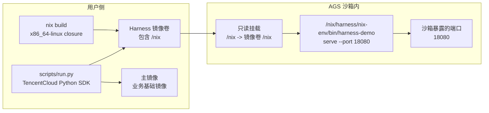

# Harness Nix 镜像卷

这个示例演示如何用 Nix 制作一个自包含的 Harness 运行时，把它打包成 AGS 镜像卷，再挂载到自定义主镜像里使用。

这个模式适合 Harness 需要固定 CLI、Node.js、Python、JVM、native tools、动态库等依赖，但又不希望每个客户的主镜像都重新内置这些依赖的场景。

## 工作方式



示例里的 Harness 是一个真实 CLI 演示：Nix 镜像卷里包含完整的 Claude Code npm package、Linux x64 native payload，以及 demo 服务需要的 Node.js/Python 运行时。沙箱会从挂载进来的 Nix 运行时启动一个 HTTP 服务，并返回 `claude --version`、`node --version` 和 Python 版本。主镜像没有安装 Claude Code 或 Node.js，这些都来自挂载的 `/nix`。

## 文件说明

| 路径 | 作用 |
|---|---|
| `nix/default.nix` | 容器化 Nix builder 默认使用的构建定义。 |
| `nix/flake.nix` | 定义 `x86_64-linux` 的自包含 Harness 运行时。 |
| `nix/src/harness_server.py` | 一个很小的 Harness 服务示例。实际接入时替换成你的 Harness 入口。 |
| `scripts/build-harness-volume.sh` | 构建 Nix closure，并把 `/nix` 打进镜像卷。 |
| `images/main/Dockerfile` | 沙箱使用的最小主镜像。 |
| `pyproject.toml` | Python SDK 辅助脚本依赖。 |
| `scripts/run.py` | 通过 TencentCloud Python SDK 创建工具、挂载镜像卷、启动沙箱并验证服务。 |
| `scripts/cleanup.py` | 停止沙箱；可选删除工具。 |

## 前置条件

- Docker。
- `uv`，用于运行本地 Python SDK 辅助脚本。
- 可以拉取 `nixos/nix` builder 镜像和 Nix packages。用户本机不需要安装 Nix。
- 一个 AGS 可以拉取的容器镜像仓库。
- 腾讯云密钥，以及一个可以拉取这些镜像的 AGS `ROLE_ARN`。
- Harness 运行时必须构建为 `x86_64-linux`，因为 AGS 沙箱是 Linux x86 容器。

## 配置

```bash
cp .env.example .env
```

至少填写：

```bash
TENCENTCLOUD_SECRET_ID=...
TENCENTCLOUD_SECRET_KEY=...
TENCENTCLOUD_REGION=ap-guangzhou
ROLE_ARN=qcs::cam::uin/<your-uin>:roleName/ags-image-volume-role

MAIN_IMAGE_REF=ccr.ccs.tencentyun.com/your-namespace/harness-nix-main:20260630
HARNESS_VOLUME_IMAGE_REF=ccr.ccs.tencentyun.com/your-namespace/harness-nix-volume:20260630
```

这里必须填写 AGS 可以拉取的镜像仓库地址。本地 `localhost/...` 这类 tag 只适合本地 Docker 检查，不能被 AGS 沙箱使用。

`MAIN_IMAGE_REGISTRY_TYPE` 和 `HARNESS_VOLUME_IMAGE_REGISTRY_TYPE` 默认是 `personal`。

## 构建并推送镜像

```bash
make build-images
docker push "$MAIN_IMAGE_REF"
docker push "$HARNESS_VOLUME_IMAGE_REF"
```

执行 `make run` 前，两张镜像都必须已经推送完成。`MAIN_IMAGE_REF` 是沙箱的自定义主镜像，`HARNESS_VOLUME_IMAGE_REF` 会作为只读 `/nix` 镜像卷挂载进沙箱。

`scripts/build-harness-volume.sh` 会使用 Linux `nixos/nix` builder 容器构建，生成的 closure 匹配沙箱里的 `x86_64-linux` 环境。用户本机不需要安装 Nix。

Harness 镜像卷里包含：

- `/nix/store/...`：Nix closure
- `/nix/harness/nix-env`：稳定的运行时 profile
- `/nix/harness/nix-env/bin/claude`：来自完整 Claude Code npm package 及其 Linux x64 native payload
- `/nix/harness/nix-env/bin/harness-demo`：demo 服务入口

镜像卷必须挂载到 `/nix`。Nix store 的引用是绝对路径，把同一份文件挂到其他目录会导致很多可执行文件无法运行。

## 运行

```bash
make setup
make run
```

`make run` 会执行以下流程：

1. 调用 `CreateSandboxTool`，`ToolType=custom`。
2. 使用 `MAIN_IMAGE_REF` 作为自定义工具的主镜像。
3. 添加一个只读镜像卷挂载：

   ```text
   name: harness-nix
   mountPath: /nix
   image: HARNESS_VOLUME_IMAGE_REF
   subPath: /nix
   ```

4. 直接启动 Harness：

   ```text
   /nix/harness/nix-env/bin/harness-demo serve --host 0.0.0.0 --port 18080
   ```

5. 暴露沙箱端口 `18080`。
6. 通过沙箱暴露的端口请求 `/health` 和 `/run`。

预期 `.state/runtime-report.json`：

```json
{
  "ok": true,
  "claude": "2.1.196 (Claude Code)",
  "python": "3.12.7",
  "node": "v22.10.0"
}
```

## 清理

```bash
make cleanup
```

默认只停止沙箱，保留工具方便复用。如果也要删除工具：

```bash
DELETE_TOOL=1 make cleanup
```

## 接入真实 Harness

如果是真实的 npm Harness，更新 `nix/claude-code/package.json`，重新生成 `nix/claude-code/package-lock.json`，再用 `nix-build` 报出的 hash mismatch 更新 `nix/default.nix` 里的 `npmDepsHash`。这个示例用 `buildNpmPackage`，由 npm 和 Nix 生成 npm 依赖布局，不需要手工组装。

如果不是 npm Harness，把 `nix/default.nix` 里的 `claudeCode` derivation 换成你的真实二进制或启动器。如果你的 Harness 需要更多运行时，依赖加到 `runtimeEnv.paths` 里，例如：

```nix
pkgs.nodejs_22
pkgs.jdk_headless
pkgs.python312
pkgs.git
pkgs.chromium
```

可写状态放到镜像卷以外，例如 `/tmp`、`/workspace` 或单独的 AGS 存储挂载。镜像卷应当当成只读运行时依赖。

如果主镜像里已经有自己的 Node.js、Java 或 Python，建议用 `/nix/harness/nix-env/bin/...` 的绝对路径启动 Harness，不要把挂载进来的 Harness `bin` 目录全局加到用户 workload 的 `PATH` 最前面。这样可以避免挂载进来的 Harness 运行时意外覆盖主镜像自己的工具。
