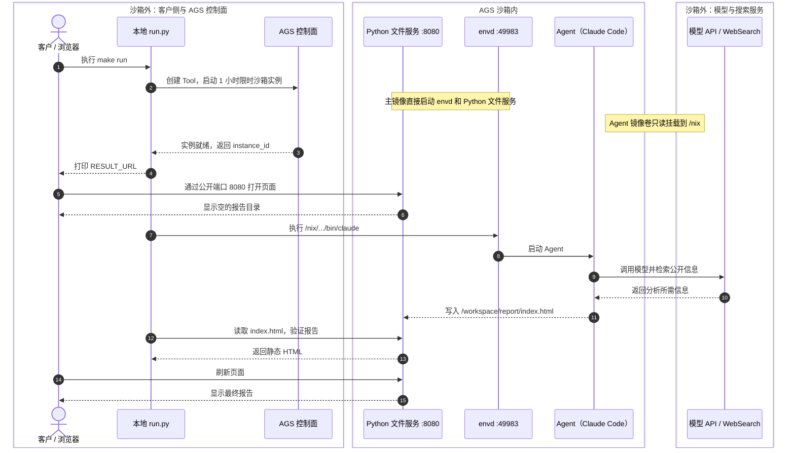

# 在 AGS 沙箱中通过镜像卷挂载 Agent

这个示例说明 AGS 如何通过镜像卷，把 **Agent 及其自身依赖**按需挂载到沙箱中。主镜像负责代码和任务环境，Agent 镜像卷负责提供 Agent 运行时，两者可以独立构建、组合和升级。

本示例以 Claude Code 作为 Agent。同样的挂载方式也适用于 Codex、Pi、OpenCode 等 Agent，以及自定义 Harness。Nix 是本示例用来生成最小、自包含软件闭包的打包手段；方案的核心能力是 AGS 为沙箱挂载独立的 Agent 镜像卷。

这种方式同时解决 **主镜像与 Agent 的依赖冲突**，以及 **环境镜像与 Agent/Harness 组合带来的镜像数量爆炸**。

主镜像只负责启动 envd 和一个 `8080` 端口的静态文件服务。Claude Code 不安装在主镜像里，而是由 `/nix` 镜像卷提供。运行脚本通过 envd 启动 Claude Code，Agent 完成任务后直接把 HTML 报告写入静态文件目录。

默认任务很简单：搜索最近 24 小时内三条重要的 AI 行业新闻，并生成一份带来源链接的中文简报。

## 这个方案解决什么

### 1. 主镜像与 Agent 的依赖冲突

RL 环境的主镜像通常已经固定了任务所需的 Python、Node.js、编译器和系统库。Claude Code、Codex、Pi、OpenCode 或自定义 Harness 也有各自的运行时依赖。如果把 Agent 直接安装进主镜像，可能出现版本冲突、`PATH` 污染，甚至因为升级 Agent 而改变原本可复现的任务环境。

Nix 将 Agent 及其依赖放在独立、带哈希的 `/nix/store` 路径中。Agent 使用自己的闭包运行，不覆盖主镜像中的文件；Agent 执行仓库测试时，仍然使用主镜像原有的工具链。

### 2. 环境镜像数量爆炸

RL 中往往有大量主镜像，例如 SWE-bench 系列的不同任务环境。同时，Agent 也有很多种类和版本，例如 Claude Code、Codex、Pi、OpenCode，以及频繁变化的自定义 Harness。

如果把 Agent 打进每个主镜像，镜像数量会形成笛卡尔积：

| 方式 | 需要维护的镜像 | Agent 或 Harness 更新时 |
|---|---|---|
| Agent 内置在主镜像 | `M 个环境 × N 个 Agent/Harness 版本` | 重新构建所有相关主镜像 |
| Agent 通过镜像卷挂载 | `M 个环境镜像 + N 个 Agent/Harness 卷` | 只重新构建对应的卷 |

这个方案把“任务环境”和“Agent/Harness”拆成两个可以独立组合、独立升级的维度。主镜像与 Agent 卷分别构建，再由 AGS Tool 组合使用，不需要提前构建每一种镜像组合。

## 你会看到什么

运行成功后，终端会输出：

```text
RESULT_URL=https://8080-<instance-id>.<region>.tencentags.com/
```

Agent 完成前，这个地址指向一个空的报告目录。Agent 完成后会生成 `index.html`，刷新页面即可查看最终中文报告和来源链接。

## 快速开始

### 1. 准备环境

需要：

- [uv](https://docs.astral.sh/uv/)、Docker，以及 AGS 可以访问的镜像仓库。
- 腾讯云凭证和允许 AGS 使用镜像卷的 `ROLE_ARN`。
- 能访问模型接口和新闻搜索的网络。

本机不需要安装 Nix。Nix 构建会在 `nixos/nix` 容器中完成。

先安装 Python 依赖：

```bash
make setup
```

### 2. 配置 AGS 和镜像地址

```bash
cp .env.example .env
```

先为后续构建的两张镜像预留完整的仓库地址。这一步只定义镜像名称和标签，不会构建或推送镜像；第 4 步会用这两个地址给本地构建结果打标签并推送，第 5 步再把它们交给 AGS 创建 Tool。

在 `.env` 中填写：

```bash
TENCENTCLOUD_SECRET_ID=...
TENCENTCLOUD_SECRET_KEY=...
TENCENTCLOUD_REGION=ap-guangzhou
ROLE_ARN=qcs::cam::uin/<your-uin>:roleName/ags-image-volume-role

# 后续构建和推送使用的目标地址
MAIN_IMAGE_REF=ccr.ccs.tencentyun.com/your-namespace/claude-code-nix-main:v1
CLAUDE_CODE_VOLUME_IMAGE_REF=ccr.ccs.tencentyun.com/your-namespace/claude-code-nix-volume:v1
```

两个目标地址必须位于 AGS 可以拉取的镜像仓库。主镜像提供 envd 和 Python 静态文件服务，Agent 镜像卷提供 Claude Code 及其运行依赖。

### 3. 配置模型

模型配置可以直接写入本地 `.env`：

```dotenv
ANTHROPIC_BASE_URL="https://api.deepseek.com/anthropic"
ANTHROPIC_API_KEY="<your-api-key>"
ANTHROPIC_MODEL="deepseek-v4-flash"
```

`.env` 已被 `.gitignore` 和 `.dockerignore` 排除：不会提交到 Git，也不会发送到 Docker build context。不要主动提交该文件，也不要在 Dockerfile 中通过 `COPY`、`ARG` 或 `ENV` 把 Key 写进镜像。

也可以不写 `.env`，改为在当前终端中 `export` 同名变量。脚本同时接受 `ANTHROPIC_API_KEY` 和 `ANTHROPIC_AUTH_TOKEN`。启动 Claude Code 时，Key 不会写入 AGS Tool，只会作为 `ANTHROPIC_AUTH_TOKEN` 注入该 Claude Code 进程，与 [DeepSeek Claude Code 接入文档](https://api-docs.deepseek.com/zh-cn/quick_start/agent_integrations/claude_code/) 保持一致。

### 4. 构建并推送镜像

首次使用时，构建主镜像和 Agent 镜像卷：

```bash
make build-images
make push-images
```

`make push-images` 会把 `.env` 中配置的两张镜像推送到镜像仓库。后续只要镜像内容没有变化，就可以直接使用已有镜像，无需重复构建。

如果已经有一个配置好所需主镜像和 Agent 镜像卷的 Tool，则可以跳过本节，不需要再次构建和推送镜像。在 `.env` 中设置 `TOOL_ID="sdt-xxxxxxxx"`，下一步会直接使用该 Tool 启动实例。

### 5. 运行任务

```bash
make run
```

未设置 `TOOL_ID` 时，脚本会使用刚刚推送的主镜像和 Agent 镜像卷创建 AGS 自定义 Tool，将 Agent 卷只读挂载到 `/nix`，然后启动沙箱实例；设置了 `TOOL_ID` 时，脚本会直接使用该 Tool 启动实例。

`RESULT_URL` 会在 Agent 开始任务前打印。此时打开会看到空的报告目录；终端显示任务完成后，刷新页面即可查看 Agent 生成的 `index.html`。实例使用 `AuthMode=PUBLIC`，结果端口 `8080` 可以直接访问。需要更换任务时，设置 `TASK_TOPIC` 和 `AGENT_TASK` 后重新运行即可。

脚本新建的 Tool 使用限时沙箱，实例超时时间为 1 小时，到期后会自动释放；不再使用时也可以提前清理。

### 6. 清理

停止实例并保留 Tool，方便下次复用：

```bash
make cleanup
```

同时删除 Tool：

```bash
DELETE_TOOL=1 make cleanup
```

## 运行流程

箭头自上而下表示执行顺序。中间的“AGS 沙箱内”区域是沙箱实例内部，其余组件均在沙箱外。



主镜像只提供 envd 和 Python 标准库的静态文件服务，镜像卷只提供 Agent 及其依赖。本地脚本负责创建资源、通过 envd 启动 Agent 和验证结果；报告由沙箱内的 Agent 直接写入静态文件目录。

## AGS 镜像卷与 Nix 的关系

AGS 提供的是通用的镜像卷挂载能力，并不要求镜像卷必须由 Nix 构建，也不会解析或管理卷内的软件依赖。镜像卷里可以是一个独立二进制文件、一组预先准备好的文件，或由其他包管理器和构建系统生成的完整依赖闭包。

使用方只需要保证镜像卷与沙箱架构兼容，文件挂载后可以从约定路径运行，并且包含 Agent 自身所需的依赖。AGS 负责把这些文件挂载进沙箱；至于卷内使用哪种打包技术、包含哪些程序，由使用方决定。

本示例选择 Nix，是因为它可以从目标程序出发，找出程序引用的全部传递依赖，形成一个可独立运行的最小闭包。`nix-store -qR` 用于收集 Claude Code 的运行时闭包，并只把这些 `/nix/store` 路径打进 Agent 镜像卷。也可以换成任何能够产出自包含运行时或完整依赖闭包的工具。

这个最小闭包提供了清晰的依赖边界，也让 Agent 可以脱离主镜像独立交付：

- **解决依赖冲突**：Agent 固定使用自己的哈希路径，不覆盖主镜像中的库。
- **避免组合爆炸**：任意主镜像都可以在运行时挂载所需的 Agent/Harness 卷。
- **避免重复安装**：多个主镜像可以复用同一份 Agent 运行时。
- **不污染主镜像**：卷只读挂载到 `/nix`，不会向 `/usr` 安装文件，也不会修改主镜像的 `PATH`。
- **独立升级**：升级 Agent 或 Harness 时，只发布新卷，不需要重新构建每个主镜像。

### 隔离的是 Agent 自身依赖

这个镜像卷只负责提供 Claude Code 自身的运行时，不会替换客户任务的执行环境。

例如，Agent 在代码仓库中运行 `python test.py` 时，仍会按主镜像的 `PATH` 使用主镜像中的 Python。只有启动 Claude Code 本身时，才使用 `/nix` 中的绝对路径。

## 查看运行证据

每次运行会在 `.state/` 下保存：

| 文件 | 内容 |
|---|---|
| `runtime-report.json` | 认证模式、Nix 路径、Claude Code 版本、模型和最终状态 |
| `claude-output.json` | Claude Code 的结构化输出，不包含 API Key |
| `report.html` | 从公开地址读回的最终静态报告 |
| `result_url` | 可以直接打开的网页地址 |

## 主要文件

| 路径 | 作用 |
|---|---|
| `nix/default.nix` | 构建示例 Agent（Claude Code）的运行时闭包 |
| `scripts/build_volume.py` | 构建闭包并生成卷镜像 |
| `images/main/Dockerfile` | 构建主镜像，并直接启动 envd 和 Python 静态文件服务 |
| `scripts/run.py` | 创建 AGS 资源、运行 Agent 并验证结果 |
| `scripts/cleanup.py` | 清理实例和 Tool |

构建、运行和清理辅助程序均为 Python；Makefile 只提供简短的用户命令。
