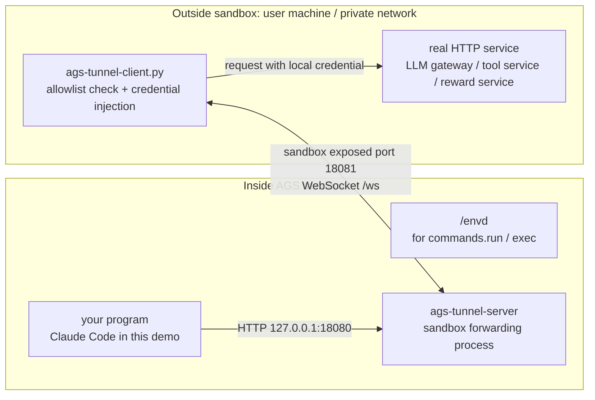
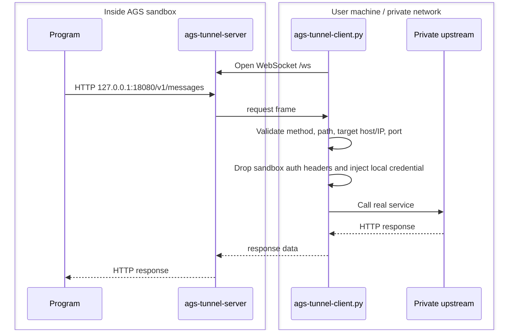

# Local Service Tunnel

This example solves a common problem: code running inside an AGS sandbox needs to call an HTTP service on your machine or private network, but the sandbox network cannot reach that address directly.

After the tunnel is running, the sandbox code calls `http://127.0.0.1:18080`. The request is forwarded to `ags-tunnel-client.py` on your machine, and the local client calls the real service, such as a private LLM gateway, tool service, or reward service. The real service address and credentials stay on your side of the network, while the sandbox can keep `NETWORK_MODE=SANDBOX`.

One local `ags-tunnel-client.py` process can connect to multiple sandboxes. All connections share the same allowlist policy.

Claude Code is only the demo program in this directory. The tunnel itself is generic, and you can use it with your own program.

## Architecture



## Sandbox Process

When creating the custom tool, configure the main process command as:

```json
{
  "Command": ["/bin/sh"],
  "Args": [
    "-lc",
    "/envd -port 49983 >/tmp/envd.log 2>&1 & exec /mnt/tunnel/bin/ags-tunnel-server"
  ]
}
```

This command starts two processes:

- `/envd`: used by `commands.run()` and shell debugging.
- `ags-tunnel-server`: receives HTTP requests from the sandbox program and sends them to the local client over WebSocket.

`/envd` is mounted from the envd image volume, and `ags-tunnel-server` is mounted from the tunnel binary image volume. `scripts/run.py` creates the corresponding image volume mounts and declares the sandbox exposed port.

The readiness check uses envd `GET /health` on port `49983`. `ags-tunnel-server` exposes:

- `127.0.0.1:18080`: called by the program inside the sandbox.
- `0.0.0.0:18081`: sandbox WebSocket control port.

## Request Flow



This example forwards HTTP requests, not arbitrary TCP traffic. That keeps the security boundary clear: the local client can check method, path, host, IP/CIDR, port, and headers before anything reaches the private service.

## Files

```text
tunnel/server/              Tunnel server that runs inside the sandbox
tunnel/ags-tunnel-client.py CLI entrypoint for the local tunnel client
tunnel/ags_tunnel_client.py Importable Python client module for customization
scripts/run.py              Create tool, start sandbox instance, start local client
scripts/cleanup.py          Stop sandbox instance and optionally delete tool
scripts/build-claude-code-dir.sh
                            Build a Linux amd64 Claude Code demo directory
scripts/build-images.sh     Build and push main, tunnel, and demo program images
config/tunnel-policy.yaml   Allowlist policy
config/tunnel-sessions.yaml Optional; used when one local client connects to multiple sandboxes
```

## Run

```bash
cd examples/local-service-tunnel
python3 -m pip install -r requirements.txt
cp .env.example .env
```

Fill `.env`:

```bash
TENCENTCLOUD_SECRET_ID=<your_tencentcloud_secret_id>
TENCENTCLOUD_SECRET_KEY=<your_tencentcloud_secret_key>
TENCENTCLOUD_REGION=ap-guangzhou
ROLE_ARN=qcs::cam::uin/xxx:roleName/xxx
MAIN_IMAGE_REF=ccr.ccs.tencentyun.com/xxx/local-service-tunnel-main:20260626
TUNNEL_IMAGE_REF=ccr.ccs.tencentyun.com/xxx/ags-tunnel-bin:20260626
WORKLOAD_IMAGE_REF=ccr.ccs.tencentyun.com/xxx/demo-workload-claude-code:20260626
DEEPSEEK_API_KEY=<your_upstream_api_key>
```

Build or update images when needed:

```bash
./scripts/build-images.sh main
./scripts/build-images.sh tunnel
./scripts/build-claude-code-dir.sh
./scripts/build-images.sh workload
```

`build-claude-code-dir.sh` runs the install step inside a Linux amd64 container and writes `dist/claude-code-linux-amd64/claude-code`. The final demo program image only receives the Claude Code launcher and Linux binary:

```text
dist/claude-code-linux-amd64/claude-code/
  bin/claude
  claude/bin/claude
```

Node.js, npm, and `node_modules` are build-time dependencies only; they are not copied into the demo program image. If you already have an equivalent Linux amd64 Claude Code directory, set `CLAUDE_CODE_DIR=/path/to/claude-code` before running `./scripts/build-images.sh workload`.

Run:

```bash
make run
```

`scripts/run.py` runs the full demo flow: it creates the AGS custom tool, starts a sandbox instance, acquires the sandbox port access token, starts the local tunnel client, and calls `/demo/run` inside the sandbox.

Set `RUN_DEMO=0` if you only want to keep the tunnel running without the Claude Code demo.

Expected demo output:

```text
DEMO_OUTPUT=.state/demo-output.json
```

The JSON file should contain `local-service-tunnel-ok`.

Cleanup:

```bash
make cleanup
DELETE_TOOL=1 make cleanup
```

## Allowlist

The local client reads the allowlist from `config/tunnel-policy.yaml` by default. Override it with `AGS_TUNNEL_POLICY_FILE`.

```yaml
upstream_base: "https://example.internal/v1"
allow_insecure_upstream: false
allowed_upstream_hosts:
  - "example.internal"
allowed_upstream_ports:
  - 443
allowed_ip_cidrs:
  - "10.0.0.0/8"
allowed_paths:
  - "/v1/messages"
allowed_path_prefixes: []
allowed_methods:
  - "POST"
```

If both `allowed_upstream_hosts` and `allowed_ip_cidrs` are set, both checks must pass. Keep the policy narrow; the sandbox is not trusted.

The local client can connect to multiple sandboxes at the same time. All connections still share the same allowlist. Use `--session-file config/tunnel-sessions.yaml` when one local client should connect to multiple sandboxes. For more advanced allowlist logic, edit `TunnelPolicy` in `tunnel/ags_tunnel_client.py`.

## Allowlist Verification

This test checks two things: an allowed path can reach the local service, and a path outside the allowlist is blocked.

It starts a temporary local HTTP service, then uses envd to run `curl` inside the sandbox:

```bash
RUN_ALLOWLIST_TEST=1 make run
make cleanup
```

Expected files:

```text
.state/allowlist-allowed.txt
.state/allowlist-denied.txt
```

Expected result:

- `/allowlist-ok` returns `HTTP/1.1 200 OK`.
- `/blocked` returns `HTTP/1.1 502 Bad Gateway`.

## Multi-Turn Verification

This test starts a local mock LLM service and sends two `/v1/messages` requests from inside the sandbox through the tunnel. The second request includes the first response, so it verifies that the same tunnel connection can carry repeated requests.

```bash
RUN_MULTI_TURN_TEST=1 make run
make cleanup
```

Expected file:

```text
.state/multi-turn-output.txt
```

Expected result:

- The first request returns `turn-1-ok`.
- The second request returns `turn-2-ok` only when the request includes `turn-1-ok` in the conversation history.

## Claude Code Demo

This directory uses Claude Code as the demo program. It runs in non-interactive `-p` mode, so the default demo is one prompt call. Use `RUN_MULTI_TURN_TEST=1` to test repeated requests.

For prompts that need Claude Code tools, set:

```bash
CLAUDE_PERMISSION_MODE=bypassPermissions \
PROMPT='Analyze today weather and stock data, then print local-service-tunnel-ok' \
make run
```

The permission setting above only reduces confirmation prompts for this Claude Code demo. For your own program, you do not need Claude Code-specific settings; send the HTTP request that would normally go to the private service to `http://127.0.0.1:18080` instead.

## Security Boundary

- Real service credentials stay on the user machine.
- Requests from the sandbox are checked by the local client before forwarding.
- The local client drops sandbox-provided auth headers and injects local credentials.
- The YAML policy restricts the real service host, IP/CIDR, port, path, method, and forwarded headers.
- Multiple sandbox connections share one YAML allowlist; the connection list cannot relax the policy.
