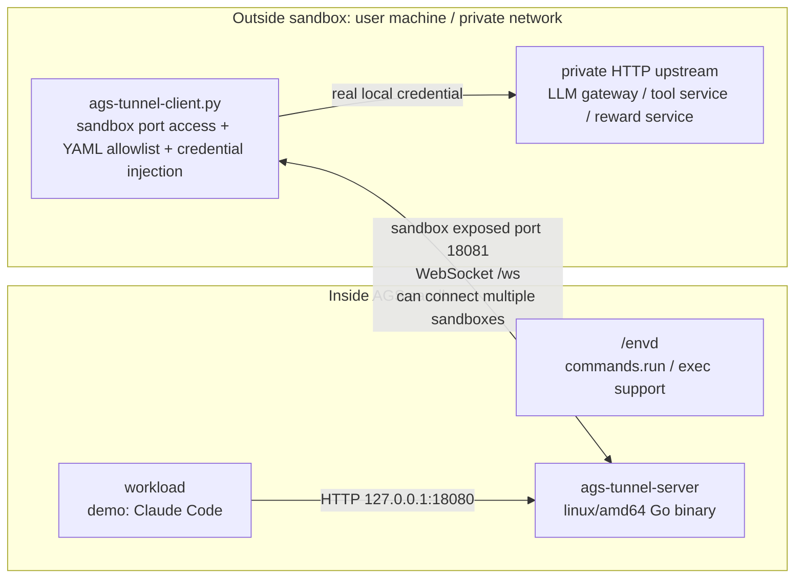
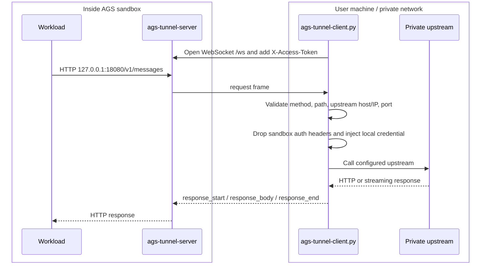

# Local Service Tunnel

This example shows a reusable AGS pattern: a workload inside a sandbox calls `http://127.0.0.1:18080`, and the request is forwarded through a WebSocket tunnel to a user-local or private HTTP service. The sandbox can keep `NETWORK_MODE=SANDBOX`; the real upstream address and credentials stay outside the sandbox. One user-side `ags-tunnel-client.py` process can manage multiple sandbox connections, and all connections share the same allowlist policy.

Claude Code is only the demo workload in this directory. The tunnel itself is generic.

## Architecture



## Sandbox Startup

When creating the custom tool, configure the main process command as:

```json
{
  "Command": ["/bin/sh"],
  "Args": [
    "-lc",
    "/envd -port 49983 >/tmp/envd.log 2>&1 & exec /mnt/tunnel/bin/ags-tunnel-server"
  ]
}
```

`/envd` is mounted from the envd image volume, and `ags-tunnel-server` is mounted from the tunnel binary image volume. `scripts/run.py` creates the corresponding image volume mounts and declares the sandbox exposed port.

The readiness probe uses envd `GET /health` on port `49983`. The tunnel server exposes:

- `127.0.0.1:18080`: called by sandbox workloads.
- `0.0.0.0:18081`: sandbox WebSocket control port.

## Flow



This is HTTP proxy over WebSocket, not a generic TCP tunnel. HTTP mode is intentional: the local client can enforce path, method, host, IP/CIDR, port, and header rules before any request reaches the private service.

## Files

```text
tunnel/server/              Sandbox-side Go tunnel server
tunnel/ags-tunnel-client.py CLI entrypoint for the user-side tunnel client
tunnel/ags_tunnel_client.py Importable Python client module
scripts/run.py              Create tool, start instance, start local client
scripts/cleanup.py          Stop instance and optionally delete tool
scripts/build-claude-code-dir.sh
                            Build a Linux amd64 Claude Code demo directory
scripts/build-images.sh     Build and push main, tunnel, and demo workload images
config/tunnel-policy.yaml   YAML allowlist policy
config/tunnel-sessions.yaml Optional; used when one local client connects to multiple sandboxes
```

## Run

```bash
cd examples/local-service-tunnel
python3 -m pip install -r requirements.txt
cp .env.example .env
```

Fill `.env`:

```bash
TENCENTCLOUD_SECRET_ID=<your_tencentcloud_secret_id>
TENCENTCLOUD_SECRET_KEY=<your_tencentcloud_secret_key>
TENCENTCLOUD_REGION=ap-guangzhou
ROLE_ARN=qcs::cam::uin/xxx:roleName/xxx
MAIN_IMAGE_REF=ccr.ccs.tencentyun.com/xxx/local-service-tunnel-main:20260626
TUNNEL_IMAGE_REF=ccr.ccs.tencentyun.com/xxx/ags-tunnel-bin:20260626
WORKLOAD_IMAGE_REF=ccr.ccs.tencentyun.com/xxx/demo-workload-claude-code:20260626
DEEPSEEK_API_KEY=<your_upstream_api_key>
```

Build images when needed:

```bash
./scripts/build-images.sh main
./scripts/build-images.sh tunnel
./scripts/build-claude-code-dir.sh
./scripts/build-images.sh workload
```

`build-claude-code-dir.sh` runs the install step inside a Linux amd64 container and writes `dist/claude-code-linux-amd64/claude-code`. The final demo workload only receives the Claude Code launcher and Linux binary:

```text
dist/claude-code-linux-amd64/claude-code/
  bin/claude
  claude/bin/claude
```

Node.js, npm, and `node_modules` are build-time dependencies only; they are not copied into the workload image. If you already have an equivalent Linux amd64 Claude Code directory, set `CLAUDE_CODE_DIR=/path/to/claude-code` before running `./scripts/build-images.sh workload`.

Run:

```bash
make run
```

`scripts/run.py` uses the TencentCloud Python SDK to create the AGS custom tool, start an instance, acquire the sandbox port access token, then start the local tunnel client. By default it also calls `/demo/run`; set `RUN_DEMO=0` if you only want to keep the tunnel running.

Expected demo output:

```text
DEMO_OUTPUT=.state/demo-output.json
```

The JSON file should contain `local-service-tunnel-ok`.

Cleanup:

```bash
make cleanup
DELETE_TOOL=1 make cleanup
```

## YAML Allowlist

The local client reads only YAML policy files. The default is `config/tunnel-policy.yaml`; override it with `AGS_TUNNEL_POLICY_FILE`.

```yaml
upstream_base: "https://example.internal/v1"
allow_insecure_upstream: false
allowed_upstream_hosts:
  - "example.internal"
allowed_upstream_ports:
  - 443
allowed_ip_cidrs:
  - "10.0.0.0/8"
allowed_paths:
  - "/v1/messages"
allowed_path_prefixes: []
allowed_methods:
  - "POST"
```

If both `allowed_upstream_hosts` and `allowed_ip_cidrs` are set, both checks must pass. Keep the policy narrow; the sandbox is not trusted.

The local client can connect to multiple sandboxes at the same time. All connections still share the same top-level allowlist. Use `--session-file config/tunnel-sessions.yaml` when one local client should connect to multiple sandboxes. For more advanced allowlist logic, edit `TunnelPolicy` in `tunnel/ags_tunnel_client.py`.

## Allowlist Verification

This mode starts a temporary local upstream and uses E2B `commands.run()` through envd to execute `curl` inside the sandbox:

```bash
RUN_ALLOWLIST_TEST=1 make run
make cleanup
```

Expected files:

```text
.state/allowlist-allowed.txt
.state/allowlist-denied.txt
```

Expected result:

- `/allowlist-ok` returns `HTTP/1.1 200 OK`.
- `/blocked` returns `HTTP/1.1 502 Bad Gateway`.

## Multi-Turn Verification

This mode starts a local Anthropic Messages-compatible mock upstream and sends two `/v1/messages` requests from inside the sandbox through the tunnel. The second request includes the first assistant response, so it verifies that repeated conversation-style requests can cross the same tunnel connection.

```bash
RUN_MULTI_TURN_TEST=1 make run
make cleanup
```

Expected file:

```text
.state/multi-turn-output.txt
```

Expected result:

- The first request returns `turn-1-ok`.
- The second request returns `turn-2-ok` only when the request includes `turn-1-ok` in the conversation history.

## Demo Workload Notes

The demo workload uses Claude Code in non-interactive `-p` mode, so it is a single-prompt demo. Use `RUN_MULTI_TURN_TEST=1` for automated multi-turn tunnel verification. For prompts that need tools, set:

```bash
CLAUDE_PERMISSION_MODE=bypassPermissions \
PROMPT='Analyze today weather and stock data, then print local-service-tunnel-ok' \
make run
```

This permission mode is only for the isolated demo sandbox. Customer workloads can be any process that calls `http://127.0.0.1:18080`.

## Security Boundary

- Real upstream credentials stay on the user machine.
- The sandbox only sends request intent through the tunnel.
- The local client drops sandbox-provided auth headers and injects local credentials.
- The YAML policy restricts upstream host, IP/CIDR, port, path, method, and forwarded headers.
- Multiple sandbox connections share one YAML allowlist; the connection list cannot relax the policy.
