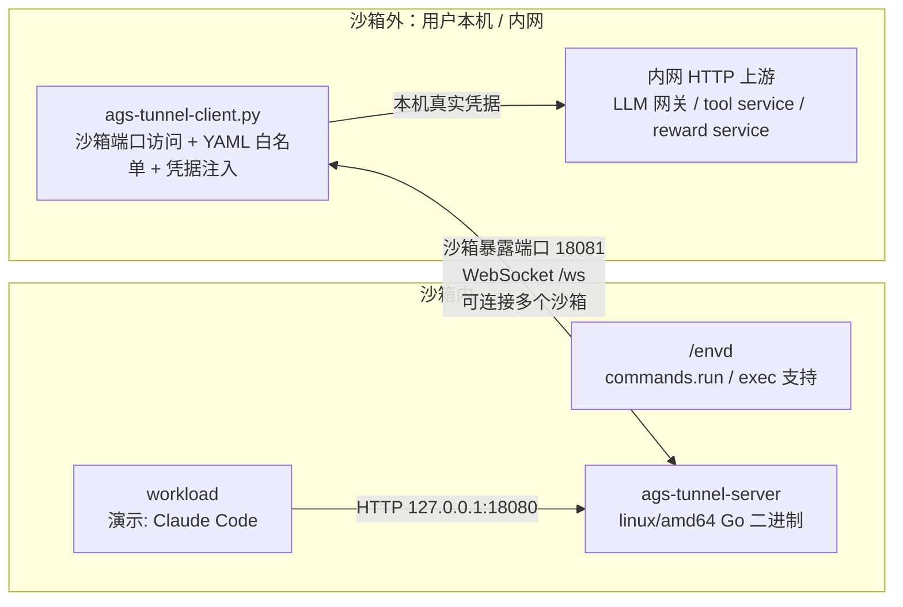
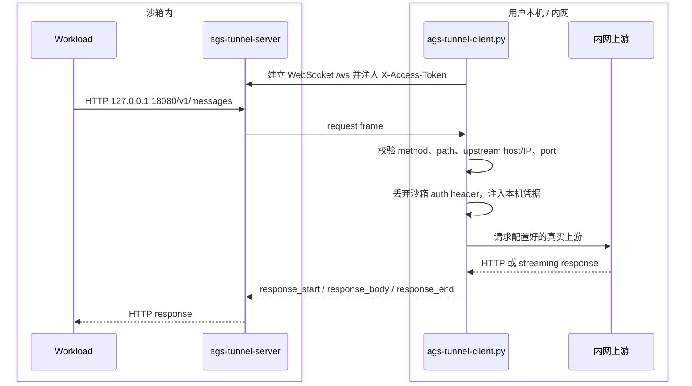

# 本地服务隧道

这个示例解决的问题是：沙箱里的程序需要访问你本机或内网里的 HTTP 服务，但沙箱网络不能直接连过去。

运行这个示例后，沙箱里的程序只需要请求 `http://127.0.0.1:18080`。请求会经过沙箱内的 `ags-tunnel-server`，再通过 WebSocket 连接转发到你本机运行的 `ags-tunnel-client.py`，最后由本机 client 访问真正的内网服务。这样可以把模型网关、工具服务、reward service 等服务和访问凭据继续留在内网，沙箱仍然使用 `NETWORK_MODE=SANDBOX`。

一个本机 `ags-tunnel-client.py` 进程可以同时连接多个沙箱。多个连接共用同一份白名单策略。

Claude Code 只是本目录里的演示 workload，隧道能力本身不绑定 Claude Code。

## 架构



## 沙箱启动配置

创建 custom tool 时，主进程启动命令配置为：

```json
{
  "Command": ["/bin/sh"],
  "Args": [
    "-lc",
    "/envd -port 49983 >/tmp/envd.log 2>&1 & exec /mnt/tunnel/bin/ags-tunnel-server"
  ]
}
```

其中 `/envd` 来自 envd 镜像卷，`ags-tunnel-server` 来自 tunnel 二进制镜像卷。`scripts/run.py` 会创建对应的 image volume 挂载，并声明沙箱暴露端口。

Readiness probe 探测 envd 的 `GET /health`，端口 `49983`。tunnel server 在沙箱内监听：

- `127.0.0.1:18080`：给沙箱内 workload 调用。
- `0.0.0.0:18081`：作为沙箱暴露的 WebSocket control port。

## 请求流程



本方案是 HTTP proxy over WebSocket，不是通用 TCP tunnel。HTTP 模式可以在本地 client 里明确限制 path、method、host、IP/CIDR、port 和 header，安全边界更清楚。

## 文件结构

```text
tunnel/server/              沙箱侧 Go tunnel server
tunnel/ags-tunnel-client.py 用户侧 tunnel client CLI 入口
tunnel/ags_tunnel_client.py 可 import 的 Python client 模块
scripts/run.py              创建 tool、启动 instance、启动本地 client
scripts/cleanup.py          停止 instance；DELETE_TOOL=1 时删除 tool
scripts/build-claude-code-dir.sh
                            构建 Linux amd64 Claude Code 演示目录
scripts/build-images.sh     构建并推送主镜像、tunnel 镜像、演示 workload 镜像
config/tunnel-policy.yaml   YAML 白名单策略
config/tunnel-sessions.yaml 可选；一个本地 client 连接多个沙箱时使用
```

## 最短运行步骤

```bash
cd examples/local-service-tunnel
python3 -m pip install -r requirements.txt
cp .env.example .env
```

填写 `.env`：

```bash
TENCENTCLOUD_SECRET_ID=<your_tencentcloud_secret_id>
TENCENTCLOUD_SECRET_KEY=<your_tencentcloud_secret_key>
TENCENTCLOUD_REGION=ap-guangzhou
ROLE_ARN=qcs::cam::uin/xxx:roleName/xxx
MAIN_IMAGE_REF=ccr.ccs.tencentyun.com/xxx/local-service-tunnel-main:20260626
TUNNEL_IMAGE_REF=ccr.ccs.tencentyun.com/xxx/ags-tunnel-bin:20260626
WORKLOAD_IMAGE_REF=ccr.ccs.tencentyun.com/xxx/demo-workload-claude-code:20260626
DEEPSEEK_API_KEY=<your_upstream_api_key>
```

需要更新镜像时执行：

```bash
./scripts/build-images.sh main
./scripts/build-images.sh tunnel
./scripts/build-claude-code-dir.sh
./scripts/build-images.sh workload
```

`build-claude-code-dir.sh` 会在 Linux amd64 容器里完成安装，并输出 `dist/claude-code-linux-amd64/claude-code`。最终传入演示 workload 的目录只包含 Claude Code launcher 和 Linux 二进制：

```text
dist/claude-code-linux-amd64/claude-code/
  bin/claude
  claude/bin/claude
```

Node.js、npm、`node_modules` 只在构建阶段使用，不会复制进 workload 镜像。如果你已有等价的 Linux amd64 Claude Code 目录，可以在构建 workload 镜像前设置 `CLAUDE_CODE_DIR=/path/to/claude-code`。

运行：

```bash
make run
```

`scripts/run.py` 使用 TencentCloud Python SDK 创建 AGS custom tool、启动 instance、获取沙箱端口访问 token，然后启动本机 tunnel client。默认还会调用一次 `/demo/run`；如果只想保留 tunnel，不跑 demo，可以设置 `RUN_DEMO=0`。

期望 demo 输出：

```text
DEMO_OUTPUT=.state/demo-output.json
```

这个 JSON 文件里应包含 `local-service-tunnel-ok`。

清理：

```bash
make cleanup
DELETE_TOOL=1 make cleanup
```

## YAML 白名单

本地 client 只读取 YAML 策略文件。默认文件是 `config/tunnel-policy.yaml`，可通过 `AGS_TUNNEL_POLICY_FILE` 覆盖。

```yaml
upstream_base: "https://example.internal/v1"
allow_insecure_upstream: false
allowed_upstream_hosts:
  - "example.internal"
allowed_upstream_ports:
  - 443
allowed_ip_cidrs:
  - "10.0.0.0/8"
allowed_paths:
  - "/v1/messages"
allowed_path_prefixes: []
allowed_methods:
  - "POST"
```

如果同时配置 `allowed_upstream_hosts` 和 `allowed_ip_cidrs`，两个条件都必须通过。不要把白名单放宽成通配配置。

本地 client 支持同时连接多个沙箱，多个连接仍然共用同一份顶层白名单。需要连接多个沙箱时，使用 `--session-file config/tunnel-sessions.yaml` 指定连接清单；如果需要更复杂的白名单逻辑，直接修改 `tunnel/ags_tunnel_client.py` 里的 `TunnelPolicy`。

## 白名单验证

验证模式会启动一个临时本地 HTTP 上游，然后通过 envd 使用 E2B `commands.run()` 在沙箱内执行 `curl`：

```bash
RUN_ALLOWLIST_TEST=1 make run
make cleanup
```

期望文件：

```text
.state/allowlist-allowed.txt
.state/allowlist-denied.txt
```

期望结果：

- `/allowlist-ok` 返回 `HTTP/1.1 200 OK`。
- `/blocked` 返回 `HTTP/1.1 502 Bad Gateway`。

## 多轮请求验证

这个模式会启动一个本地 Anthropic Messages-compatible mock upstream，然后从沙箱内通过 tunnel 连续发送两次 `/v1/messages` 请求。第二次请求会带上第一轮 assistant 的响应，因此可以验证同一条 tunnel 连接能承载连续的对话式请求。

```bash
RUN_MULTI_TURN_TEST=1 make run
make cleanup
```

期望文件：

```text
.state/multi-turn-output.txt
```

期望结果：

- 第一轮请求返回 `turn-1-ok`。
- 第二轮请求只有在 conversation history 中带上 `turn-1-ok` 时才返回 `turn-2-ok`。

## 演示 Workload

演示 workload 使用 Claude Code 的非交互 `-p` 模式，因此它是单 prompt demo。自动化多轮 tunnel 验证请使用 `RUN_MULTI_TURN_TEST=1`。复杂 prompt 如果需要工具权限，可以设置：

```bash
CLAUDE_PERMISSION_MODE=bypassPermissions \
PROMPT='分析今天的天气和股票表现，最后输出 local-service-tunnel-ok' \
make run
```

上面的权限参数只是为了让本示例里的 Claude Code demo 少一点交互确认。实际接入自己的程序时，不需要关心 Claude Code；程序把原本要发往内网服务的 HTTP 请求发到 `http://127.0.0.1:18080` 即可。

## 安全边界

- 真实上游凭据保留在用户本机。
- 沙箱只能通过 tunnel 表达请求意图。
- 本地 client 丢弃沙箱传来的 auth header，再注入本机凭据。
- YAML 策略限制上游 host、IP/CIDR、port、path、method 和可转发 header。
- 多个沙箱连接共用同一份 YAML 白名单，连接清单不能放宽策略。
