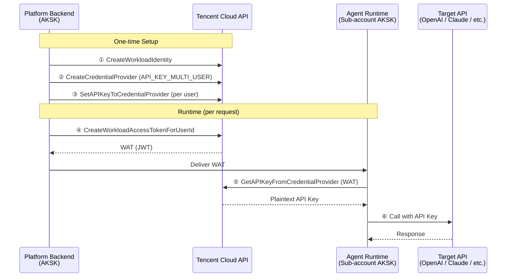

# Multi-Tenant API Key CredentialProvider

Demonstrates the complete workflow for securely managing and distributing per-user API keys through AGS CredentialProvider, for platforms running their own (non-hosted) Agent runtimes.

## Architecture



## Prerequisites

- Python >= 3.12
- `TENCENTCLOUD_SECRET_ID` / `TENCENTCLOUD_SECRET_KEY`

## Quick Start

### 1. Configure credentials

```bash
cp .env.example .env
# Edit .env with your real credentials
```

### 2. Run

```bash
make setup
make run
```

## Expected Output

```
Phase 1: One-time Setup
  [1/2] Creating WorkloadIdentity...
    Created WorkloadIdentity: wi-********
  [2/2] Creating CredentialProvider (API_KEY_MULTI_USER)...
    Created CredentialProvider: agc-********

Phase 2: Key Management
  [1/4] Setting API Key for customer-001... Done.
  [2/4] Setting API Key for customer-002... Done.
  [3/4] Listing API Keys (masked)...
    TotalCount: 2
    UserId=customer-001  MaskedKey=sk-****
    UserId=customer-002  MaskedKey=sk-****
  [4/4] Rotating API Key for customer-001 (OverwriteAllowed=true)... Done.

Phase 3: Issue WAT for user 'customer-001'
  WAT issued (first 40 chars): eyJhbGci...

Phase 4: Agent Retrieves API Key via WAT
  Retrieved API Key (masked): sk-****

Demo Complete
  In production the Agent uses this key to call the target API:
    Authorization: Bearer sk-****
    POST https://api.example.com/v1/chat/completions
```

## Security Design

| Principle | Implementation |
|-----------|---------------|
| **Least privilege** | Agent AKSK only has `GetAPIKeyFromCredentialProvider` permission |
| **Identity isolation** | UserId is extracted from JWT claims in WAT — Agent cannot forge another user's identity |
| **Short-lived tokens** | WAT TTL is 3600 seconds; expired tokens are rejected |
| **Ownership check** | Service verifies AppID owns the target CredentialProvider |
| **Encrypted storage** | API keys are encrypted at rest via KMS integration |

## API Reference

| Action | Purpose | Caller |
|--------|---------|--------|
| `CreateWorkloadIdentity` | Create identity for WAT issuance | Platform |
| `CreateCredentialProvider` | Create API_KEY_MULTI_USER type provider | Platform |
| `SetAPIKeyToCredentialProvider` | Store per-user API key (encrypted) | Platform |
| `DeleteAPIKeyFromCredentialProvider` | Remove a user's API key | Platform |
| `DescribeCredentialProviderAPIKeyList` | List keys (masked) | Platform |
| `CreateWorkloadAccessTokenForUserId` | Issue WAT for a user | Platform |
| `GetAPIKeyFromCredentialProvider` | Retrieve plaintext key via WAT | Agent |

## Common Failure Hints

- **AuthFailure.UnauthorizedOperation**: AKSK does not own the target resource — verify AppID matches
- **WAT expired**: Re-issue with `CreateWorkloadAccessTokenForUserId` (TTL fixed at 3600s)
- **ResourceNotFound**: Double-check the CredentialProviderId or WorkloadIdentityId
- **UnsupportedOperation**: Ensure CredentialProvider type is `API_KEY_MULTI_USER` (not `API_KEY_SINGLE`)
