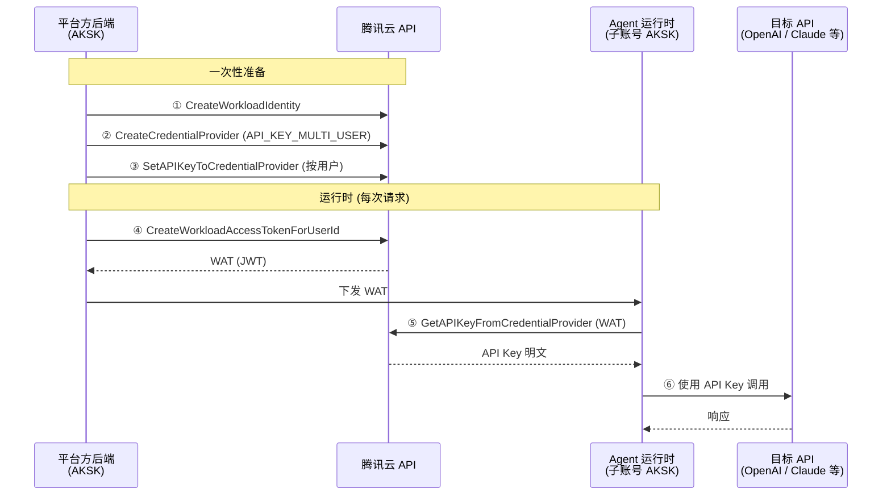

# Multi-Tenant API Key CredentialProvider

演示平台方使用 AGS CredentialProvider 安全管理和分发多租户静态密钥（API Key）的完整流程，适用于非托管 Agent 场景（平台方自行运行 Agent 运行时）。

## 架构



## 前置条件

- Python >= 3.12
- `TENCENTCLOUD_SECRET_ID` / `TENCENTCLOUD_SECRET_KEY`

## 快速开始

### 1. 配置凭证

```bash
cp .env.example .env
# 编辑 .env，填入真实凭证
```

### 2. 运行

```bash
make setup
make run
```

## 预期输出

```
Phase 1: One-time Setup
  [1/2] Creating WorkloadIdentity...
    Created WorkloadIdentity: wi-********
  [2/2] Creating CredentialProvider (API_KEY_MULTI_USER)...
    Created CredentialProvider: agc-********

Phase 2: Key Management
  [1/4] Setting API Key for customer-001... Done.
  [2/4] Setting API Key for customer-002... Done.
  [3/4] Listing API Keys (masked)...
    TotalCount: 2
    UserId=customer-001  MaskedKey=sk-****
    UserId=customer-002  MaskedKey=sk-****
  [4/4] Rotating API Key for customer-001 (OverwriteAllowed=true)... Done.

Phase 3: Issue WAT for user 'customer-001'
  WAT issued (first 40 chars): eyJhbGci...

Phase 4: Agent Retrieves API Key via WAT
  Retrieved API Key (masked): sk-****

Demo Complete
  In production the Agent uses this key to call the target API:
    Authorization: Bearer sk-****
    POST https://api.example.com/v1/chat/completions
```

## 安全设计

| 原则 | 实现方式 |
|------|---------|
| **最小权限** | Agent AKSK 仅有 `GetAPIKeyFromCredentialProvider` 权限 |
| **身份隔离** | UserId 从 WAT 的 JWT Claims 中提取 — Agent 无法伪造其他用户身份 |
| **短期令牌** | WAT TTL 固定 3600 秒；过期 Token 会被拒绝 |
| **归属校验** | 服务验证调用方 AppID 拥有目标 CredentialProvider |
| **加密存储** | API Key 通过 KMS 集成加密存储 |

## 接口参考

| Action | 用途 | 调用方 |
|--------|------|--------|
| `CreateWorkloadIdentity` | 创建身份标识，用于签发 WAT | 平台方 |
| `CreateCredentialProvider` | 创建 API_KEY_MULTI_USER 类型凭证提供者 | 平台方 |
| `SetAPIKeyToCredentialProvider` | 为用户存储 API Key（加密） | 平台方 |
| `DeleteAPIKeyFromCredentialProvider` | 删除用户的 API Key | 平台方 |
| `DescribeCredentialProviderAPIKeyList` | 查询 Key 列表（脱敏） | 平台方 |
| `CreateWorkloadAccessTokenForUserId` | 为用户签发 WAT | 平台方 |
| `GetAPIKeyFromCredentialProvider` | 通过 WAT 获取 Key 明文 | Agent |

## 常见问题

- **AuthFailure.UnauthorizedOperation**：AKSK 不拥有目标资源 — 检查 AppID 是否匹配
- **WAT 过期**：重新调用 `CreateWorkloadAccessTokenForUserId` 签发（TTL 固定 3600 秒）
- **ResourceNotFound**：检查 CredentialProviderId 或 WorkloadIdentityId 是否正确
- **UnsupportedOperation**：确保 CredentialProvider 类型为 `API_KEY_MULTI_USER`（非 `API_KEY_SINGLE`）
