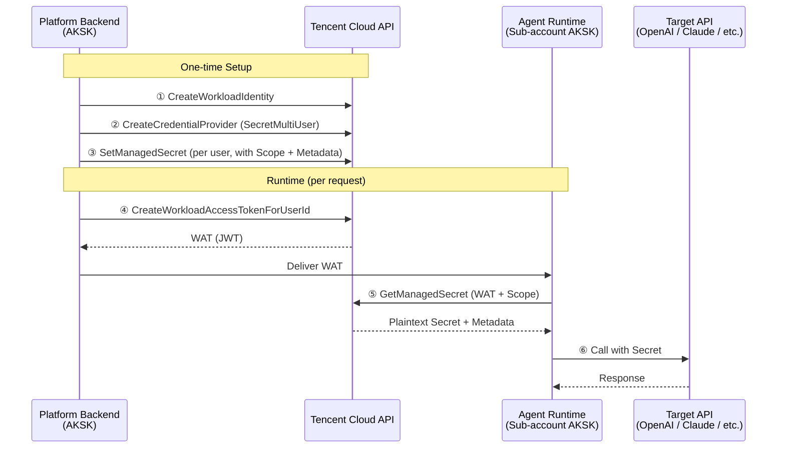

# Multi-Tenant ManagedSecret CredentialProvider

Demonstrates the complete workflow for securely managing and distributing per-user managed secrets through AGS CredentialProvider, for platforms running their own (non-hosted) Agent runtimes.

Two key concepts ship with ManagedSecret:

- **Scope** — a non-empty namespace string (e.g. `openai`, `github`). **Required** for `SetManagedSecret` and `GetManagedSecret`. One user can own multiple secrets, one per Scope.
- **Metadata** — optional list of `{Name, Value}` entries attached to a secret (e.g. email, client_id). Returned by `Get` / `List`.

## Architecture



## Prerequisites

- Python >= 3.12
- `TENCENTCLOUD_SECRET_ID` / `TENCENTCLOUD_SECRET_KEY`

## Quick Start

### 1. Configure credentials

```bash
cp .env.example .env
# Edit .env with your real credentials
```

### 2. Run

```bash
make setup
make run
```

## Expected Output

```
Phase 1: One-time Setup
  [1/2] Creating WorkloadIdentity...
    Created WorkloadIdentity: wi-********
  [2/2] Creating CredentialProvider (SecretMultiUser)...
    Created CredentialProvider: agc-********

Phase 2: ManagedSecret Management
  [1/4] Setting ManagedSecret for customer-001 (scope=openai)... Done.
  [2/4] Setting ManagedSecret for customer-002 (scope=openai)... Done.
  [3/4] Listing ManagedSecrets (masked, scope=openai)...
    TotalCount: 2
    UserId=customer-001  Scope=openai  MaskedSecret=sk-****  CreatedAt=...  Metadata=[email=customer-001@example.com, plan=pro]
    UserId=customer-002  Scope=openai  MaskedSecret=sk-****  CreatedAt=...  Metadata=[email=customer-002@example.com]
  [4/4] Rotating ManagedSecret for customer-001 (OverwriteAllowed=true)... Done.

Phase 3: Issue WAT for user 'customer-001'
  WAT issued (first 40 chars): eyJhbGci...

Phase 4: Agent Retrieves ManagedSecret via WAT
  Retrieved Secret (masked): sk-****
  Metadata:
    email=customer-001@example.com
    plan=pro
    rotated=true

Demo Complete
  In production the Agent uses this secret to call the target API:
    Authorization: Bearer sk-****
    POST https://api.example.com/v1/chat/completions
```

## Security Design

| Principle | Implementation |
|-----------|---------------|
| **Least privilege** | Agent AKSK only has `GetManagedSecret` permission |
| **Identity isolation** | UserId is extracted from JWT claims in WAT — Agent cannot forge another user's identity |
| **Scope isolation** | Each call must specify a non-empty `Scope`; secrets across Scopes are isolated for the same user |
| **Short-lived tokens** | WAT TTL is 3600 seconds; expired tokens are rejected |
| **Ownership check** | Service verifies AppID owns the target CredentialProvider |
| **Encrypted storage** | Managed secrets are encrypted at rest via KMS integration |

## API Reference

| Action | Purpose | Caller |
|--------|---------|--------|
| `CreateWorkloadIdentity` | Create identity for WAT issuance | Platform |
| `CreateCredentialProvider` | Create `SecretMultiUser` type provider | Platform |
| `SetManagedSecret` | Store per-user managed secret (encrypted). Requires `Scope`; supports `Metadata` | Platform |
| `DeleteManagedSecret` | Remove a user's managed secret (omit `Scope` to delete all of the user's secrets; empty string is rejected) | Platform |
| `DescribeManagedSecretList` | List managed secrets (masked); supports `Filters` by `scope` | Platform |
| `CreateWorkloadAccessTokenForUserId` | Issue WAT for a user | Platform |
| `GetManagedSecret` | Retrieve plaintext secret + metadata via WAT. Requires `Scope` | Agent |

## Common Failure Hints

- **AuthFailure.UnauthorizedOperation**: AKSK does not own the target resource — verify AppID matches
- **InvalidParameter (Scope)**: `Scope` is required for `SetManagedSecret` / `GetManagedSecret` and must not be an empty string
- **WAT expired**: Re-issue with `CreateWorkloadAccessTokenForUserId` (TTL fixed at 3600s)
- **ResourceNotFound**: Double-check the `CredentialProviderId` or `WorkloadIdentityId`
- **UnsupportedOperation**: Ensure CredentialProvider type is `SecretMultiUser`
