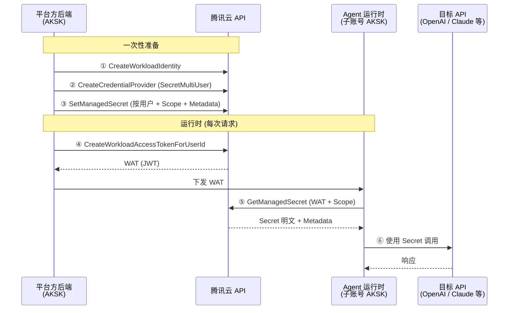

# Multi-Tenant ManagedSecret CredentialProvider

演示平台方使用 AGS CredentialProvider 安全管理和分发多租户托管密钥（ManagedSecret）的完整流程，适用于非托管 Agent 场景（平台方自行运行 Agent 运行时）。

ManagedSecret 涉及两个关键概念：

- **Scope**：非空命名空间字符串（如 `openai`、`github`）。`SetManagedSecret` 和 `GetManagedSecret` **必填**。同一个用户可以在不同 Scope 下持有多个独立的密钥。
- **Metadata**：可选的 `{Name, Value}` 列表，用于附加业务元信息（如 email、client_id），`Get` / `List` 接口会返回。

## 架构



## 前置条件

- Python >= 3.12
- `TENCENTCLOUD_SECRET_ID` / `TENCENTCLOUD_SECRET_KEY`

## 快速开始

### 1. 配置凭证

```bash
cp .env.example .env
# 编辑 .env，填入真实凭证
```

### 2. 运行

```bash
make setup
make run
```

## 预期输出

```
Phase 1: One-time Setup
  [1/2] Creating WorkloadIdentity...
    Created WorkloadIdentity: wi-********
  [2/2] Creating CredentialProvider (SecretMultiUser)...
    Created CredentialProvider: agc-********

Phase 2: ManagedSecret Management
  [1/4] Setting ManagedSecret for customer-001 (scope=openai)... Done.
  [2/4] Setting ManagedSecret for customer-002 (scope=openai)... Done.
  [3/4] Listing ManagedSecrets (masked, scope=openai)...
    TotalCount: 2
    UserId=customer-001  Scope=openai  MaskedSecret=sk-****  CreatedAt=...  Metadata=[email=customer-001@example.com, plan=pro]
    UserId=customer-002  Scope=openai  MaskedSecret=sk-****  CreatedAt=...  Metadata=[email=customer-002@example.com]
  [4/4] Rotating ManagedSecret for customer-001 (OverwriteAllowed=true)... Done.

Phase 3: Issue WAT for user 'customer-001'
  WAT issued (first 40 chars): eyJhbGci...

Phase 4: Agent Retrieves ManagedSecret via WAT
  Retrieved Secret (masked): sk-****
  Metadata:
    email=customer-001@example.com
    plan=pro
    rotated=true

Demo Complete
  In production the Agent uses this secret to call the target API:
    Authorization: Bearer sk-****
    POST https://api.example.com/v1/chat/completions
```

## 安全设计

| 原则 | 实现方式 |
|------|---------|
| **最小权限** | Agent AKSK 仅有 `GetManagedSecret` 权限 |
| **身份隔离** | UserId 从 WAT 的 JWT Claims 中提取 — Agent 无法伪造其他用户身份 |
| **Scope 隔离** | 每次调用必须指定非空 `Scope`；同一个用户在不同 Scope 下的密钥互相隔离 |
| **短期令牌** | WAT TTL 固定 3600 秒；过期 Token 会被拒绝 |
| **归属校验** | 服务验证调用方 AppID 拥有目标 CredentialProvider |
| **加密存储** | ManagedSecret 通过 KMS 集成加密存储 |

## 接口参考

| Action | 用途 | 调用方 |
|--------|------|--------|
| `CreateWorkloadIdentity` | 创建身份标识，用于签发 WAT | 平台方 |
| `CreateCredentialProvider` | 创建 `SecretMultiUser` 类型凭证提供者 | 平台方 |
| `SetManagedSecret` | 为用户存储托管密钥（加密）。需要 `Scope`，支持 `Metadata` | 平台方 |
| `DeleteManagedSecret` | 删除用户的托管密钥（不传 `Scope` 则删除该用户所有密钥；传空字符串报错） | 平台方 |
| `DescribeManagedSecretList` | 查询托管密钥列表（脱敏）；支持按 `scope` Filter | 平台方 |
| `CreateWorkloadAccessTokenForUserId` | 为用户签发 WAT | 平台方 |
| `GetManagedSecret` | 通过 WAT 获取 Secret 明文 + Metadata。需要 `Scope` | Agent |

## 常见问题

- **AuthFailure.UnauthorizedOperation**：AKSK 不拥有目标资源 — 检查 AppID 是否匹配
- **InvalidParameter (Scope)**：`SetManagedSecret` / `GetManagedSecret` 的 `Scope` 必填且不允许为空字符串
- **WAT 过期**：重新调用 `CreateWorkloadAccessTokenForUserId` 签发（TTL 固定 3600 秒）
- **ResourceNotFound**：检查 `CredentialProviderId` 或 `WorkloadIdentityId` 是否正确
- **UnsupportedOperation**：确保 CredentialProvider 类型为 `SecretMultiUser`
